# OSI Model - شرح تفصيلي لطبقات الاتصال في الشبكات

## المقدمة

في الجزء ده هنتكلم عن:
- يعني إيه OSI Model وليه محتاجينه
- الـ 7 طبقات اللي بيتكون منهم
- كل طبقة بتعمل إيه ومسؤوليتها إيه
- إزاي البيانات بتمشي في الطبقات
- أمثلة عملية لإرسال البيانات عبر الشبكة

---

## الجزء الأول: يعني إيه OSI Model؟

### الحاجة للقواعد

عشان الأبلكيشنز والبروسيسورز يقدروا يتكلموا مع بعض من خلال الشبكة، لازم يتفقوا على مجموعة **قواعد**.

القواعد دي بتحدد:
- إزاي البيانات بتتعامل
- الفورمات اللي المفروض البيانات تبقى عليه
- إزاي نضمن التوصيل الموثوق

القواعد دي بنسميها **البروتوكولات**.

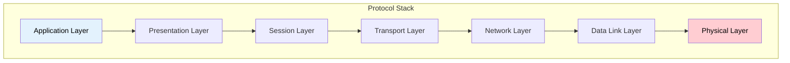

### إطار الـ OSI

**OSI** اختصار لـ **Open Systems Interconnection**. ده إطار فكري أو Framework بيشرح إزاي الأبلكيشنز بتتواصل مع بعض من خلال الشبكة.

```mermaid
graph LR
    subgraph "المُرسِل"
        S7["الطبقة 7"] --> S6["الطبقة 6"] --> S5["الطبقة 5"] --> S4["الطبقة 4"]
        S4 --> S3["الطبقة 3"] --> S2["الطبقة 2"] --> S1["الطبقة 1"]
    end

    S1 -->|"الوسيط المادي"| R1

    subgraph "المُستقبِل"
        R1["الطبقة 1"] --> R2["الطبقة 2"] --> R3["الطبقة 3"] --> R4["الطبقة 4"]
        R4 --> R5["الطبقة 5"] --> R6["الطبقة 6"] --> R7["الطبقة 7"]
    end

    style S1 fill:#ffcdd2,color:#000
    style R1 fill:#ffcdd2,color:#000
    style S7 fill:#c8e6c9,color:#000
    style R7 fill:#c8e6c9,color:#000
```

**المفهوم الأساسي:** البيانات بتمشي من **فوق لتحت** عند المُرسِل، ومن **تحت لفوق** عند المُستقبِل.

> تخيل إن كل طبقة زي **لاعب في فريق** - كل واحد له دور محدد!

---

## الجزء التاني: نظرة عامة على الـ 7 طبقات

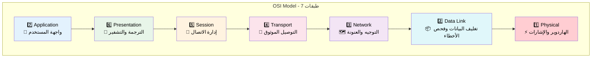

| الطبقة | الاسم | الوظيفة الأساسية | أمثلة |
|--------|-------|------------------|-------|
| 7 | Application | واجهة المستخدم والخدمات | HTTP, SMTP, FTP |
| 6 | Presentation | ترجمة البيانات والتشفير | SSL/TLS, JPEG, ASCII |
| 5 | Session | إدارة الاتصالات | NetBIOS, RPC |
| 4 | Transport | التوصيل من طرف لطرف | TCP, UDP |
| 3 | Network | التوجيه والعنونة | IP, ICMP |
| 2 | Data Link | تغليف البيانات | Ethernet, Wi-Fi |
| 1 | Physical | نقل الهاردوير | الكابلات، الإشارات |

**تذكر:** كل ما ننزل لتحت، بنقرب أكتر من **الهاردوير**!

---

## الجزء التالت: الطبقة 1 - Physical Layer ⚡

### بتعمل إيه؟

الـ Physical Layer دي اللي بتكون **تحت خالص** وهي المسؤولة عن **الهاردوير نفسه**.

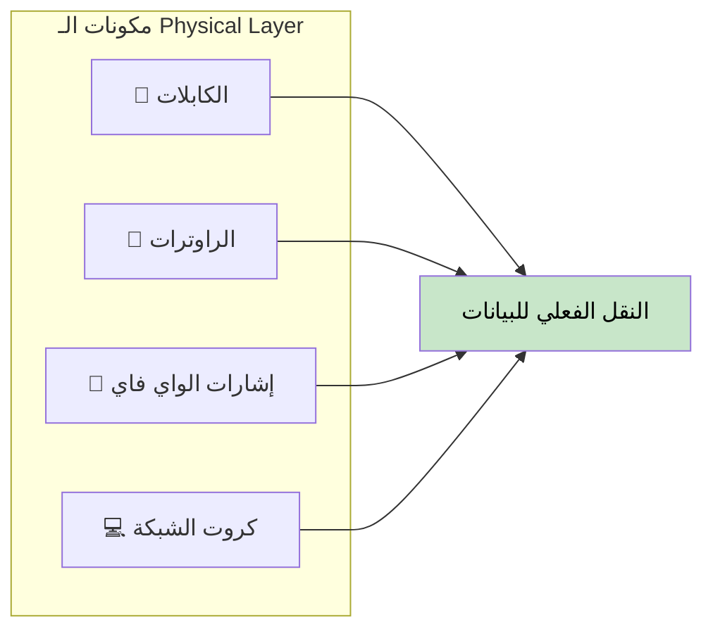

### المسؤوليات

- النقل الفعلي للـ **Bits** (الأصفار والواحدات)
- التعامل مع **الكابلات** و**الموصلات** و**الإشارات اللاسلكية**
- التعامل مع **مستويات الجهد** و**التوقيت**
- شغالة مع الاتصالات **السلكية** و**اللاسلكية**

### طب لو مفيش Physical Layer؟

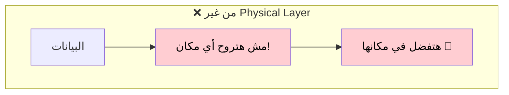

> من غير الـ Physical Layer، البيانات **مش هتتحرك أصلاً** - ده الوسيط اللي بيشيل كل حاجة!

---

## الجزء الرابع: الطبقة 2 - Data Link Layer 📦

### بتعمل إيه؟

الـ Data Link Layer بتتأكد إن البيانات بتتحرك بين الأجهزة **على نفس الشبكة** من غير مشاكل.

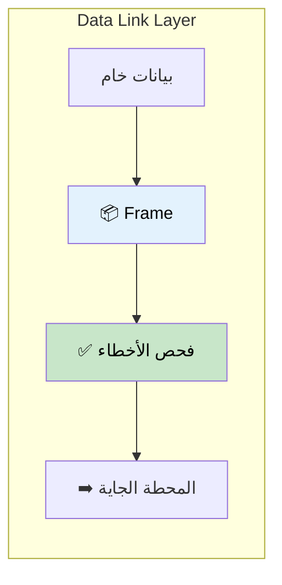

### الوظائف الأساسية

| الوظيفة | الوصف |
|---------|-------|
| **Framing** | تغليف البيانات في إطارات |
| **Error Detection** | الكشف عن أخطاء النقل |
| **MAC Addressing** | استخدام عناوين الهاردوير |
| **Flow Control** | إدارة معدل البيانات بين الأجهزة |

### البروتوكول الأساسي: Ethernet

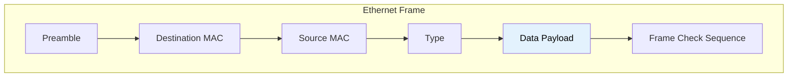

> **الإيثرنت** هو البروتوكول الأساسي اللي بيشتغل في الطبقة دي!

---

## الجزء الخامس: الطبقة 3 - Network Layer 🗺️

### بتعمل إيه؟

الـ Network Layer زي **الـ GPS** - بتحط الـ IP Address وبتحدد **أحسن طريق** للبيانات عشان توصل.

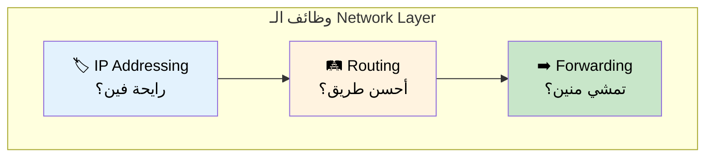

### المسؤوليات الأساسية

| المسؤولية | الوصف |
|-----------|-------|
| **IP Addressing** | تعيين العناوين المنطقية (IP) |
| **Routing** | تحديد أحسن طريق بين الشبكات |
| **Packet Forwarding** | نقل الـ Packets للوجهة |
| **Fragmentation** | تقسيم الـ Packets الكبيرة لو لزم |

### مثال على الـ IP Address

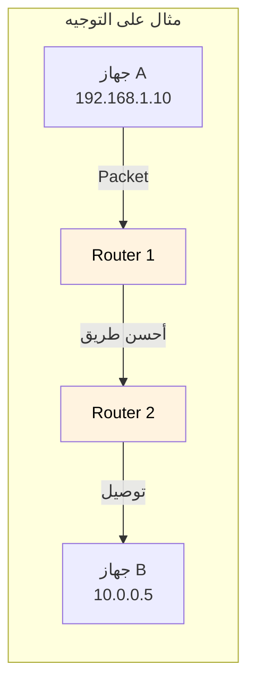

> بروتوكول الـ **IP** موجود هنا - بيحدد **فين** البيانات رايحة و**إزاي** هتوصل!

---

## الجزء السادس: الطبقة 4 - Transport Layer 🚚

### بتعمل إيه؟

الـ Transport Layer زي **عربية التوصيل** - بتتأكد إن كل أجزاء البيانات وصلت **بالترتيب الصحيح**، ولو في حاجة ناقصة بتبعتها تاني.

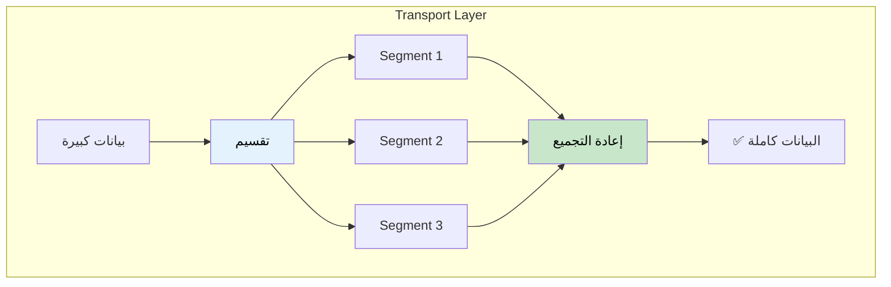

### الاتصال من طرف لطرف

الطبقة دي بتتعامل مع الاتصال **من طرف للتاني** (من Process لـ Process).

### البروتوكولين الأساسيين

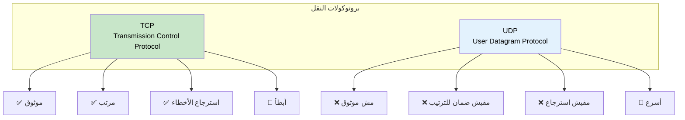

| البروتوكول | الموثوقية | السرعة | الاستخدام |
|------------|-----------|--------|-----------|
| **TCP** | ✅ عالية | 🐢 أبطأ | الويب، الإيميل، نقل الملفات |
| **UDP** | ❌ منخفضة | 🚀 أسرع | الفيديو، الألعاب، المكالمات |

> **TCP** و **UDP** هم أهم بروتوكولين على الإنترنت!

---

## الجزء السابع: الطبقات 5، 6، 7 - الطبقات العليا

في الواقع العملي، التلات طبقات دول غالباً بيكونوا **متجمعين** أو مش منفصلين بوضوح. بروتوكولات زي **HTTP** بتشتغل على التلاتة.

### الطبقة 5: Session Layer 🔗

بتحافظ على **الاتصال** وبتديره بين الأجهزة.

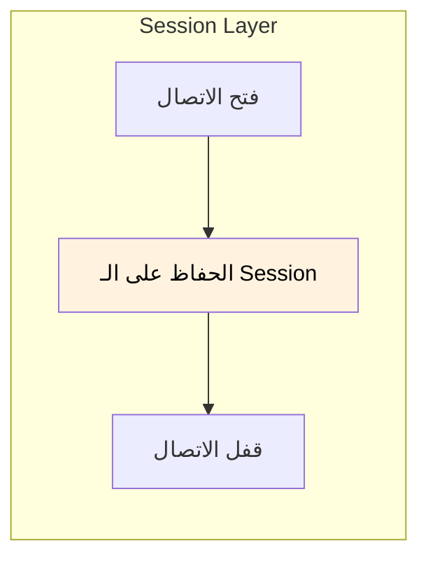

| الوظيفة | الوصف |
|---------|-------|
| فتح الـ Session | إنشاء الاتصال |
| الحفاظ على الـ Session | خليه مفتوح طول النقل |
| إنهاء الـ Session | قفله لما نخلص |

### الطبقة 6: Presentation Layer 🔄

بتترجم البيانات بين الفورمات المختلفة وبتتعامل مع **التشفير**.

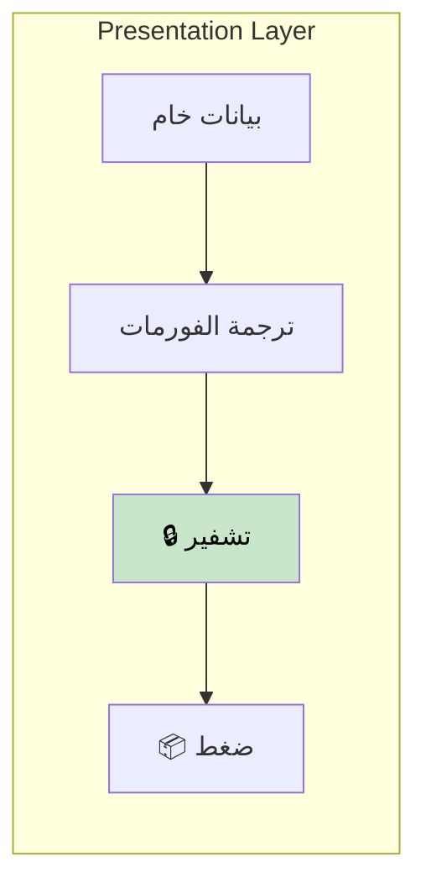

| الوظيفة | الوصف |
|---------|-------|
| ترجمة البيانات | تحويل الفورمات |
| التشفير/فك التشفير | الأمان (SSL/TLS) |
| الضغط | تقليل الحجم |

### الطبقة 7: Application Layer 👤

دي اللي **بتتعامل معاها مباشرة** - المواقع، الإيميل، التطبيقات.

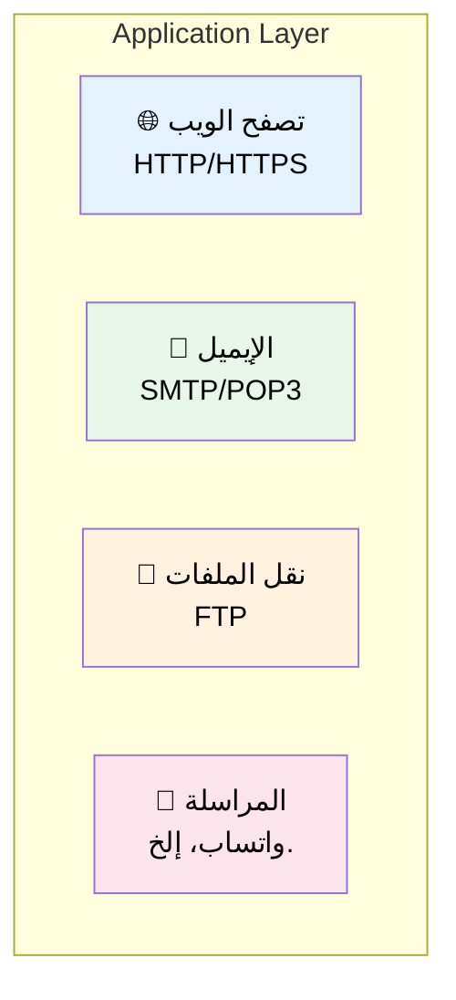

> هنا بيكون **معظم شغلنا** كمبرمجين!

---

## الجزء التامن: مثال عملي - إرسال صورة

خلونا نشوف إزاي إرسال صورة لصاحبنا بيمشي على كل الـ 7 طبقات:

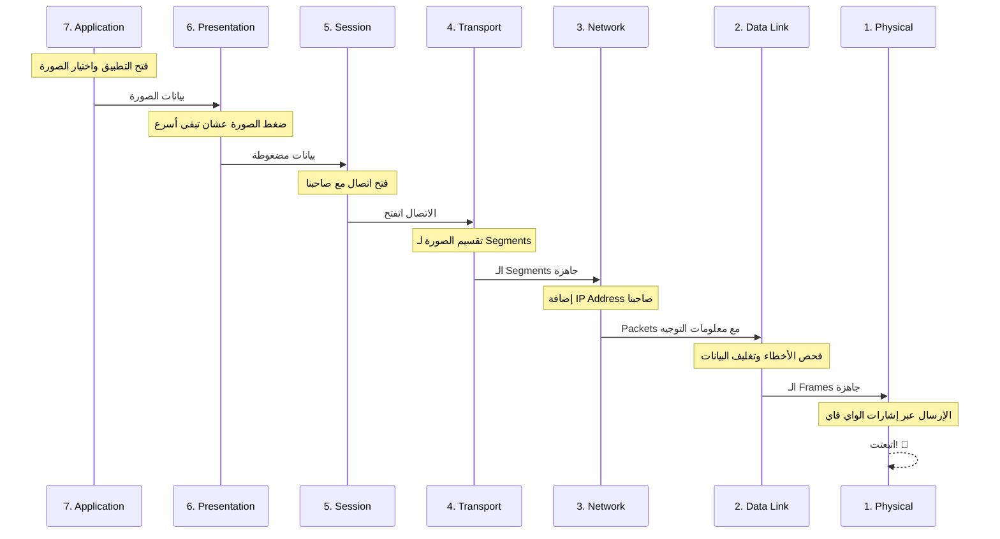

### خطوة بخطوة

| الطبقة | إيه اللي بيحصل |
|--------|----------------|
| **7. Application** | بتفتح التطبيق وتختار الصورة |
| **6. Presentation** | الصورة بتتضغط عشان تتنقل أسرع |
| **5. Session** | الاتصال بيتفتح مع صاحبك |
| **4. Transport** | الصورة بتتقسم لـ Segments صغيرة |
| **3. Network** | الـ IP Address بتاع صاحبك بيتحط |
| **2. Data Link** | البيانات بتتغلف وبيتم فحص الأخطاء |
| **1. Physical** | الإشارات بتتبعت عبر الواي فاي/الكابلات |

### على جانب المستقبِل

العملية بتكون **بالعكس** - البيانات بتمشي من الطبقة 1 لحد الطبقة 7!

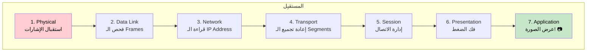

---

## الجزء التاسع: الاستخدام في الواقع

### ليه الـ OSI مهم؟

الـ OSI Model في الأساس أداة **تعليمية وفكرية**. بيساعدنا في:

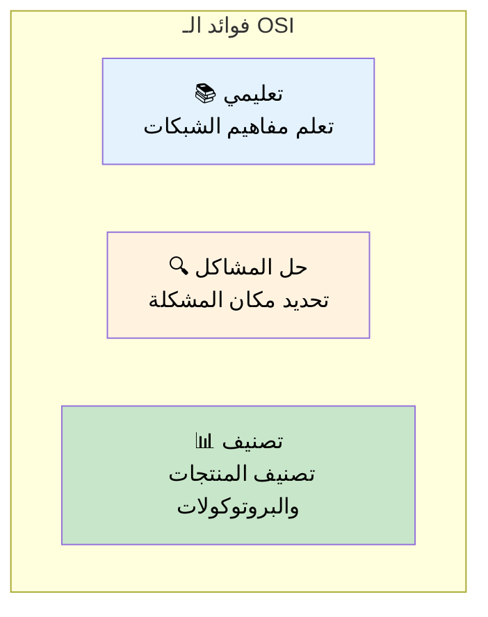

### استخدام الطبقات في الصناعة

الشركات ومزودي الخدمات السحابية بيستخدموا طبقات الـ OSI عشان يوصفوا منتجاتهم بتشتغل فين:

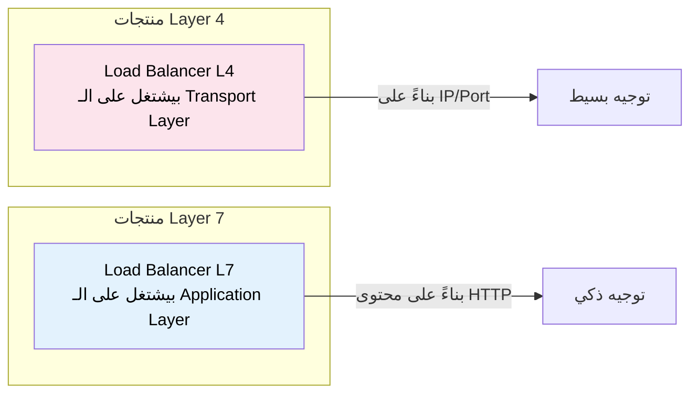

| المصطلح | المعنى |
|---------|--------|
| **Layer 4 LB** | بيوجه بناءً على IP/Port (TCP/UDP) |
| **Layer 7 LB** | بيوجه بناءً على HTTP headers, URLs, cookies |
| **L3 Switch** | بيشتغل على الـ Network Layer |

---

## الخلاصة

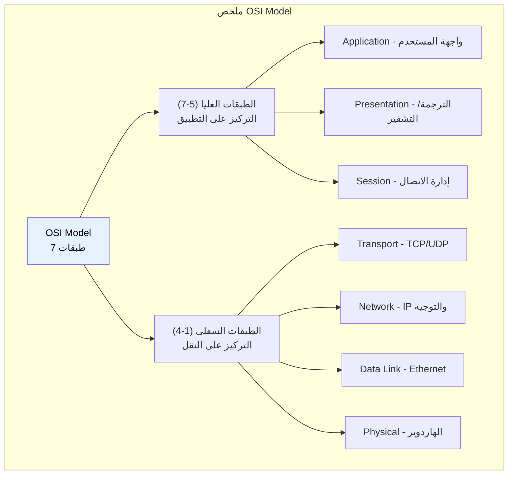

## جدول المراجعة السريعة

| الطبقة | الاسم | البروتوكول الأساسي | التشبيه |
|--------|-------|-------------------|---------|
| 7 | Application | HTTP, SMTP | 👤 المستخدم |
| 6 | Presentation | SSL, JPEG | 🔄 المترجم |
| 5 | Session | NetBIOS | 🔗 مدير المكالمات |
| 4 | Transport | TCP, UDP | 🚚 عربية التوصيل |
| 3 | Network | IP | 🗺️ الـ GPS |
| 2 | Data Link | Ethernet | 📦 التغليف |
| 1 | Physical | الكابلات، الواي فاي | ⚡ الطريق |

## طريقة للحفظ

**من الطبقة 7 لـ 1:** "**A**ll **P**eople **S**eem **T**o **N**eed **D**ata **P**rocessing"

**من الطبقة 1 لـ 7:** "**P**lease **D**o **N**ot **T**hrow **S**ausage **P**izza **A**way"
