# OSI Model - A Detailed Guide to Network Communication Layers

## Introduction

In this section, we'll cover:
- What is the OSI Model and why do we need it
- The 7 layers of the OSI Model
- What each layer does and its responsibilities
- How data flows through the layers
- Practical examples of sending data across a network

---

## Part 1: What is the OSI Model?

### The Need for Standards

For applications and processors to communicate with each other through a network, they need to agree on a set of **rules**.

These rules define:
- How data is handled
- What format the data should be in
- How to ensure reliable delivery

We call these rules **Protocols**.

### The OSI Framework

**OSI** stands for **Open Systems Interconnection**. It's a conceptual framework that explains how applications communicate through a network.

**Key Concept:** Data flows **top to bottom** on the sender side, and **bottom to top** on the receiver side.

> Think of each layer as a **player on a team** - each one has a specific role to play!

---

## Part 2: The 7 Layers Overview

```mermaid
graph TB
    subgraph "OSI Model - 7 Layers"
        L7["7️⃣ Application<br/>👤 User Interface"]
        L6["6️⃣ Presentation<br/>🔄 Translation & Encryption"]
        L5["5️⃣ Session<br/>🔗 Connection Management"]
        L4["4️⃣ Transport<br/>🚚 Reliable Delivery"]
        L3["3️⃣ Network<br/>🗺️ Routing & Addressing"]
        L2["2️⃣ Data Link<br/>📦 Framing & Error Check"]
        L1["1️⃣ Physical<br/>⚡ Hardware & Signals"]
    end

    L7 --> L6 --> L5 --> L4 --> L3 --> L2 --> L1

    style L7 fill:#e3f2fd,color:#000
    style L6 fill:#e8f5e9,color:#000
    style L5 fill:#fff3e0,color:#000
    style L4 fill:#fce4ec,color:#000
    style L3 fill:#f3e5f5,color:#000
    style L2 fill:#e0f7fa,color:#000
    style L1 fill:#ffcdd2,color:#000
```

| Layer | Name | Main Function | Example |
|-------|------|---------------|---------|
| 7 | Application | User interface & services | HTTP, SMTP, FTP |
| 6 | Presentation | Data translation & encryption | SSL/TLS, JPEG, ASCII |
| 5 | Session | Connection management | NetBIOS, RPC |
| 4 | Transport | End-to-end delivery | TCP, UDP |
| 3 | Network | Routing & addressing | IP, ICMP |
| 2 | Data Link | Frame handling | Ethernet, Wi-Fi |
| 1 | Physical | Hardware transmission | Cables, Signals |

**Remember:** The lower you go, the closer you get to the **hardware**!

---

## Part 3: Layer 1 - Physical Layer ⚡

### What Does It Do?

The Physical Layer is at the **very bottom** and is responsible for the **hardware itself**.

```mermaid
graph LR
    subgraph "Physical Layer Components"
        C["🔌 Cables"]
        R["📡 Routers"]
        W["📶 WiFi Signals"]
        H["💻 Network Cards"]
    end

    C --> TRANS["Actual Data Transmission"]
    R --> TRANS
    W --> TRANS
    H --> TRANS

    style TRANS fill:#c8e6c9,color:#000
```

### Responsibilities

- Physical transmission of **bits** (0s and 1s)
- Handles **cables**, **connectors**, and **wireless signals**
- Deals with **voltage levels** and **timing**
- Works with both **wired** and **wireless** connections

### What If We Don't Have It?

```mermaid
graph TB
    subgraph "❌ Without Physical Layer"
        DATA["Data"] --> NOTHING["Can't go anywhere!"]
        NOTHING --> STUCK["Data stays in place 🛑"]
    end

    style NOTHING fill:#ffcdd2,color:#000
    style STUCK fill:#ffcdd2,color:#000
```

> Without the Physical Layer, data **cannot move at all** - it's the medium that carries everything!

---

## Part 4: Layer 2 - Data Link Layer 📦

### What Does It Do?

The Data Link Layer ensures data moves between devices **on the same network** without problems.

```mermaid
graph LR
    subgraph "Data Link Layer"
        RAW["Raw Data"] --> FRAME["📦 Frame"]
        FRAME --> CHECK["✅ Error Check"]
        CHECK --> NEXT["➡️ Next Hop"]
    end

    style FRAME fill:#e3f2fd,color:#000
    style CHECK fill:#c8e6c9,color:#000
```

### Key Functions

| Function | Description |
|----------|-------------|
| **Framing** | Wraps data into frames |
| **Error Detection** | Checks for transmission errors |
| **MAC Addressing** | Uses hardware addresses |
| **Flow Control** | Manages data rate between devices |

### Main Protocol: Ethernet

> **Ethernet** is the primary protocol that operates at this layer!

---

## Part 5: Layer 3 - Network Layer 🗺️

### What Does It Do?

The Network Layer is like a **GPS** - it assigns IP addresses and determines the **best path** for data to travel.

```mermaid
graph TB
    subgraph "Network Layer Functions"
        IP["🏷️ IP Addressing<br/>Where to go?"]
        ROUTE["🛤️ Routing<br/>Best path?"]
        FWD["➡️ Forwarding<br/>Which way?"]
    end

    IP --> ROUTE --> FWD

    style IP fill:#e3f2fd,color:#000
    style ROUTE fill:#fff3e0,color:#000
    style FWD fill:#c8e6c9,color:#000
```

### Key Responsibilities

| Responsibility | Description |
|----------------|-------------|
| **IP Addressing** | Assigns logical addresses (IP) |
| **Routing** | Determines best path between networks |
| **Packet Forwarding** | Moves packets toward destination |
| **Fragmentation** | Breaks large packets if needed |

### IP Address Example

> The **IP Protocol** lives here - it defines **where** data goes and **how** it gets there!

---

## Part 6: Layer 4 - Transport Layer 🚚

### What Does It Do?

The Transport Layer is like a **delivery truck** - it ensures all parts of the data arrive in the **correct order**, and re-sends anything that's missing.

```mermaid
graph TB
    subgraph "Transport Layer"
        DATA["Large Data"] --> SEG["Segmentation"]
        SEG --> S1["Segment 1"]
        SEG --> S2["Segment 2"]
        SEG --> S3["Segment 3"]

        S1 --> REASSEMBLE
        S2 --> REASSEMBLE
        S3 --> REASSEMBLE

        REASSEMBLE["Reassembly"] --> COMPLETE["✅ Complete Data"]
    end

    style SEG fill:#e3f2fd,color:#000
    style REASSEMBLE fill:#c8e6c9,color:#000
```

### End-to-End Communication

This layer handles communication **from one end to the other** (process to process).

### The Two Main Protocols

```mermaid
graph TB
    subgraph "Transport Protocols"
        TCP["TCP<br/>Transmission Control Protocol"]
        UDP["UDP<br/>User Datagram Protocol"]
    end

    TCP --> TCP1["✅ Reliable"]
    TCP --> TCP2["✅ Ordered"]
    TCP --> TCP3["✅ Error Recovery"]
    TCP --> TCP4["🐢 Slower"]

    UDP --> UDP1["❌ Unreliable"]
    UDP --> UDP2["❌ No Order Guarantee"]
    UDP --> UDP3["❌ No Recovery"]
    UDP --> UDP4["🚀 Faster"]

    style TCP fill:#c8e6c9,color:#000
    style UDP fill:#e3f2fd,color:#000
```

| Protocol | Reliability | Speed | Use Case |
|----------|-------------|-------|----------|
| **TCP** | ✅ High | 🐢 Slower | Web, Email, File Transfer |
| **UDP** | ❌ Low | 🚀 Faster | Video Streaming, Gaming, VoIP |

> **TCP** and **UDP** are the two most important protocols on the internet!

---

## Part 7: Layers 5, 6, 7 - Upper Layers

In practice, these three layers are often **combined** or not clearly separated. Many protocols like **HTTP** span across all three.

### Layer 5: Session Layer 🔗

Maintains and manages **connections** between devices.

| Function | Description |
|----------|-------------|
| Session establishment | Creates the connection |
| Session maintenance | Keeps it open during transfer |
| Session termination | Closes when done |

### Layer 6: Presentation Layer 🔄

Translates data between different formats and handles **encryption**.

```mermaid
graph LR
    subgraph "Presentation Layer"
        RAW["Raw Data"] --> TRANSLATE["Translate Format"]
        TRANSLATE --> ENCRYPT["🔒 Encrypt"]
        ENCRYPT --> COMPRESS["📦 Compress"]
    end

    style ENCRYPT fill:#c8e6c9,color:#000
```

| Function | Description |
|----------|-------------|
| Data translation | Convert formats |
| Encryption/Decryption | Security (SSL/TLS) |
| Compression | Reduce size |

### Layer 7: Application Layer 👤

This is what **you interact with directly** - websites, email, apps.

```mermaid
graph TB
    subgraph "Application Layer"
        WEB["🌐 Web Browsing<br/>HTTP/HTTPS"]
        EMAIL["📧 Email<br/>SMTP/POP3"]
        FILE["📁 File Transfer<br/>FTP"]
        MSG["💬 Messaging<br/>WhatsApp, etc."]
    end

    style WEB fill:#e3f2fd,color:#000
    style EMAIL fill:#e8f5e9,color:#000
    style FILE fill:#fff3e0,color:#000
    style MSG fill:#fce4ec,color:#000
```

> This is where **most of our work** as developers happens!

---

## Part 8: Practical Example - Sending a Photo

Let's see how sending a photo to a friend works through all 7 layers:

```mermaid
sequenceDiagram
    participant APP as 7. Application
    participant PRES as 6. Presentation
    participant SESS as 5. Session
    participant TRANS as 4. Transport
    participant NET as 3. Network
    participant DATA as 2. Data Link
    participant PHYS as 1. Physical

    Note over APP: Open app, select photo
    APP->>PRES: Photo data

    Note over PRES: Compress photo for speed
    PRES->>SESS: Compressed data

    Note over SESS: Open connection to friend
    SESS->>TRANS: Connection established

    Note over TRANS: Split photo into segments
    TRANS->>NET: Segments ready

    Note over NET: Add friend's IP address
    NET->>DATA: Packets with routing info

    Note over DATA: Check for errors, frame it
    DATA->>PHYS: Frames ready

    Note over PHYS: Send via WiFi signals
    PHYS-->>PHYS: Transmitted! 📶
```

### Step-by-Step Breakdown

| Layer | What Happens |
|-------|--------------|
| **7. Application** | You open the app and select the photo |
| **6. Presentation** | Photo is compressed for faster transfer |
| **5. Session** | Connection opens to your friend |
| **4. Transport** | Photo is split into small segments |
| **3. Network** | Friend's IP address is attached |
| **2. Data Link** | Data is framed and error-checked |
| **1. Physical** | Signals sent via WiFi/cables |

### On the Receiver Side

The process is **reversed** - data flows from Layer 1 up to Layer 7!

```mermaid
graph TB
    subgraph "Receiver"
        R1["1. Physical<br/>Receive signals"] --> R2["2. Data Link<br/>Check frames"]
        R2 --> R3["3. Network<br/>Read IP address"]
        R3 --> R4["4. Transport<br/>Reassemble segments"]
        R4 --> R5["5. Session<br/>Manage connection"]
        R5 --> R6["6. Presentation<br/>Decompress"]
        R6 --> R7["7. Application<br/>Display photo! 📷"]
    end

    style R1 fill:#ffcdd2,color:#000
    style R7 fill:#c8e6c9,color:#000
```

---

## Part 9: Real-World Usage

### Why OSI Matters

The OSI Model is primarily an **educational and conceptual** tool. It helps us:

```mermaid
graph TB
    subgraph "OSI Benefits"
        B1["📚 Educational<br/>Learn networking concepts"]
        B2["🔍 Troubleshooting<br/>Identify where problems occur"]
        B3["📊 Classification<br/>Categorize products & protocols"]
    end

    style B1 fill:#e3f2fd,color:#000
    style B2 fill:#fff3e0,color:#000
    style B3 fill:#c8e6c9,color:#000
```

### Layer References in Industry

Cloud providers and companies use OSI layers to describe where their products operate:

| Term | Meaning |
|------|---------|
| **Layer 4 LB** | Routes based on IP/Port (TCP/UDP) |
| **Layer 7 LB** | Routes based on HTTP headers, URLs, cookies |
| **L3 Switch** | Operates at Network Layer |

---

## Summary

## Quick Reference Table

| Layer | Name | Key Protocol | Analogy |
|-------|------|--------------|---------|
| 7 | Application | HTTP, SMTP | 👤 The user |
| 6 | Presentation | SSL, JPEG | 🔄 Translator |
| 5 | Session | NetBIOS | 🔗 Phone call manager |
| 4 | Transport | TCP, UDP | 🚚 Delivery truck |
| 3 | Network | IP | 🗺️ GPS |
| 2 | Data Link | Ethernet | 📦 Packaging |
| 1 | Physical | Cables, WiFi | ⚡ The road |

## Memory Trick

**From Layer 7 to 1:** "**A**ll **P**eople **S**eem **T**o **N**eed **D**ata **P**rocessing"

**From Layer 1 to 7:** "**P**lease **D**o **N**ot **T**hrow **S**ausage **P**izza **A**way"
