# TLS/SSL - شرح تفصيلي للاتصال الآمن

## المقدمة

في الجزء ده هنتكلم عن:
- إزاي نأمّن الاتصال بين التطبيقات
- بروتوكول TLS (Transport Layer Security) وإزاي بيحقق الأمان
- التلات ركائز: التشفير، التحقق من الهوية، وسلامة البيانات
- عملية الـ TLS Handshake
- أفضل الممارسات لإدارة الشهادات

---

## الجزء الأول: المشكلة - البيانات بتتبعت Plain Text

### ليه محتاجين أمان؟

إحنا فهمنا إزاي نبعت بيانات بين التطبيقات والـ Nodes في الشبكة. بس في مشكلة كبيرة:

**البيانات بتتبعت في صورة Plain Text!**

يعني أي حد في النص يقدر يعترض الاتصال ويقرأ البيانات.

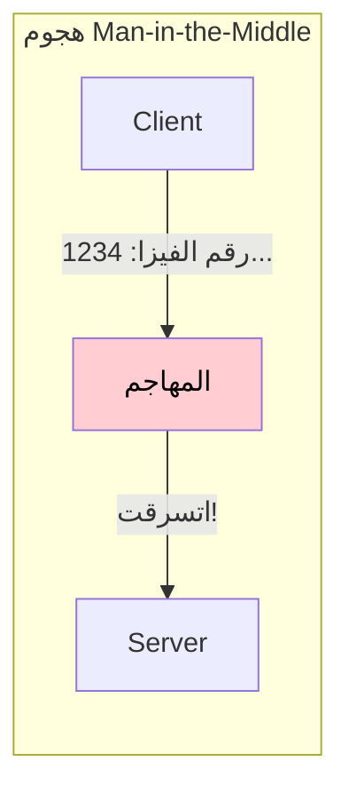

**مثال:** تخيل إنك بتشتري حاجة أونلاين وفجأة حد وقف في النص بين البراوزر والسيرفر - ممكن يسرق بيانات الفيزا بتاعتك!

### إيه الحل؟

علشان نحمي نفسنا بنستخدم حاجة اسمها **TLS (Transport Layer Security)** أو اللي قبله **SSL (Secure Sockets Layer)**.

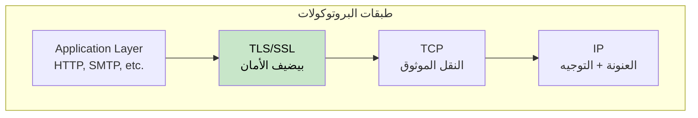

---

## الجزء التاني: الركائز التلاتة للـ TLS

الـ TLS بيقدم تلات ضمانات أساسية للأمان:

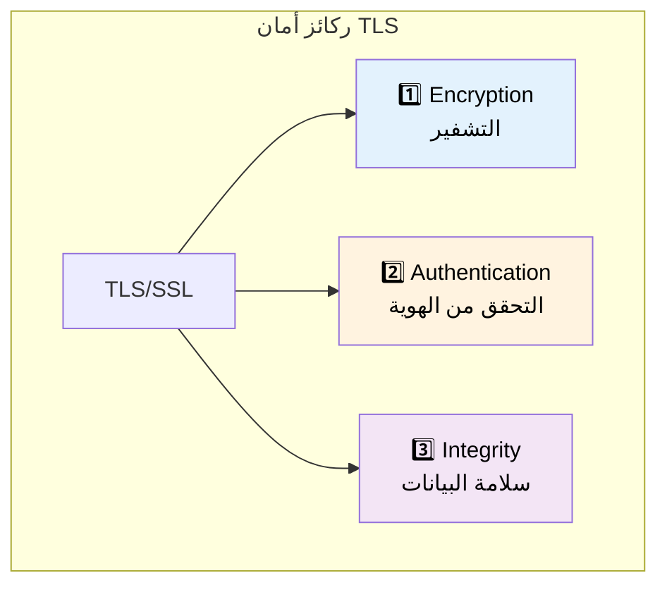

| الركيزة | الغرض |
|---------|-------|
| **التشفير** | إخفاء البيانات عشان الطرفين بس يقدروا يقرأوها |
| **التحقق من الهوية** | التأكد من هوية اللي بتكلمه |
| **سلامة البيانات** | ضمان إن البيانات ما اتغيرتش في الطريق |

---

## الجزء التالت: التشفير - إخفاء البيانات

### التشفير بيشتغل إزاي؟

التشفير بيضمن إن البيانات اللي بتتبادل بين الـ Client والـ Server تكون مخفية - الطرفين بس اللي بيكلموا بعض يقدروا يقرأوها.

### مشكلة تبادل المفاتيح

لما الـ Connection بيتفتح، الـ Client والـ Server محتاجين يتفقوا على **مفتاح سري مشترك**. بس إزاي تشارك سر على قناة مش آمنة؟

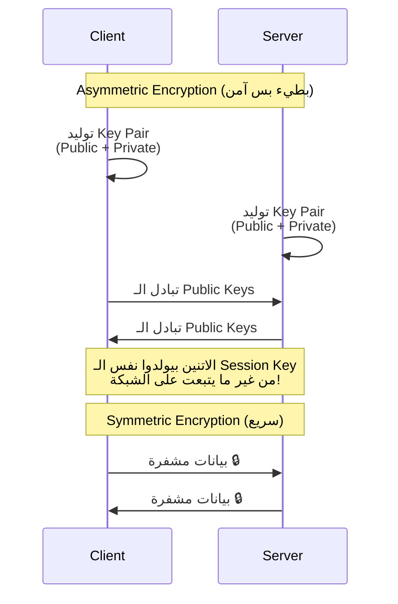

### نوعين من التشفير

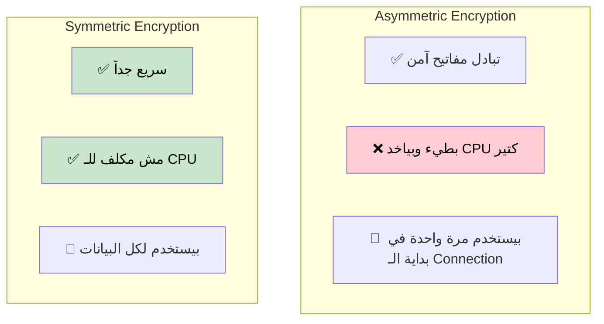

| النوع | السرعة | الاستخدام |
|-------|--------|-----------|
| **Asymmetric** | 🐢 بطيء | تبادل المفاتيح بس |
| **Symmetric** | 🚀 سريع | كل البيانات بعد الـ Handshake |

### تجديد الـ Session Key

علشان أمان أكتر، الـ **Session Key** ممكن يتجدد كل فترة:

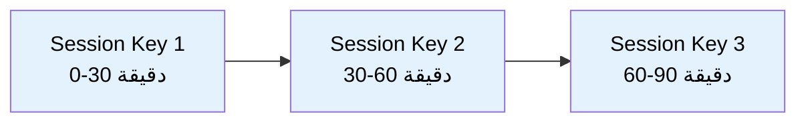

**ليه؟** لو المفتاح اتسرب لأي سبب، المهاجم هيقدر يفك تشفير جزء صغير جداً من البيانات.

### دعم الـ Hardware الحديث

النهاردة، تكلفة التشفير تكاد تكون لا تُذكر لأن المعالجات الحديثة عندها **Hardware Acceleration** للعمليات التشفيرية (AES-NI).

> **أفضل ممارسة:** استخدم TLS لكل الاتصالات - حتى داخل الشبكة الداخلية!

---

## الجزء الرابع: التحقق من الهوية - التأكد من هوية الطرف التاني

### المشكلة

حتى مع التشفير، إزاي نعرف إننا بنكلم السيرفر **الحقيقي** مش حد مزيف؟

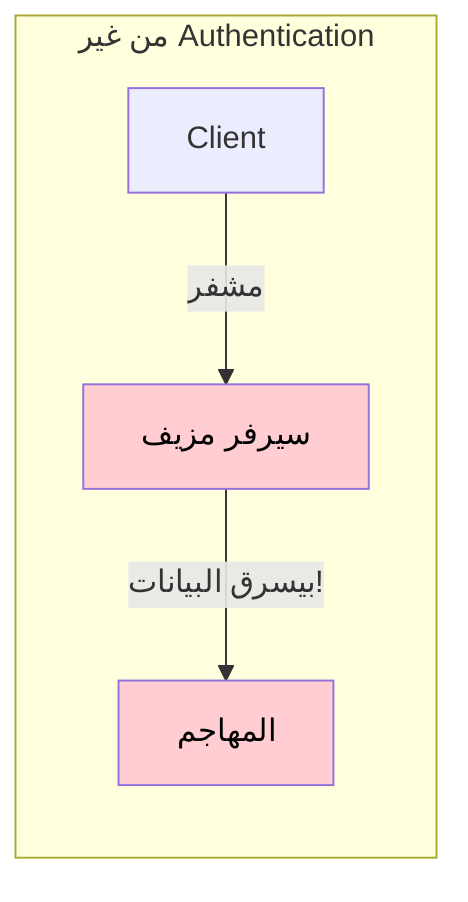

### التوقيع الرقمي (Digital Signature)

التحقق من الهوية بيتم من خلال **Digital Signatures** المبنية على الـ Asymmetric Cryptography.

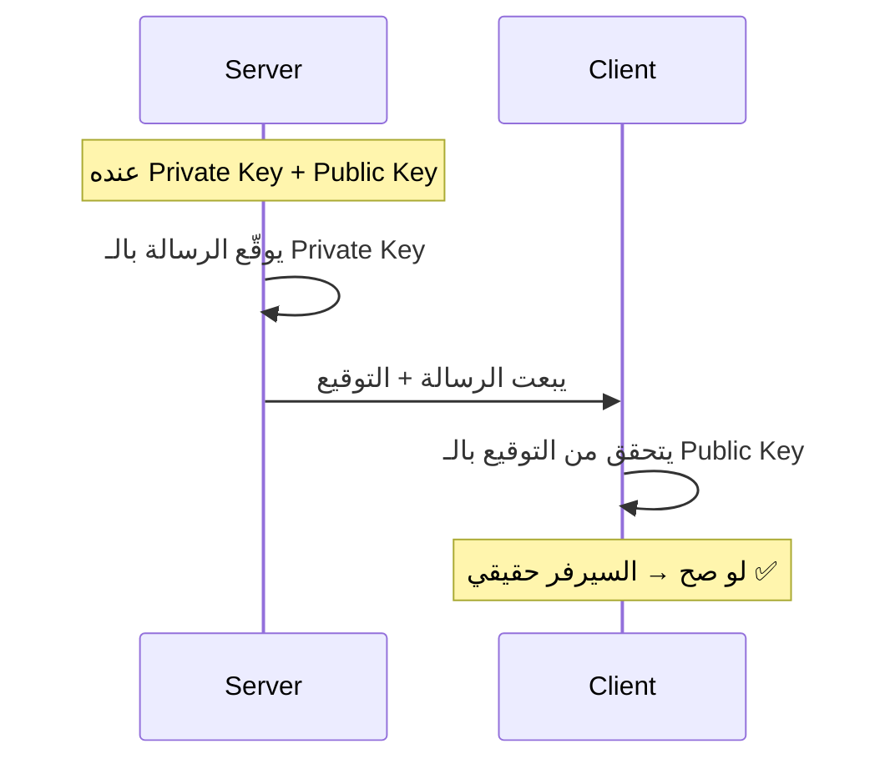

### الشهادات الرقمية (Digital Certificates)

بس إزاي الـ Client يعرف إن الـ **Public Key** نفسه حقيقي؟

هنا بييجي دور **الشهادات الرقمية**!

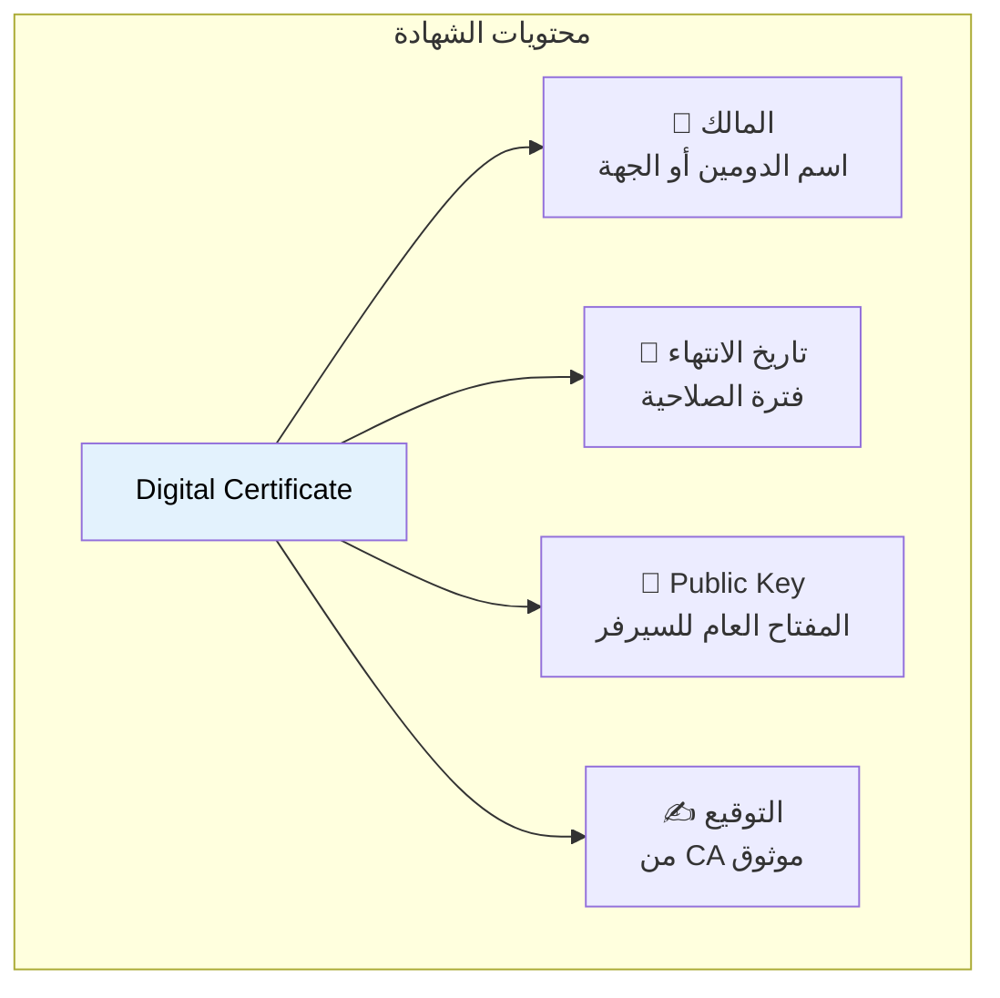

### الـ Certificate Authority (CA)

الشهادات بتصدر من جهات موثوقة اسمها **Certificate Authorities (CAs)**.

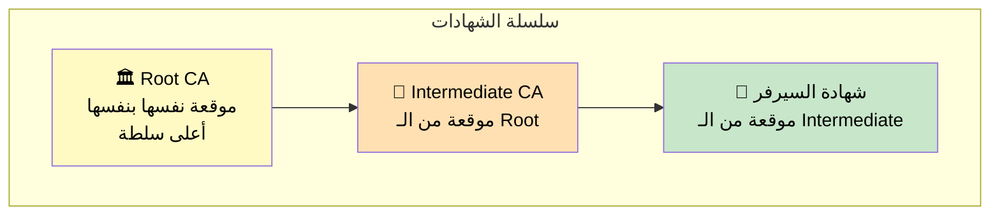

### عملية التحقق من الشهادة

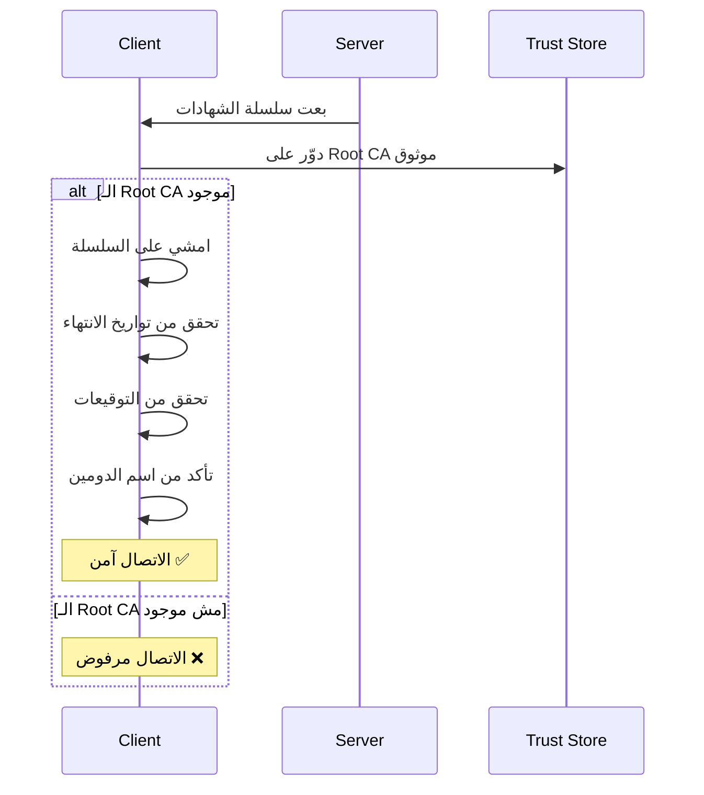

### مشكلة انتهاء الشهادة

واحدة من أكثر الأخطاء الشائعة:

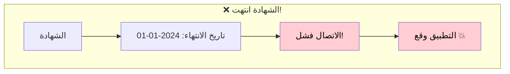

**أفضل الممارسات:**
- ✅ اعمل **مراقبة** لتواريخ انتهاء الشهادات
- ✅ اعمل **تجديد تلقائي** (مثلاً Let's Encrypt)
- ✅ أتمتة إدارة الشهادات

> **تحذير:** الاستثمار في أتمتة الشهادات ممكن ينقذ التطبيق كله من وقوع مفاجئ!

---

## الجزء الخامس: سلامة البيانات - التأكد من عدم التلاعب

### المشكلة

حتى مع التشفير، ماذا لو حد عدّل في البيانات المشفرة وهي ماشية؟

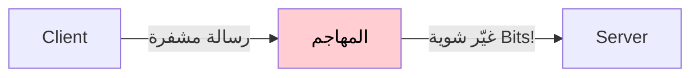

المهاجم مش هيقدر يقرأ الرسالة، بس ممكن **يخربها**!

### الـ Message Authentication Code (MAC)

الـ TLS بيضمن سلامة البيانات باستخدام **MAC (Message Authentication Code)**.

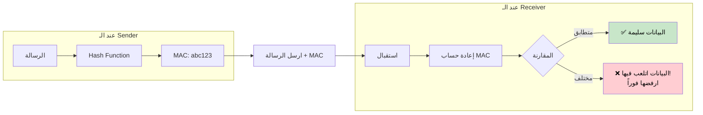

### ليه مش الـ TCP Checksum بس؟

ممكن تسأل: "مش المفروض الـ TCP عنده Checksum؟"

| الخاصية | TCP Checksum | TLS MAC |
|---------|--------------|---------|
| الغرض | اكتشاف أخطاء النقل | اكتشاف التلاعب + الأخطاء |
| الدقة | ~1 في كل 16 مليون مليار يفشل | آمن تشفيرياً |
| الأمان | ❌ مش آمن | ✅ آمن |

**إحصائيات:** الـ TCP Checksum ممكن يفشل في اكتشاف الأخطاء مرة تقريباً كل 16 Exabytes من البيانات. الـ TLS MAC بيدي طبقة حماية تشفيرية إضافية.

---

## الجزء السادس: الـ TLS Handshake

### نظرة عامة

قبل ما الاتصال الآمن يبدأ، الـ Client والـ Server بيعملوا **TLS Handshake**.

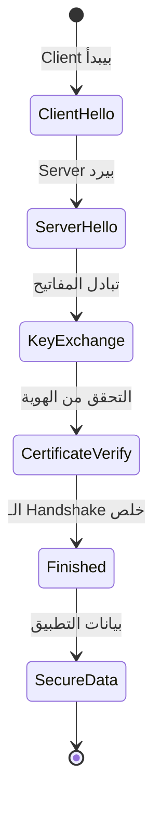

### التفاوض على الـ Cipher Suite

أول حاجة، الطرفين بيتفقوا على **Cipher Suite** - مجموعة الخوارزميات اللي هيستخدموها.

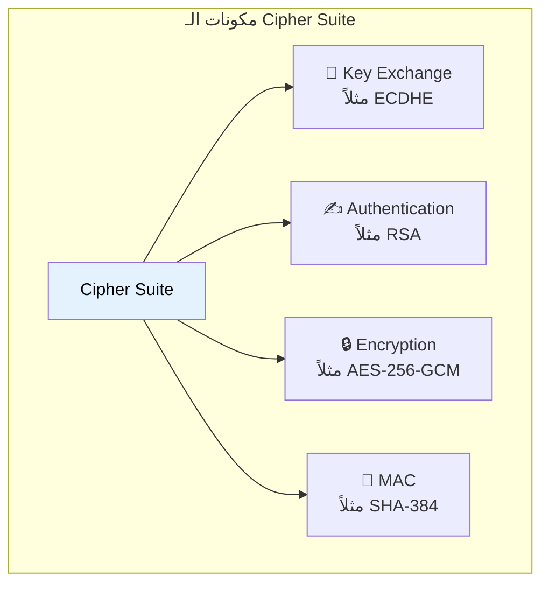

**مثال على Cipher Suite:** `TLS_ECDHE_RSA_WITH_AES_256_GCM_SHA384`

### خطوات الـ Handshake

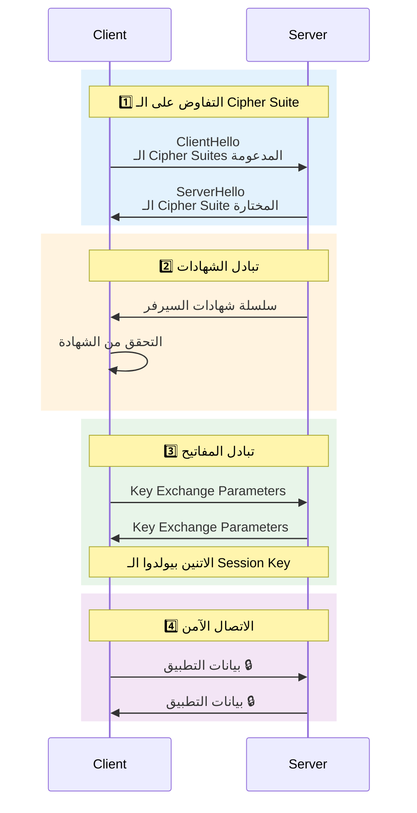

### قائمة التحقق من الشهادة

خلال الـ Handshake، الـ Client بيتحقق من:

| الفحص | السؤال |
|-------|--------|
| ✅ CA موثوق | الشهادة من جهة موثوقة؟ |
| ✅ مش منتهية | الشهادة لسه سارية؟ |
| ✅ الدومين صح | الشهادة للدومين الصح؟ |
| ✅ التوقيع صحيح | التوقيع الرقمي حقيقي؟ |

### مقارنة إصدارات TLS

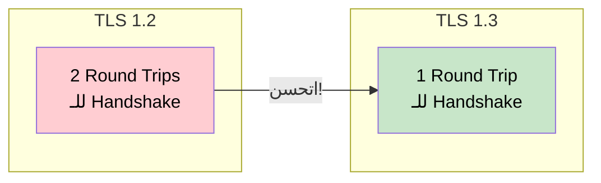

| الإصدار | عدد الـ Round Trips | ملاحظات |
|---------|---------------------|---------|
| TLS 1.2 | 2 RTT | أقدم، أبطأ |
| TLS 1.3 | 1 RTT | أسرع، أكثر أماناً |

---

## الجزء السابع: أفضل الممارسات للأداء

### تكلفة فتح Connections جديدة

كل TLS Connection جديد بيحتاج Handshake، وده بياخد وقت و CPU.

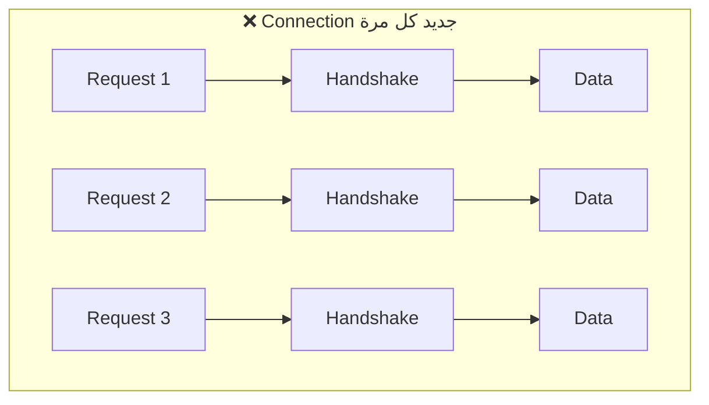

### أفضل الممارسات

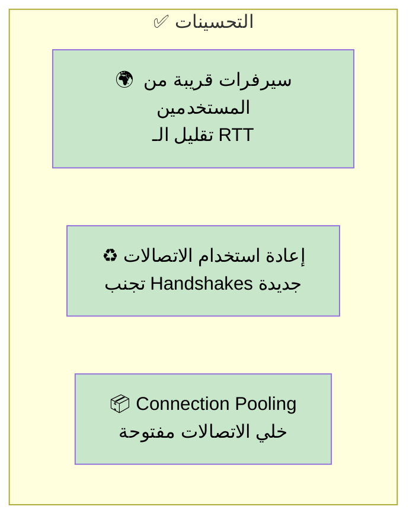

| الممارسة | الفايدة |
|----------|---------|
| القرب الجغرافي | تقليل التأخير |
| إعادة استخدام الاتصالات | تجنب تكلفة الـ Handshake |
| Connection Pooling | استخدام أفضل للموارد |

---

## الخلاصة

```mermaid
graph TB
    subgraph "أمان TLS/SSL"
        TLS["TLS/SSL"]

        TLS --> ENC["🔒 التشفير"]
        ENC --> ENC1["Asymmetric لتبادل المفاتيح"]
        ENC --> ENC2["Symmetric للبيانات"]

        TLS --> AUTH["✍️ التحقق من الهوية"]
        AUTH --> AUTH1["الشهادات الرقمية"]
        AUTH --> AUTH2["Certificate Authorities"]

        TLS --> INT["📝 سلامة البيانات"]
        INT --> INT1["التحقق بالـ MAC"]
        INT --> INT2["اكتشاف التلاعب"]
    end

    style TLS fill:#e3f2fd,color:#000
```

## ملخص سريع للمراجعة

| الموضوع | النقاط الأساسية |
|---------|------------------|
| **TLS/SSL** | طبقة أمان فوق الـ TCP |
| **التشفير** | Asymmetric (بطيء) + Symmetric (سريع) |
| **التحقق من الهوية** | التوقيعات الرقمية + الشهادات |
| **سلسلة الشهادات** | Root CA → Intermediate CA → Server Cert |
| **سلامة البيانات** | MAC لاكتشاف التلاعب |
| **TLS Handshake** | تفاوض على الـ Cipher → تبادل المفاتيح → التحقق |
| **TLS 1.3** | 1 RTT (أسرع من TLS 1.2) |
| **أفضل الممارسات** | تجديد تلقائي، مراقبة، Connection Pooling |
