# TLS/SSL - A Detailed Guide to Secure Communication

## Introduction

In this section, we'll cover:
- How to secure communication between applications
- TLS (Transport Layer Security) and how it achieves security
- The three pillars: Encryption, Authentication, and Integrity
- The TLS Handshake process
- Best practices for certificate management

---

## Part 1: The Problem - Data in Plain Text

### Why Do We Need Security?

We've learned how to send data between applications and nodes in a network. But there's a big problem:

**Data is sent in plain text!**

This means anyone in the middle can intercept and read your data.


**Example:** Imagine you're shopping online and someone intercepts the connection between your browser and the server - they could steal your credit card information!

### What's the Solution?

To protect ourselves, we use something called **TLS (Transport Layer Security)** or its predecessor **SSL (Secure Sockets Layer)**.


---

## Part 2: The Three Pillars of TLS

TLS provides three fundamental security guarantees:

```mermaid
graph TB
    subgraph "TLS Security Pillars"
        TLS[TLS/SSL] --> E["1️⃣ Encryption<br/>Confidentiality"]
        TLS --> A["2️⃣ Authentication<br/>Identity Verification"]
        TLS --> I["3️⃣ Integrity<br/>Data Protection"]
    end

    style E fill:#e3f2fd,color:#000
    style A fill:#fff3e0,color:#000
    style I fill:#f3e5f5,color:#000
```

| Pillar | Purpose |
|--------|---------|
| **Encryption** | Hide data so only intended parties can read it |
| **Authentication** | Verify the identity of who you're talking to |
| **Integrity** | Ensure data wasn't modified in transit |

---

## Part 3: Encryption - Keeping Data Secret

### How Does Encryption Work?

Encryption ensures that data exchanged between client and server is hidden - only the two communicating parties can read it.

### The Key Exchange Problem

When a connection opens, client and server need to agree on a **shared secret key**. But how do you share a secret over an insecure channel?

```mermaid
sequenceDiagram
    participant C as Client
    participant S as Server

    Note over C,S: Asymmetric Encryption (Slow but Secure)

    C->>C: Generate Key Pair<br/>(Public + Private)
    S->>S: Generate Key Pair<br/>(Public + Private)

    C->>S: Exchange Public Keys
    S->>C: Exchange Public Keys

    Note over C,S: Both derive same Session Key<br/>without sending it over network!

    Note over C,S: Symmetric Encryption (Fast)
    C->>S: Encrypted Data 🔒
    S->>C: Encrypted Data 🔒
```

### Two Types of Encryption

```mermaid
graph TB
    subgraph "Asymmetric Encryption"
        A1["✅ Secure key exchange"]
        A2["❌ Slow & CPU intensive"]
        A3["📍 Used once at connection start"]
    end

    subgraph "Symmetric Encryption"
        S1["✅ Very fast"]
        S2["✅ Low CPU cost"]
        S3["📍 Used for all data transfer"]
    end

    style A2 fill:#ffcdd2,color:#000
    style S1 fill:#c8e6c9,color:#000
    style S2 fill:#c8e6c9,color:#000
```

| Type | Speed | Usage |
|------|-------|-------|
| **Asymmetric** | 🐢 Slow | Key exchange only |
| **Symmetric** | 🚀 Fast | All data after handshake |

### Session Key Rotation

For extra security, the **Session Key** can be rotated periodically:


**Why?** If a key is ever compromised, the attacker can only decrypt a small portion of data.

### Modern Hardware Support

Today, encryption overhead is negligible because modern CPUs have **hardware acceleration** for cryptographic operations (AES-NI).

> **Best Practice:** Use TLS for ALL connections - even internal network traffic!

---

## Part 4: Authentication - Verifying Identity

### The Problem

Even with encryption, how do we know we're talking to the **real** server and not an imposter?


### Digital Signatures

Authentication is achieved through **Digital Signatures** based on asymmetric cryptography.

```mermaid
sequenceDiagram
    participant S as Server
    participant C as Client

    Note over S: Has Private Key + Public Key

    S->>S: Sign message with Private Key
    S->>C: Send message + Signature

    C->>C: Verify signature using Public Key

    Note over C: If valid → Server is authentic ✅
```

### Digital Certificates

But how does the client know the **Public Key** itself is legitimate?

This is where **Digital Certificates** come in!

```mermaid
graph TB
    subgraph "Certificate Contents"
        CERT[Digital Certificate]
        CERT --> O["👤 Owner<br/>Domain name or organization"]
        CERT --> E["📅 Expiry Date<br/>Validity period"]
        CERT --> P["🔑 Public Key<br/>Server's public key"]
        CERT --> S["✍️ Signature<br/>From trusted CA"]
    end

    style CERT fill:#e3f2fd,color:#000
```

### Certificate Authority (CA)

Certificates are issued by trusted third parties called **Certificate Authorities (CAs)**.

```mermaid
graph TB
    subgraph "Certificate Chain"
        ROOT["🏛️ Root CA<br/>Self-signed<br/>Highest authority"]
        ROOT --> INT["🏢 Intermediate CA<br/>Signed by Root"]
        INT --> LEAF["📄 Server Certificate<br/>Signed by Intermediate"]
    end

    style ROOT fill:#fff9c4,color:#000
    style INT fill:#ffe0b2,color:#000
    style LEAF fill:#c8e6c9,color:#000
```

### Certificate Validation Process

```mermaid
sequenceDiagram
    participant C as Client
    participant S as Server
    participant TS as Trust Store

    S->>C: Send Certificate Chain

    C->>TS: Look for trusted Root CA

    alt Root CA Found
        C->>C: Walk up the chain
        C->>C: Check expiry dates
        C->>C: Verify signatures
        C->>C: Match domain name
        Note over C: Connection Secure ✅
    else Root CA Not Found
        Note over C: Connection Rejected ❌
    end
```

### Certificate Expiration Problem

One of the most common errors:

```mermaid
graph TB
    subgraph "❌ Certificate Expired!"
        CERT["Certificate"] --> EXP["Expiry: 2024-01-01"]
        EXP --> FAIL["Connection Failed!"]
        FAIL --> DOWN["Application Down 💥"]
    end

    style FAIL fill:#ffcdd2,color:#000
    style DOWN fill:#ffcdd2,color:#000
```

**Best Practices:**
- ✅ Set up **monitoring** for certificate expiration
- ✅ Implement **auto-renewal** (e.g., Let's Encrypt)
- ✅ Automate certificate management

> **Warning:** Investing in certificate automation can save your entire application from unexpected downtime!

---

## Part 5: Integrity - Ensuring Data Wasn't Modified

### The Problem

Even with encryption, what if someone modifies the encrypted data in transit?


The attacker can't read the message, but they might **corrupt** it!

### Message Authentication Code (MAC)

TLS ensures data integrity using **MAC (Message Authentication Code)**.


### Why Not Just TCP Checksum?

You might ask: "Doesn't TCP already have a checksum?"

| Feature | TCP Checksum | TLS MAC |
|---------|--------------|---------|
| Purpose | Detect transmission errors | Detect tampering + errors |
| Accuracy | ~1 in 16 million billion fails | Cryptographically secure |
| Security | ❌ Not secure | ✅ Secure |

**Statistics:** TCP checksum can fail to detect errors approximately once every 16 exabytes of data. TLS MAC provides an additional cryptographic layer of protection.

---

## Part 6: The TLS Handshake

### Overview

Before secure communication begins, client and server perform a **TLS Handshake**.


### Cipher Suite Negotiation

First, both parties agree on a **Cipher Suite** - the set of algorithms they'll use.

```mermaid
graph TB
    subgraph "Cipher Suite Components"
        CS["Cipher Suite"]
        CS --> KE["🔑 Key Exchange<br/>e.g., ECDHE"]
        CS --> AUTH["✍️ Authentication<br/>e.g., RSA"]
        CS --> ENC["🔒 Encryption<br/>e.g., AES-256-GCM"]
        CS --> MAC["📝 MAC<br/>e.g., SHA-384"]
    end

    style CS fill:#e3f2fd,color:#000
```

**Example Cipher Suite:** `TLS_ECDHE_RSA_WITH_AES_256_GCM_SHA384`

### Handshake Steps

```mermaid
sequenceDiagram
    participant C as Client
    participant S as Server

    rect rgb(227, 242, 253)
    Note over C,S: 1️⃣ Cipher Suite Negotiation
    C->>S: ClientHello<br/>Supported cipher suites
    S->>C: ServerHello<br/>Selected cipher suite
    end

    rect rgb(255, 243, 224)
    Note over C,S: 2️⃣ Certificate Exchange
    S->>C: Server Certificate Chain
    C->>C: Verify certificate
    end

    rect rgb(232, 245, 233)
    Note over C,S: 3️⃣ Key Exchange
    C->>S: Key exchange parameters
    S->>C: Key exchange parameters
    Note over C,S: Both derive Session Key
    end

    rect rgb(243, 229, 245)
    Note over C,S: 4️⃣ Secure Communication
    C->>S: Application Data 🔒
    S->>C: Application Data 🔒
    end
```

### Certificate Verification Checklist

During the handshake, the client verifies:

| Check | Question |
|-------|----------|
| ✅ Trusted CA | Is the certificate from a trusted authority? |
| ✅ Not Expired | Is the certificate still valid? |
| ✅ Domain Match | Does the certificate match the domain? |
| ✅ Valid Signature | Is the digital signature authentic? |

### TLS Version Comparison


| Version | Round Trips | Notes |
|---------|-------------|-------|
| TLS 1.2 | 2 RTT | Older, slower |
| TLS 1.3 | 1 RTT | Faster, more secure |

---

## Part 7: Performance Best Practices

### The Cost of New Connections

Every new TLS connection requires a handshake, which consumes time and CPU resources.

```mermaid
graph TB
    subgraph "❌ New Connection Every Time"
        R1["Request 1"] --> H1["Handshake"] --> D1["Data"]
        R2["Request 2"] --> H2["Handshake"] --> D2["Data"]
        R3["Request 3"] --> H3["Handshake"] --> D3["Data"]
    end
```

### Best Practices

```mermaid
graph TB
    subgraph "✅ Optimizations"
        P1["🌍 Servers close to users<br/>Reduce RTT"]
        P2["♻️ Connection reuse<br/>Avoid new handshakes"]
        P3["📦 Connection pooling<br/>Keep connections alive"]
    end

    style P1 fill:#c8e6c9,color:#000
    style P2 fill:#c8e6c9,color:#000
    style P3 fill:#c8e6c9,color:#000
```

| Practice | Benefit |
|----------|---------|
| Geographic proximity | Lower latency |
| Connection reuse | Avoid handshake overhead |
| Connection pooling | Better resource utilization |

---

## Summary

```mermaid
graph TB
    subgraph "TLS/SSL Security"
        TLS["TLS/SSL"]

        TLS --> ENC["🔒 Encryption"]
        ENC --> ENC1["Asymmetric for key exchange"]
        ENC --> ENC2["Symmetric for data"]

        TLS --> AUTH["✍️ Authentication"]
        AUTH --> AUTH1["Digital Certificates"]
        AUTH --> AUTH2["Certificate Authorities"]

        TLS --> INT["📝 Integrity"]
        INT --> INT1["MAC verification"]
        INT --> INT2["Tamper detection"]
    end

    style TLS fill:#e3f2fd,color:#000
```

## Quick Reference

| Topic | Key Points |
|-------|------------|
| **TLS/SSL** | Security layer on top of TCP |
| **Encryption** | Asymmetric (slow) + Symmetric (fast) |
| **Authentication** | Digital signatures + Certificates |
| **Certificate Chain** | Root CA → Intermediate CA → Server Cert |
| **Integrity** | MAC for tamper detection |
| **TLS Handshake** | Cipher negotiation → Key exchange → Verify |
| **TLS 1.3** | 1 RTT (faster than TLS 1.2) |
| **Best Practices** | Auto-renewal, monitoring, connection pooling |
