# DNS - شرح تفصيلي لنظام أسماء النطاقات

## المقدمة

في الجزء ده هنتكلم عن:
- يعني إيه DNS وليه محتاجينه
- إزاي عملية الـ DNS Resolution بتحصل خطوة بخطوة
- التسلسل الهرمي لسيرفرات الـ DNS
- الـ Caching وتحسين الأداء
- الـ TTL (Time To Live) ومقايضاته
- الـ DNS Failover والـ Static Stability

---

## الجزء الأول: يعني إيه DNS؟

### المشكلة: إزاي نلاقي الـ IP Address؟

إحنا فهمنا إزاي نعمل Communication Channel بين التطبيقات من خلال الشبكة. بس قبل ما نقدر نفتح أي Connection جديد، لازم الأول نعرف الـ **IP Address** بتاع الهدف.

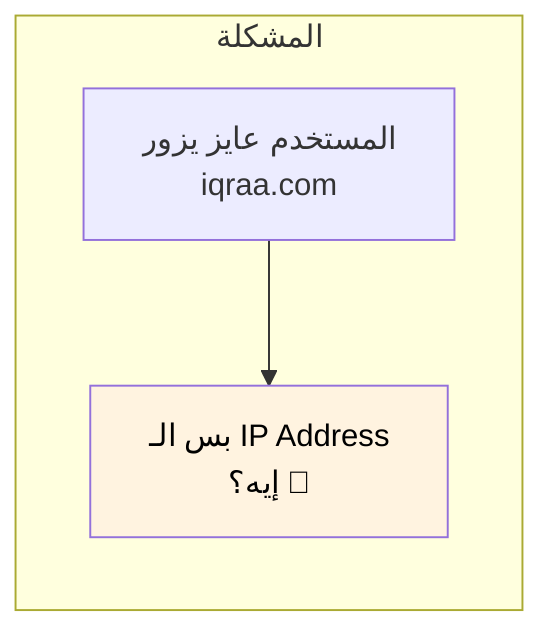

### الحل: DNS

أكتر طريقة منتشرة لاكتشاف الـ IP Addresses هي من خلال **نظام أسماء النطاقات (DNS)** - اللي بنسميه **"دفتر تليفونات الإنترنت"**.

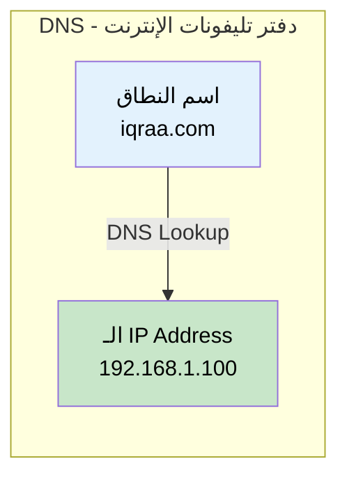

| المفهوم | التشبيه |
|---------|---------|
| **اسم النطاق** | اسم الشخص في دفتر التليفونات |
| **الـ IP Address** | رقم التليفون |
| **سيرفر الـ DNS** | دفتر التليفونات نفسه |
| **الـ DNS Query** | البحث عن اسم |

---

## الجزء التاني: عملية الـ DNS Resolution

### نظرة عامة

لما بتكتب URL زي `iqraa.com` في المتصفح، عملية معقدة اسمها **DNS Resolution** بتحصل ورا الكواليس.

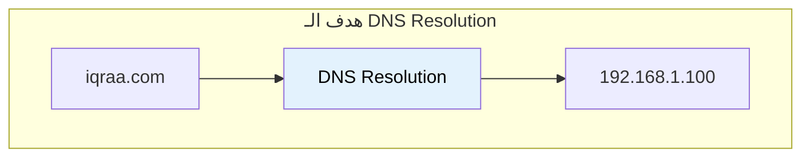

### اللاعبين الأساسيين

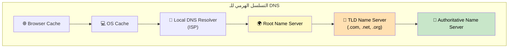

| السيرفر | الدور |
|---------|-------|
| **Browser Cache** | أول فحص - الاستعلامات الأخيرة |
| **OS Cache** | تاني فحص - كاش على مستوى النظام |
| **Local DNS Resolver** | سيرفر الـ DNS بتاع الـ ISP، بيعمل الشغل الثقيل |
| **Root Name Server** | بيعرف فين سيرفرات الـ TLD |
| **TLD Name Server** | بيعرف السيرفرات الـ Authoritative للدومينات |
| **Authoritative Name Server** | عنده الـ IP Address الفعلي |

---

## الجزء التالت: خطوات الـ DNS Resolution بالتفصيل

### الرحلة الكاملة

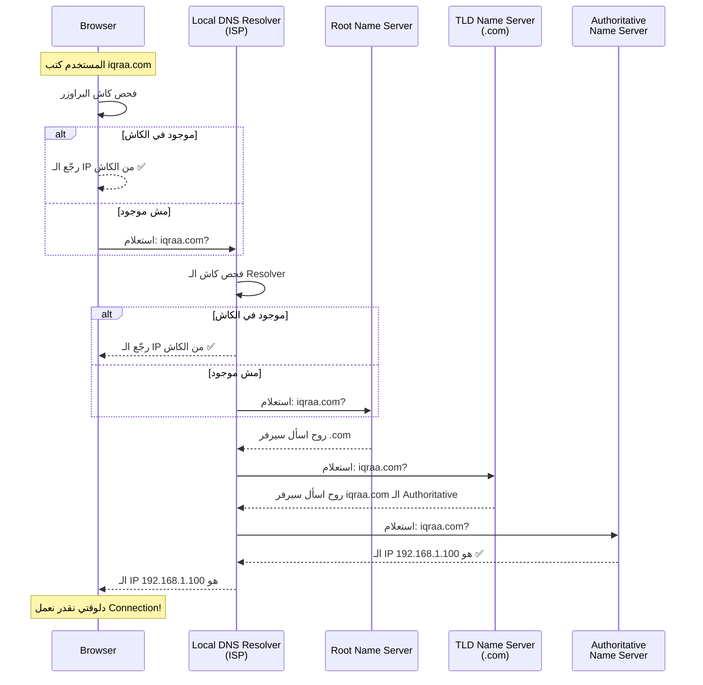

### خطوة بخطوة

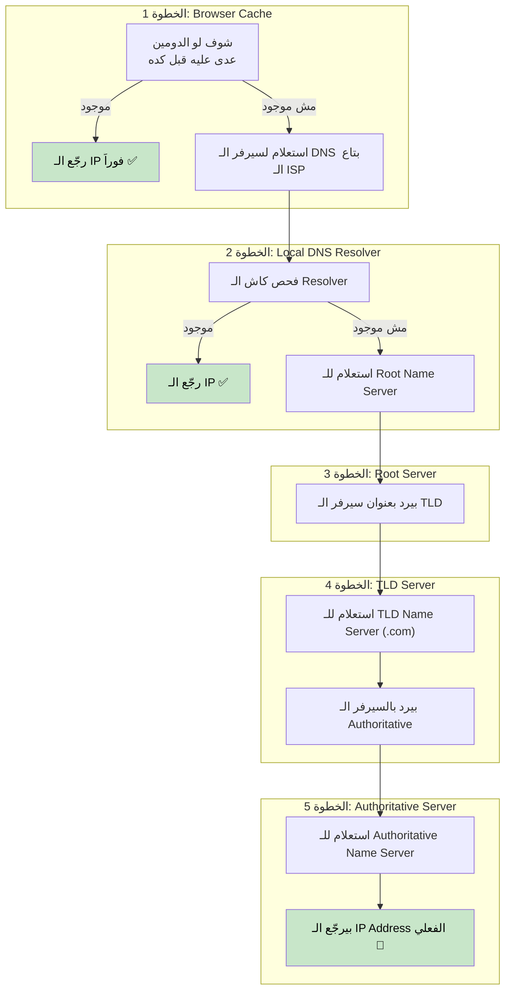

### التعامل مع الـ Subdomains

للـ Subdomains زي `api.iqraa.com` أو `www.iqraa.com`، ممكن نحتاج **خطوة إضافية**:

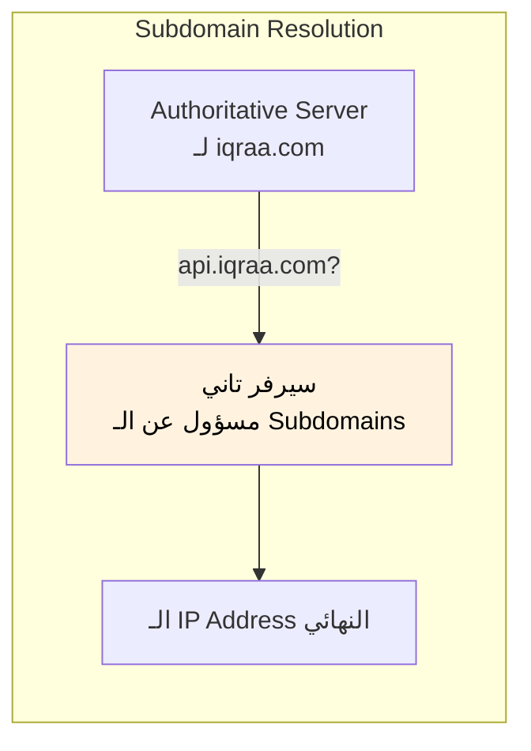

---

## الجزء الرابع: مشكلة الأداء

### خطوات كتير جداً!

زي ما شوفنا، الـ DNS Resolution فيه **خطوات كتير**. لو كل طلب هيعدي على كل الخطوات دي:

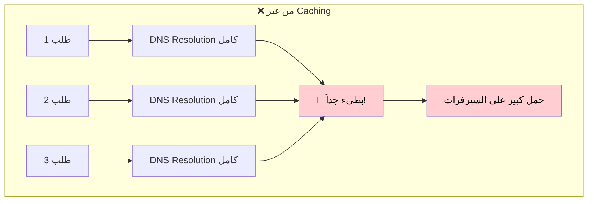

| المشكلة | التأثير |
|---------|---------|
| **التأخير** | كل صفحة بتحمل ببطء |
| **حمل السيرفرات** | السيرفرات بتتعب |
| **التكلفة** | محتاجين بنية تحتية أكبر |

### الحل: Caching

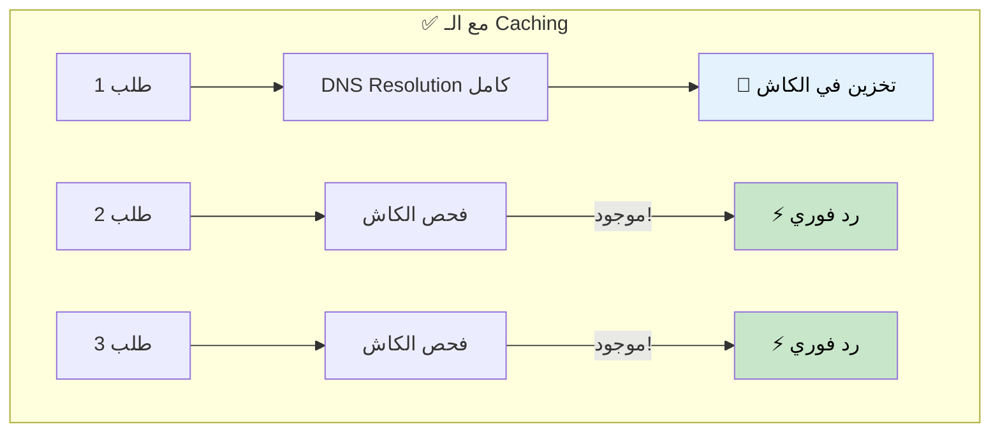

### طبقات الكاش المتعددة

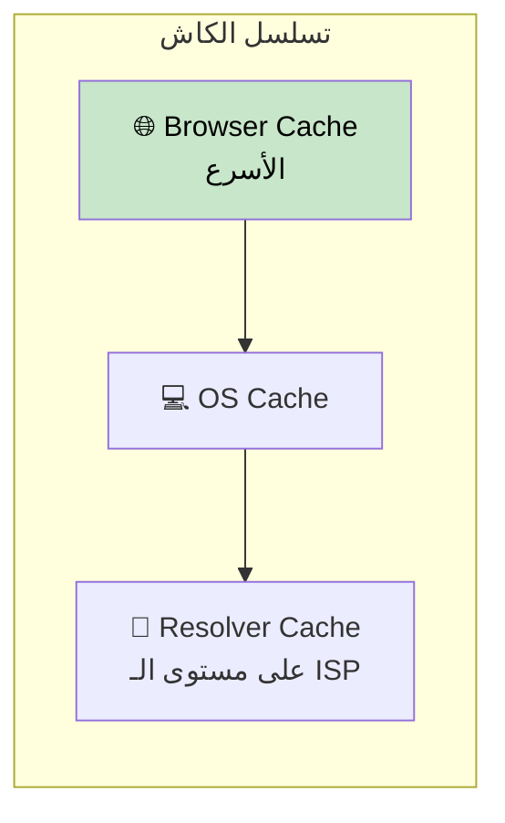

| مستوى الكاش | السرعة | النطاق |
|-------------|--------|--------|
| **البراوزر** | ⚡ الأسرع | لكل براوزر |
| **نظام التشغيل** | ⚡ سريع جداً | لكل جهاز |
| **الـ Resolver** | 🚀 سريع | لكل منطقة ISP |

---

## الجزء الخامس: TTL - Time To Live

### مأزق الـ Caching

الـ Caching حلو، بس ماذا لو الـ IP Address **اتغير**؟

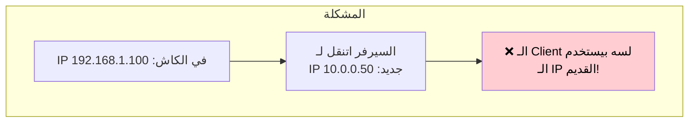

### يعني إيه TTL؟

كل DNS Record له **TTL (Time To Live)** - رقم بيقول لنا قد إيه النتيجة دي صالحة قبل ما نعتبرها قديمة.

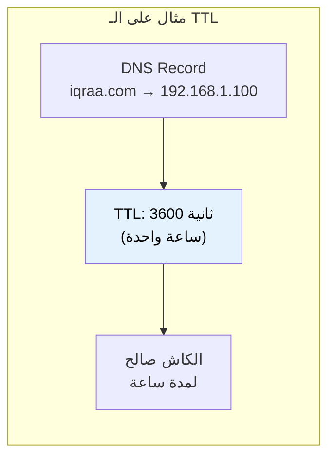

### مقايضات الـ TTL

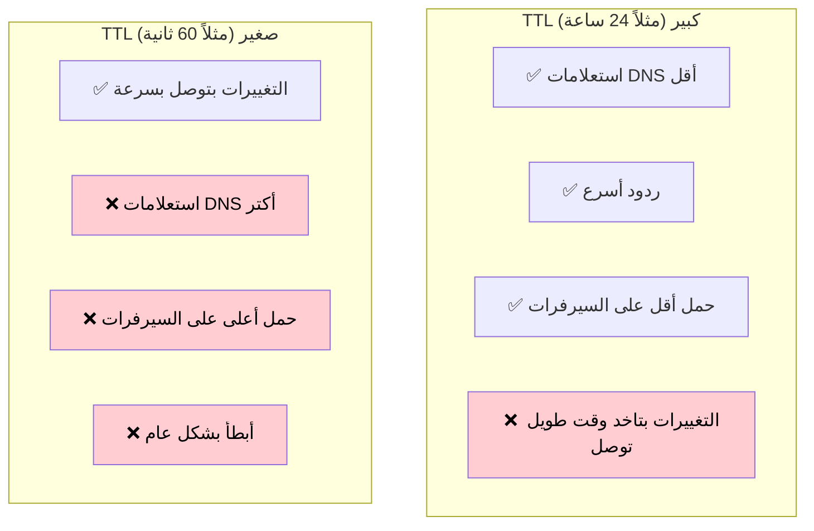

| حجم الـ TTL | المميزات | العيوب | الأفضل لـ |
|------------|----------|--------|-----------|
| **كبير** (ساعات/أيام) | سريع، حمل قليل | تحديثات بطيئة | الخدمات الثابتة |
| **صغير** (ثواني/دقائق) | تحديثات سريعة | حمل أكتر | الخدمات الديناميكية |

### اختيار الـ TTL المناسب

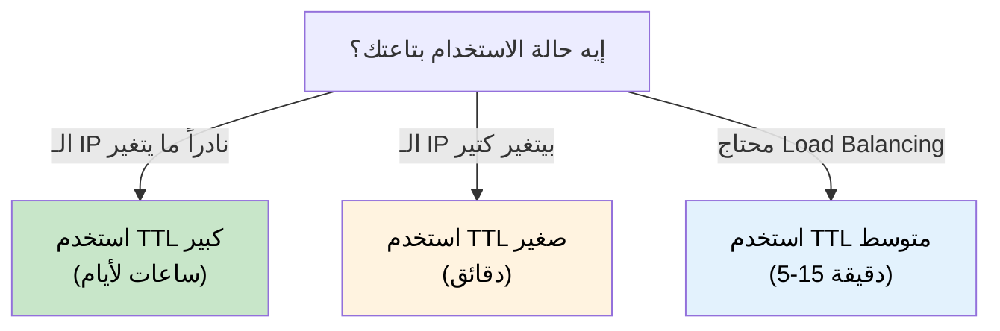

---

## الجزء السادس: DNS Failover والـ Static Stability

### ماذا لو سيرفر الـ DNS وقع؟

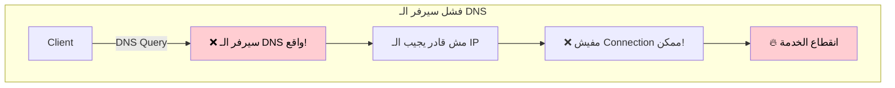

### الحل: Static Stability

مبدأ قوي اسمه **Static Stability** معناه إن النظام بيفضل شغال حتى لو أجزاء بيعتمد عليها وقعت.

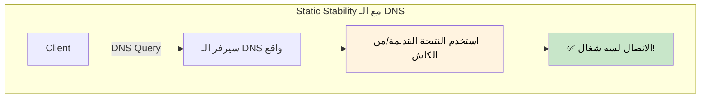

### ليه البيانات القديمة أحسن من مفيش بيانات

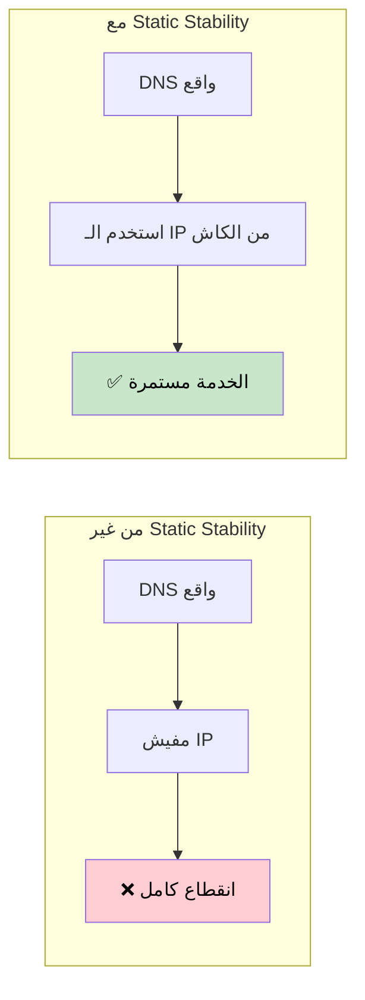

| المقاربة | لما الـ DNS يفشل |
|----------|------------------|
| **من غير Static Stability** | انقطاع كامل للخدمة |
| **مع Static Stability** | الخدمة تستمر بالبيانات المخزنة |

> **الفكرة المهمة:** طالما الـ IP Addresses نادراً ما بتتغير، الأحسن نرجّع نتيجة قديمة شوية بدل ما نرجّع لا حاجة خالص!

---

## الجزء السابع: استراتيجيات DNS Failover

### سيرفرات DNS متعددة

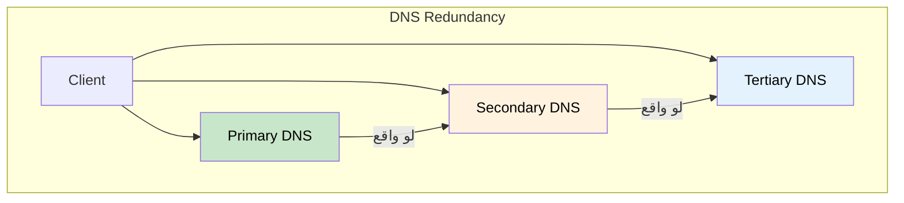

### توزيع الحمل بالـ DNS

الـ DNS ممكن يرجّع **IP Addresses متعددة** لنفس الدومين:

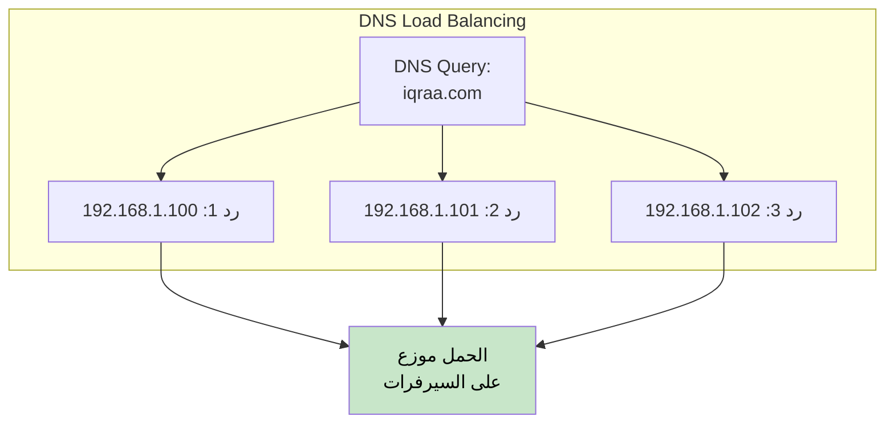

---

## الخلاصة

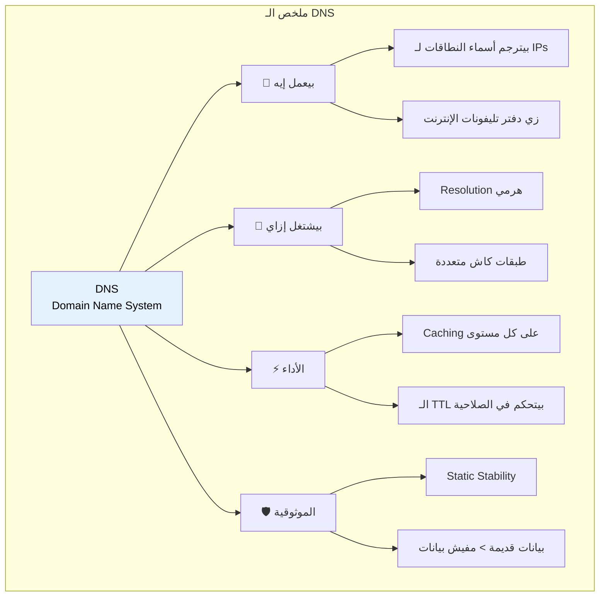

## جدول المراجعة السريعة

| الموضوع | النقاط الأساسية |
|---------|------------------|
| **DNS** | نظام أسماء النطاقات - بيترجم الأسماء لـ IPs |
| **مسار الـ Resolution** | Browser → OS → Resolver → Root → TLD → Authoritative |
| **الـ Caching** | طبقات متعددة (البراوزر، النظام، الـ Resolver) |
| **الـ TTL** | Time To Live - مدة صلاحية الكاش |
| **TTL كبير** | حمل أقل، تحديثات أبطأ |
| **TTL صغير** | تحديثات سريعة، حمل أكتر |
| **Static Stability** | استمر في العمل بالبيانات القديمة لما الـ DNS يفشل |
| **أفضل ممارسة** | بيانات قديمة أحسن من مفيش بيانات |

## مخطط الـ DNS Resolution

```mermaid
flowchart TB
    START["المستخدم يدخل الدومين"] --> BC{"كاش<br/>البراوزر؟"}
    BC -->|"موجود"| DONE["✅ استخدم الـ IP من الكاش"]
    BC -->|"مش موجود"| OSC{"كاش<br/>النظام؟"}

    OSC -->|"موجود"| DONE
    OSC -->|"مش موجود"| RC{"كاش<br/>الـ Resolver؟"}

    RC -->|"موجود"| DONE
    RC -->|"مش موجود"| ROOT["استعلام للـ Root Server"]

    ROOT --> TLD["استعلام للـ TLD Server"]
    TLD --> AUTH["استعلام للـ Authoritative Server"]
    AUTH --> IP["الحصول على الـ IP Address"]
    IP --> CACHE["تخزين في كل مستويات الكاش"]
    CACHE --> DONE

    style DONE fill:#c8e6c9,color:#000
    style CACHE fill:#e3f2fd,color:#000
```
