# DNS - A Detailed Guide to Domain Name System

## Introduction

In this section, we'll cover:
- What is DNS and why do we need it
- How DNS Resolution works step by step
- The hierarchy of DNS servers
- Caching and performance optimization
- TTL (Time To Live) trade-offs
- DNS Failover and Static Stability

---

## Part 1: What is DNS?

### The Problem: Finding IP Addresses

We've learned how to create communication channels between applications through the network. But before we can open any new connection, we need to know the **IP address** of the target.

```mermaid
graph LR
    subgraph "The Problem"
        USER["User wants to visit<br/>iqraa.com"] --> QUESTION["But what's the<br/>IP address? 🤔"]
    end

    style QUESTION fill:#fff3e0,color:#000
```

### The Solution: DNS

The most common way to discover IP addresses is through the **Domain Name System (DNS)** - often called the **"Phone Book of the Internet"**.


| Concept | Analogy |
|---------|---------|
| **Domain Name** | Person's name in phone book |
| **IP Address** | Phone number |
| **DNS Server** | The phone book itself |
| **DNS Query** | Looking up a name |

---

## Part 2: DNS Resolution Process

### Overview

When you type a URL like `iqraa.com` in your browser, a complex process called **DNS Resolution** happens behind the scenes.


### The Key Players

```mermaid
graph TB
    subgraph "DNS Hierarchy"
        BROWSER["🌐 Browser Cache"]
        OS["💻 OS Cache"]
        RESOLVER["🏢 Local DNS Resolver<br/>(ISP)"]
        ROOT["🌍 Root Name Server"]
        TLD["📁 TLD Name Server<br/>(.com, .net, .org)"]
        AUTH["🎯 Authoritative Name Server"]
    end

    BROWSER --> OS --> RESOLVER --> ROOT --> TLD --> AUTH

    style ROOT fill:#fff9c4,color:#000
    style TLD fill:#ffe0b2,color:#000
    style AUTH fill:#c8e6c9,color:#000
```

| Server | Role |
|--------|------|
| **Browser Cache** | First check - recent lookups |
| **OS Cache** | Second check - system-level cache |
| **Local DNS Resolver** | ISP's DNS server, does the heavy lifting |
| **Root Name Server** | Knows where TLD servers are |
| **TLD Name Server** | Knows authoritative servers for domains |
| **Authoritative Name Server** | Has the actual IP address |

---

## Part 3: Step-by-Step DNS Resolution

### The Complete Journey

```mermaid
sequenceDiagram
    participant B as Browser
    participant R as Local DNS Resolver<br/>(ISP)
    participant ROOT as Root Name Server
    participant TLD as TLD Name Server<br/>(.com)
    participant AUTH as Authoritative<br/>Name Server

    Note over B: User types iqraa.com

    B->>B: Check browser cache
    alt Found in cache
        B-->>B: Return cached IP ✅
    else Not in cache
        B->>R: Query: iqraa.com?
    end

    R->>R: Check resolver cache
    alt Found in cache
        R-->>B: Return cached IP ✅
    else Not in cache
        R->>ROOT: Query: iqraa.com?
    end

    ROOT-->>R: Go ask .com TLD server

    R->>TLD: Query: iqraa.com?
    TLD-->>R: Go ask iqraa.com's authoritative server

    R->>AUTH: Query: iqraa.com?
    AUTH-->>R: IP is 192.168.1.100 ✅

    R-->>B: IP is 192.168.1.100
    Note over B: Now can connect!
```

### Step-by-Step Breakdown

```mermaid
graph TB
    subgraph "Step 1: Browser Cache"
        S1["Check if domain<br/>was visited before"]
        S1 -->|"Found"| S1Y["Return IP immediately ✅"]
        S1 -->|"Not Found"| S2
    end

    subgraph "Step 2: Local DNS Resolver"
        S2["Query ISP's DNS server"]
        S2 --> S2C["Check resolver cache"]
        S2C -->|"Found"| S2Y["Return IP ✅"]
        S2C -->|"Not Found"| S3
    end

    subgraph "Step 3: Root Server"
        S3["Query Root Name Server"]
        S3 --> S3R["Responds with TLD server address"]
    end

    subgraph "Step 4: TLD Server"
        S3R --> S4["Query TLD Name Server (.com)"]
        S4 --> S4R["Responds with Authoritative server"]
    end

    subgraph "Step 5: Authoritative Server"
        S4R --> S5["Query Authoritative Name Server"]
        S5 --> S5R["Returns actual IP address 🎯"]
    end

    style S1Y fill:#c8e6c9,color:#000
    style S2Y fill:#c8e6c9,color:#000
    style S5R fill:#c8e6c9,color:#000
```

### Handling Subdomains

For subdomains like `api.iqraa.com` or `www.iqraa.com`, an **extra step** may be needed:


---

## Part 4: The Performance Problem

### Too Many Steps!

As we've seen, DNS resolution involves **many steps**. If every single request goes through all of them:

```mermaid
graph TB
    subgraph "❌ Without Caching"
        R1["Request 1"] --> ALL1["Full DNS Resolution"]
        R2["Request 2"] --> ALL2["Full DNS Resolution"]
        R3["Request 3"] --> ALL3["Full DNS Resolution"]

        ALL1 --> SLOW["🐢 Very Slow!"]
        ALL2 --> SLOW
        ALL3 --> SLOW

        SLOW --> LOAD["Heavy load on servers"]
    end

    style SLOW fill:#ffcdd2,color:#000
    style LOAD fill:#ffcdd2,color:#000
```

| Problem | Impact |
|---------|--------|
| **Latency** | Every page load is slow |
| **Server Load** | DNS servers get overwhelmed |
| **Cost** | More infrastructure needed |

### The Solution: Caching

```mermaid
graph TB
    subgraph "✅ With Caching"
        R1["Request 1"] --> FULL["Full DNS Resolution"]
        FULL --> CACHE["💾 Store in Cache"]

        R2["Request 2"] --> CHECK["Check Cache"]
        CHECK -->|"Hit!"| FAST["⚡ Instant Response"]

        R3["Request 3"] --> CHECK2["Check Cache"]
        CHECK2 -->|"Hit!"| FAST2["⚡ Instant Response"]
    end

    style FAST fill:#c8e6c9,color:#000
    style FAST2 fill:#c8e6c9,color:#000
    style CACHE fill:#e3f2fd,color:#000
```

### Multiple Cache Layers

```mermaid
graph LR
    subgraph "Cache Hierarchy"
        B["🌐 Browser Cache<br/>Fastest"] --> OS["💻 OS Cache"] --> R["🏢 Resolver Cache<br/>ISP Level"]
    end

    style B fill:#c8e6c9,color:#000
```

| Cache Level | Speed | Scope |
|-------------|-------|-------|
| **Browser** | ⚡ Fastest | Per browser |
| **OS** | ⚡ Very fast | Per device |
| **Resolver** | 🚀 Fast | Per ISP region |

---

## Part 5: TTL - Time To Live

### The Caching Dilemma

Caching is great, but what if the IP address **changes**?

```mermaid
graph TB
    subgraph "The Problem"
        OLD["Cached IP: 192.168.1.100"] --> CHANGE["Server moves to<br/>new IP: 10.0.0.50"]
        CHANGE --> FAIL["❌ Client still uses<br/>old cached IP!"]
    end

    style FAIL fill:#ffcdd2,color:#000
```

### What is TTL?

Every DNS record has a **TTL (Time To Live)** - a number that says how long the result is valid before it's considered stale.

```mermaid
graph LR
    subgraph "TTL Example"
        RECORD["DNS Record<br/>iqraa.com → 192.168.1.100"]
        RECORD --> TTL["TTL: 3600 seconds<br/>(1 hour)"]
        TTL --> MEANING["Cache is valid<br/>for 1 hour"]
    end

    style TTL fill:#e3f2fd,color:#000
```

### TTL Trade-offs

```mermaid
graph TB
    subgraph "Large TTL (e.g., 24 hours)"
        L1["✅ Less DNS queries"]
        L2["✅ Faster responses"]
        L3["✅ Lower server load"]
        L4["❌ Changes take long to propagate"]
    end

    subgraph "Small TTL (e.g., 60 seconds)"
        S1["✅ Changes propagate quickly"]
        S2["❌ More DNS queries"]
        S3["❌ Higher server load"]
        S4["❌ Slower overall"]
    end

    style L4 fill:#ffcdd2,color:#000
    style S2 fill:#ffcdd2,color:#000
    style S3 fill:#ffcdd2,color:#000
    style S4 fill:#ffcdd2,color:#000
```

| TTL Size | Pros | Cons | Best For |
|----------|------|------|----------|
| **Large** (hours/days) | Fast, low load | Slow updates | Static services |
| **Small** (seconds/minutes) | Quick updates | More load | Dynamic services |

### Choosing the Right TTL


---

## Part 6: DNS Failover & Static Stability

### What If DNS Server Goes Down?


### The Solution: Static Stability

A powerful concept called **Static Stability** means the system keeps working even when parts it depends on fail.

```mermaid
graph TB
    subgraph "Static Stability with DNS"
        CLIENT["Client"] -->|"DNS Query"| DOWN["DNS Server Down"]
        DOWN --> STALE["Use stale/cached result"]
        STALE --> WORKS["✅ Connection still works!"]
    end

    style STALE fill:#fff3e0,color:#000
    style WORKS fill:#c8e6c9,color:#000
```

### Why Stale Data is Better Than No Data

```mermaid
graph LR
    subgraph "Without Static Stability"
        NO1["DNS down"] --> NO2["No IP"] --> NO3["❌ Complete outage"]
    end

    subgraph "With Static Stability"
        YES1["DNS down"] --> YES2["Use cached IP"] --> YES3["✅ Service continues"]
    end

    style NO3 fill:#ffcdd2,color:#000
    style YES3 fill:#c8e6c9,color:#000
```

| Approach | When DNS Fails |
|----------|----------------|
| **No Static Stability** | Complete service outage |
| **With Static Stability** | Service continues with cached data |

> **Key Insight:** Since IP addresses rarely change, it's better to return a slightly stale result than no result at all!

---

## Part 7: DNS Failover Strategies

### Multiple DNS Servers


### DNS-Based Load Balancing

DNS can return **multiple IP addresses** for the same domain:


---

## Summary

```mermaid
graph TB
    subgraph "DNS Summary"
        DNS["DNS<br/>Domain Name System"]

        DNS --> WHAT["📖 What it does"]
        WHAT --> W1["Translates domain names to IPs"]
        WHAT --> W2["Like phone book of internet"]

        DNS --> HOW["🔄 How it works"]
        HOW --> H1["Hierarchical resolution"]
        HOW --> H2["Multiple cache layers"]

        DNS --> PERF["⚡ Performance"]
        PERF --> P1["Caching at every level"]
        PERF --> P2["TTL controls freshness"]

        DNS --> RELIABLE["🛡️ Reliability"]
        RELIABLE --> R1["Static Stability"]
        RELIABLE --> R2["Stale > No Data"]
    end

    style DNS fill:#e3f2fd,color:#000
```

## Quick Reference Table

| Topic | Key Points |
|-------|------------|
| **DNS** | Domain Name System - translates names to IPs |
| **Resolution Path** | Browser → OS → Resolver → Root → TLD → Authoritative |
| **Caching** | Multiple levels (Browser, OS, Resolver) |
| **TTL** | Time To Live - how long cache is valid |
| **Large TTL** | Less load, slower updates |
| **Small TTL** | Quick updates, more load |
| **Static Stability** | Keep working with stale data when DNS fails |
| **Best Practice** | Stale data is better than no data |

## DNS Resolution Flowchart

```mermaid
flowchart TB
    START["User enters domain"] --> BC{"Browser<br/>Cache?"}
    BC -->|"Hit"| DONE["✅ Use cached IP"]
    BC -->|"Miss"| OSC{"OS<br/>Cache?"}

    OSC -->|"Hit"| DONE
    OSC -->|"Miss"| RC{"Resolver<br/>Cache?"}

    RC -->|"Hit"| DONE
    RC -->|"Miss"| ROOT["Query Root Server"]

    ROOT --> TLD["Query TLD Server"]
    TLD --> AUTH["Query Authoritative Server"]
    AUTH --> IP["Get IP Address"]
    IP --> CACHE["Cache at all levels"]
    CACHE --> DONE

    style DONE fill:#c8e6c9,color:#000
    style CACHE fill:#e3f2fd,color:#000
```
