# APIs - شرح تفصيلي لواجهات برمجة التطبيقات

## المقدمة

في الجزء ده هنتكلم عن:
- يعني إيه API وليه محتاجينه
- الفرق بين التواصل المباشر وغير المباشر
- الـ Request-Response Model
- فورمات البيانات (JSON vs Protocol Buffers)
- الفرق بين الـ Synchronous والـ Asynchronous
- التقنيات الشهيرة: HTTP, gRPC, و REST

---

## الجزء الأول: يعني إيه API؟

### المشكلة: إزاي التطبيقات تتواصل؟

بعد ما عرفنا إزاي نكتشف الـ IP Address بتاع السيرفر ونعمل معاه Connection، الكلاينت محتاج **ينفذ العمليات** اللي السيرفر بيقدمها. بس إزاي؟

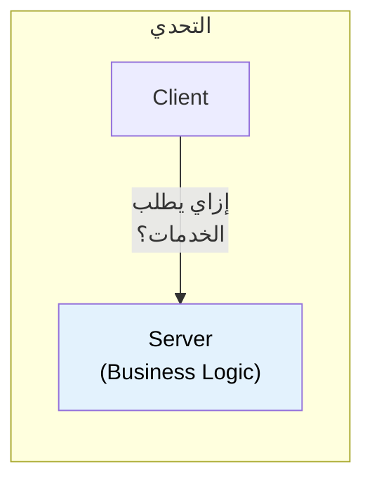

### الحل: API

السيرفر بيستخدم Adapter اسمه **API (Application Programming Interface)** بيترجم الرسايل الجاية لعمليات بيزنس فعلية.

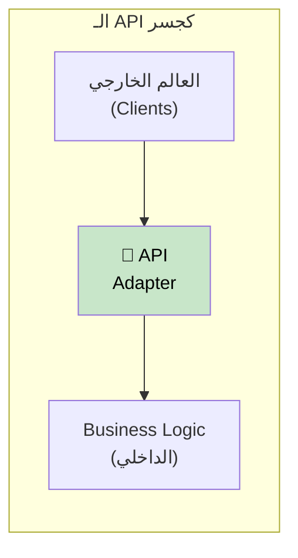

### تشبيه المطعم 🍽️

فكر في الـ API زي **الجرسون في المطعم**:

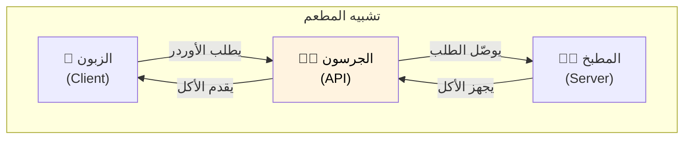

| المطعم | السوفتوير |
|--------|-----------|
| الزبون | تطبيق الـ Client |
| الجرسون | الـ API |
| المطبخ | السيرفر (البيزنس لوجيك) |
| المنيو | توثيق الـ API |
| الطلب | الـ Request |
| الأكل | الـ Response |

### ليه منتكلمش مع السيرفر مباشرة؟

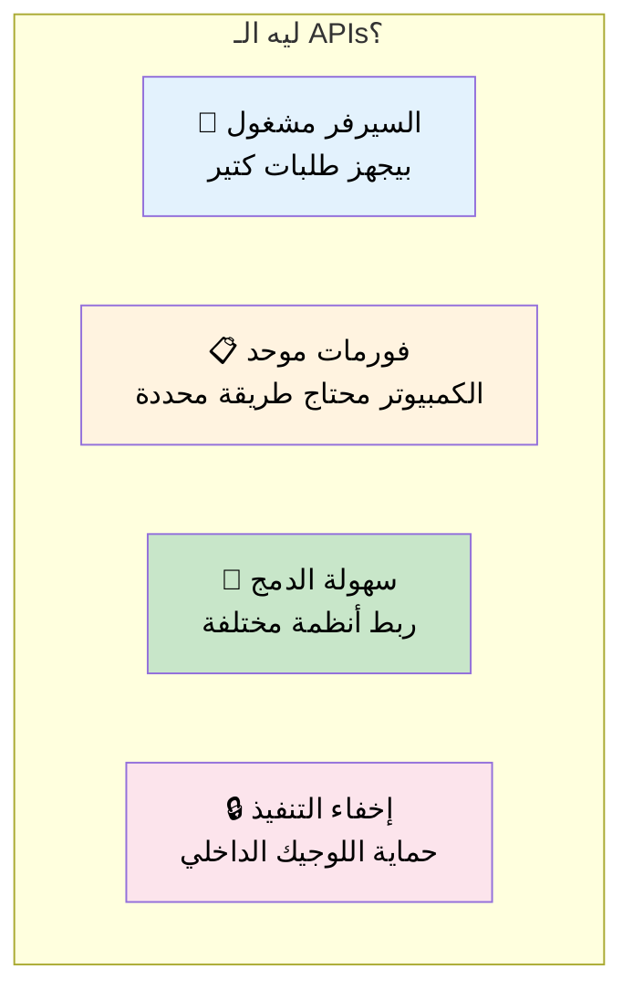

| السبب | التوضيح |
|-------|---------|
| **السيرفر مشغول** | مش قادر يتعامل مع طلبات خام وهو بيشتغل |
| **تواصل موحد** | الكل بيتكلم نفس "اللغة" |
| **سهولة الدمج** | نربط أنظمة من غير ما نبنيها تاني |
| **إخفاء التنفيذ** | نحمي "الوصفة السرية" |

### مثال واقعي: ChatGPT API

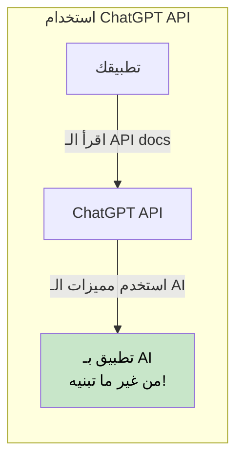

> تقدر تستفيد من كل مميزات نظام زي ChatGPT **من غير ما تبنيه من الصفر** - بس اقرأ توثيق الـ API!

---

## الجزء التاني: أنماط التواصل

### نوعين من التواصل

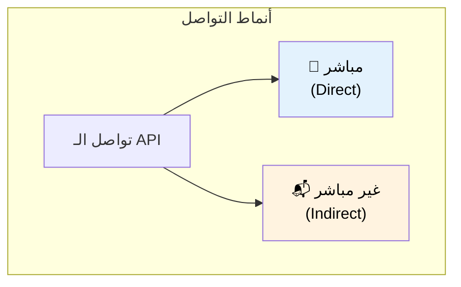

### التواصل المباشر (Direct)

في **التواصل المباشر**، الكلاينت بيكلم السيرفر مباشرة. لازم الاتنين يكونوا **شغالين في نفس الوقت**.

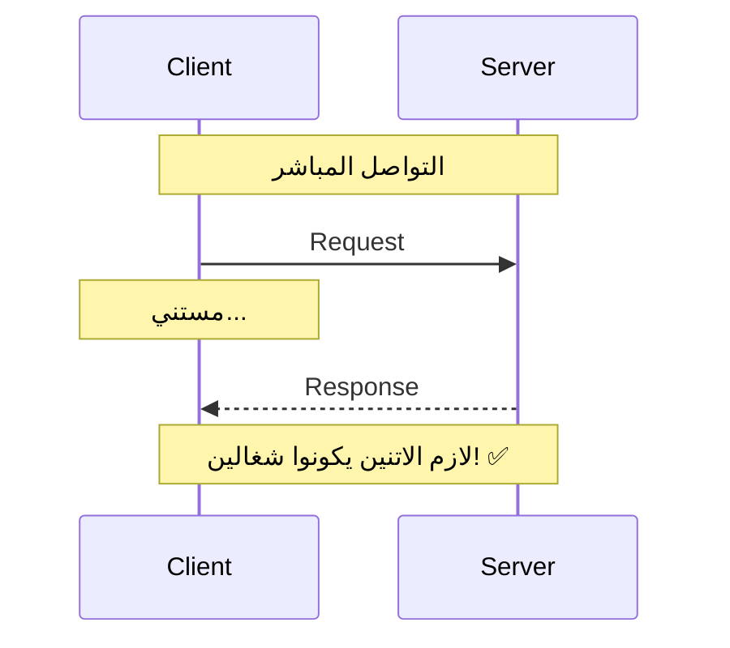

| المميزات | العيوب |
|----------|--------|
| ✅ رد فوري | ❌ لازم الاتنين يكونوا أونلاين |
| ✅ سهل الفهم | ❌ الكلاينت واقف ومستني |
| ✅ تفاعل في الوقت الحقيقي | ❌ مشاكل الشبكة = فشل |

### التواصل غير المباشر (Indirect)

في **التواصل غير المباشر**، بنستخدم **وسيط** (Queue أو Channel). السيرفر ممكن يعالج الرسايل **لما يكون جاهز**.

```mermaid
sequenceDiagram
    participant C as Client
    participant Q as Queue/Channel
    participant S as Server

    Note over C,Q,S: التواصل غير المباشر

    C->>Q: ابعت رسالة
    Note over C: كمّل شغلك! ✅

    Note over Q: الرسالة متخزنة

    S->>Q: هات الرسالة (لما يكون جاهز)
    Q-->>S: وصّل الرسالة
    S->>S: عالج
```

| المميزات | العيوب |
|----------|--------|
| ✅ الكلاينت مش بيستنى | ❌ إعداد أكثر تعقيداً |
| ✅ السيرفر يشتغل لما يكون جاهز | ❌ مفيش رد فوري |
| ✅ بيتحمل حمل عالي | ❌ محتاج بنية Queue |

### مثال: إشعارات الإيميل

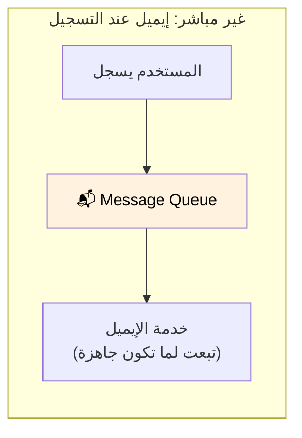

> النمط ده اسمه **Pub/Sub Model** - هنغطيه بالتفصيل بعدين!

---

## الجزء التالت: الـ Request-Response Model

### النمط الأكثر شيوعاً

الـ **Request-Response Model** هو أكتر شكل شائع للتواصل المباشر.

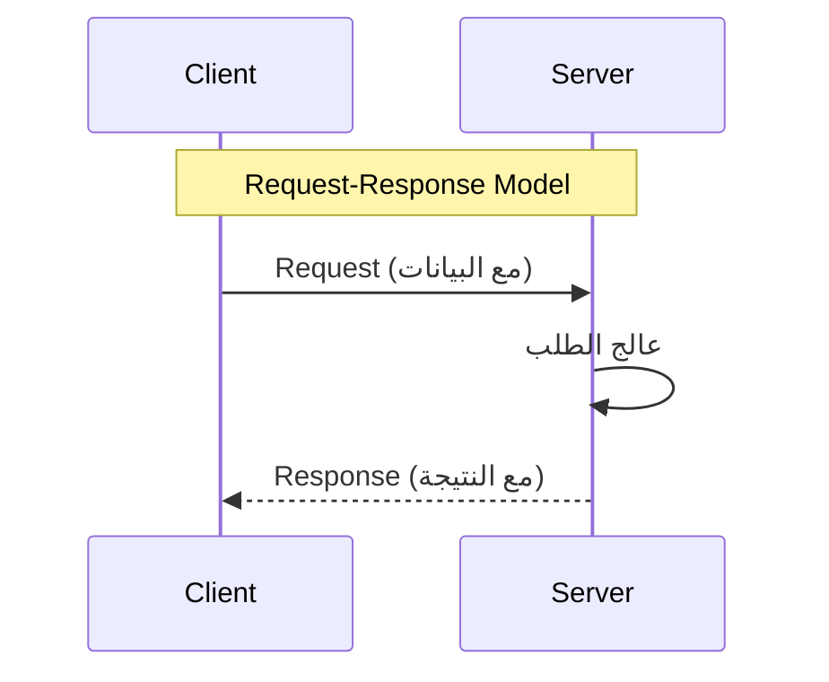

### زي استدعاء فانكشن... بس عبر الشبكة!

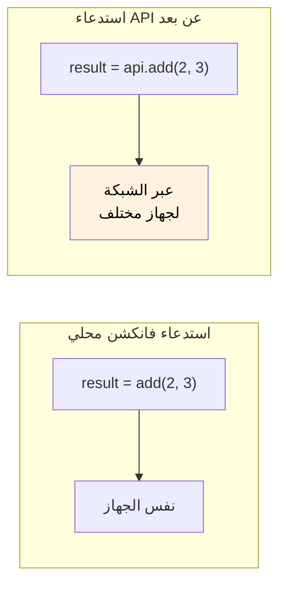

| فانكشن محلي | استدعاء API |
|-------------|-------------|
| نفس الـ Process | Processes مختلفة |
| نفس الجهاز | أجهزة مختلفة |
| فوري | فيه تأخير شبكة |
| دايماً بيشتغل | ممكن يفشل (مشاكل شبكة) |

---

## الجزء الرابع: فورمات البيانات

### ليه فورمات البيانات مهم؟

الـ Request بيحتوي على **بيانات** لازم تتبعت بفورمات الطرفين يفهموه، **بغض النظر عن لغة البرمجة**.

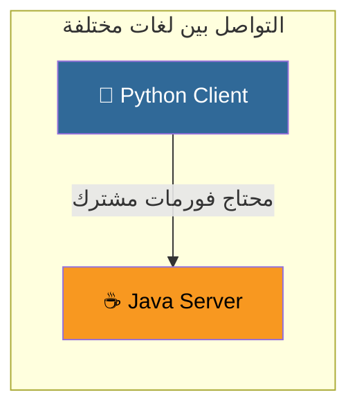

### تلات عوامل أساسية

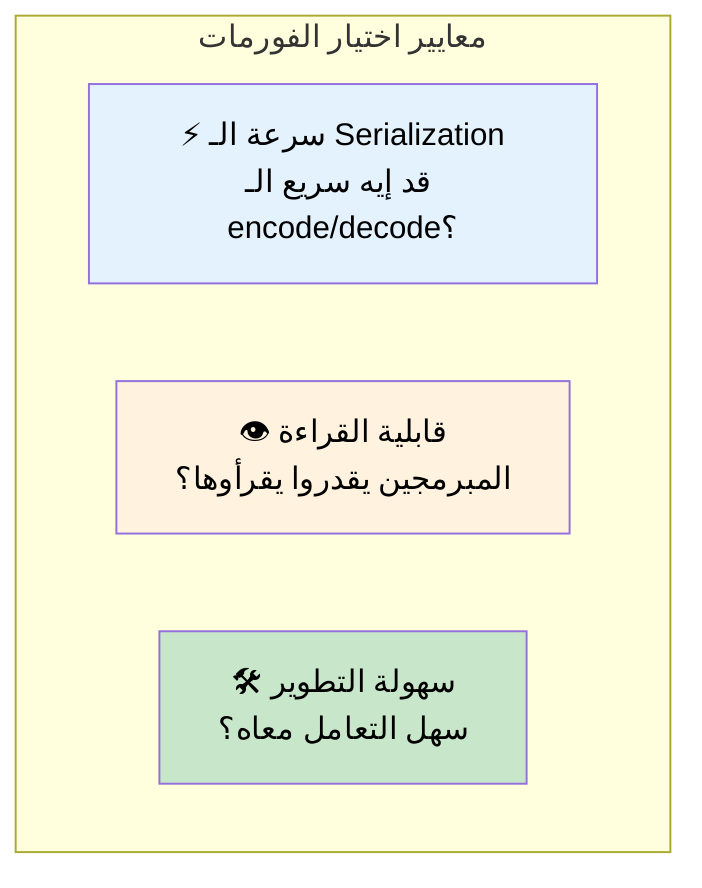

### JSON (JavaScript Object Notation)

```json
{
  "name": "أحمد",
  "age": 25,
  "skills": ["Python", "Java", "Go"]
}
```

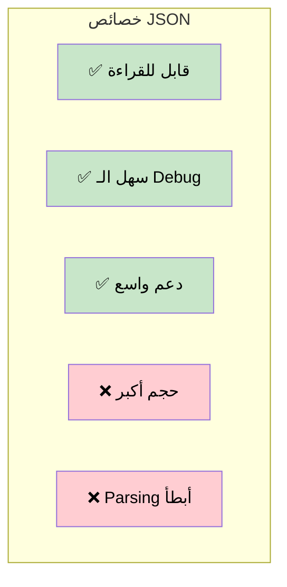

### Protocol Buffers (Protobuf)

```
Binary data: 0x0A 0x05 0x41 0x68 0x6D 0x65 0x64...
```

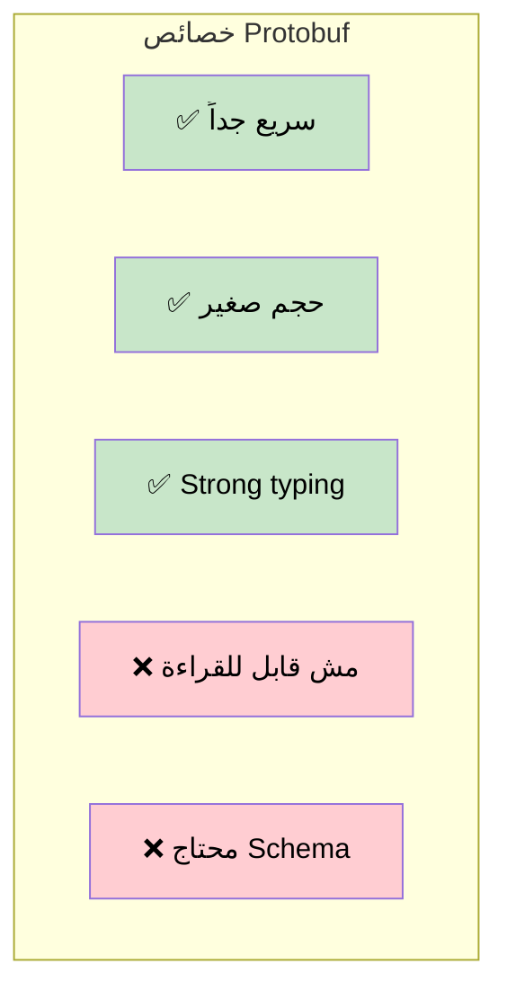

### جدول المقارنة

| الخاصية | JSON | Protocol Buffers |
|---------|------|------------------|
| **القراءة** | 👁️ قابل للقراءة | ❌ Binary |
| **الحجم** | 📦 أكبر | 📦 مضغوط |
| **السرعة** | 🐢 أبطأ | 🚀 أسرع بكتير |
| **الـ Schema** | ❌ اختياري | ✅ مطلوب |
| **الأفضل لـ** | Public APIs, الويب | الخدمات الداخلية |

---

## الجزء الخامس: Sync vs Async

### التواصل المتزامن (Synchronous)

في الوضع **المتزامن**، الكلاينت **بيستنى** الرد قبل ما يكمل.

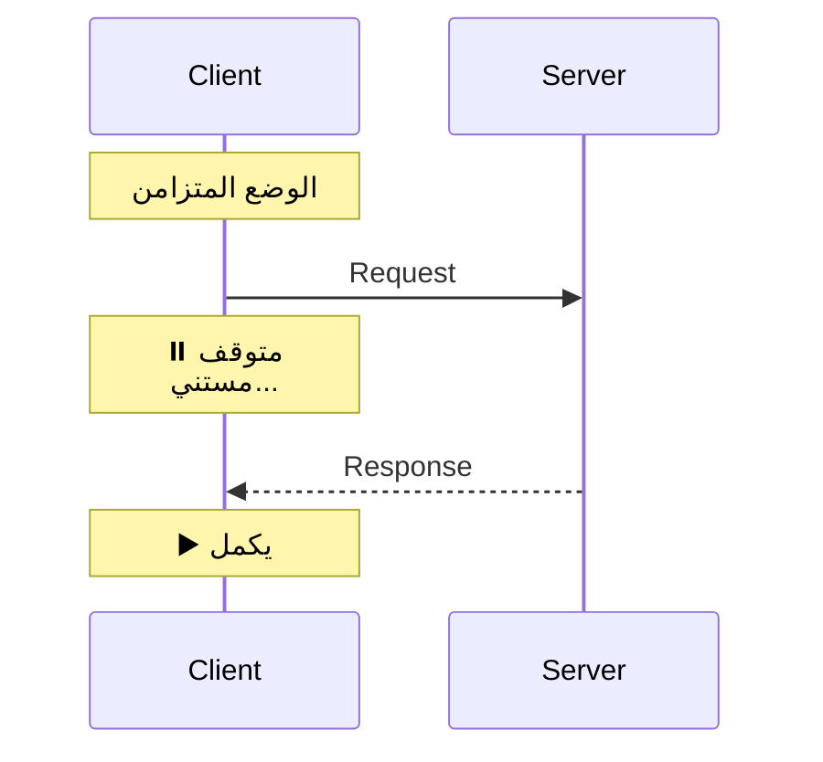

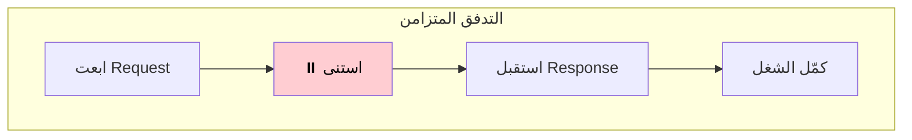

### التواصل غير المتزامن (Asynchronous)

في الوضع **غير المتزامن**، الكلاينت **بيكمل شغله** ويتعامل مع الرد بعدين عن طريق Callback.

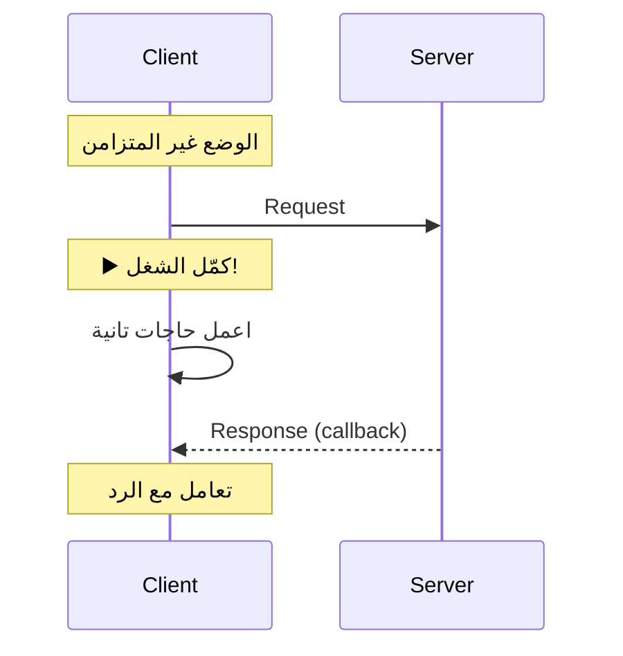

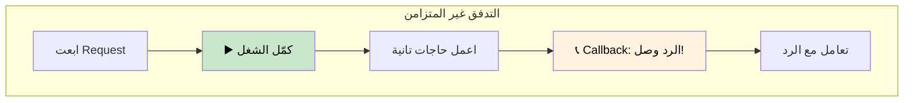

### دعم اللغات الحديثة

لغات زي **C#** و**JavaScript** و**Go** بتخلي الكود الـ Async يبان زي الـ Sync باستخدام `async/await`:

```javascript
// يبان متزامن، بس بيشتغل async!
const result = await api.fetchData();
console.log(result);
```

| اللغة | ميزة الـ Async |
|-------|---------------|
| JavaScript | `async/await`, Promises |
| C# | `async/await`, Task |
| Go | Goroutines, Channels |
| Python | `asyncio`, `await` |

---

## الجزء السادس: التقنيات الشهيرة

### نظرة عامة

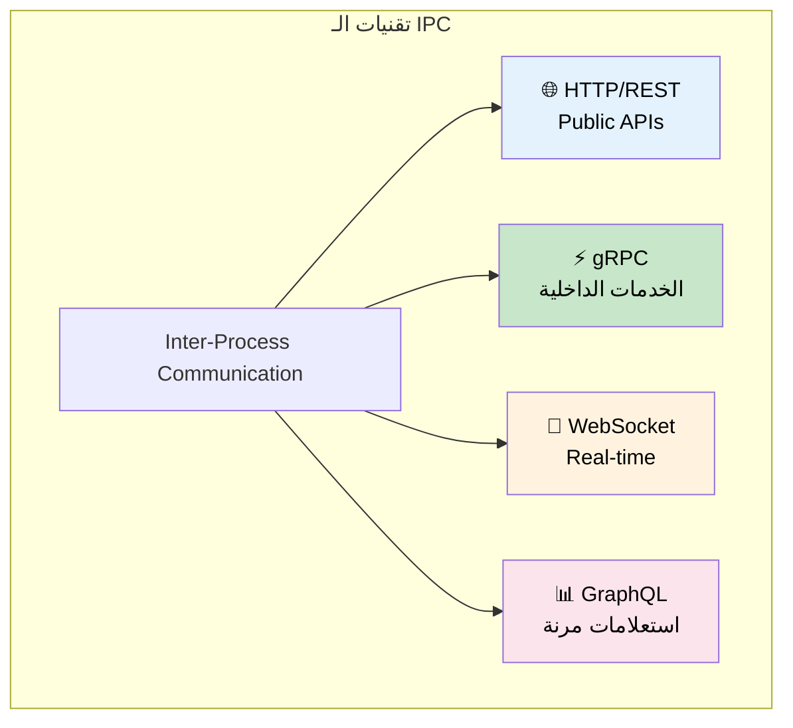

### HTTP (HyperText Transfer Protocol)

```mermaid
graph LR
    subgraph "استخدامات HTTP"
        WEB["🌐 المتصفحات"] --> HTTP["HTTP"]
        MOBILE["📱 تطبيقات الموبايل"] --> HTTP
        PUBLIC["🔓 Public APIs"] --> HTTP
    end

    style HTTP fill:#e3f2fd,color:#000
```

| المميزات | العيوب |
|----------|--------|
| ✅ بيشتغل في كل مكان | ❌ نصي (أبطأ) |
| ✅ سهل مع JavaScript | ❌ Overhead أكتر |
| ✅ مفهوم على نطاق واسع | ❌ مش مثالي للداخلي |

### gRPC (Google Remote Procedure Call)

```mermaid
graph LR
    subgraph "استخدامات gRPC"
        S1["Server 1"] --> GRPC["gRPC"]
        GRPC --> S2["Server 2"]
        S2 --> GRPC
        GRPC --> S3["Server 3"]
    end

    style GRPC fill:#c8e6c9,color:#000
```

| المميزات | العيوب |
|----------|--------|
| ✅ سريع جداً | ❌ مش صديق للمتصفح |
| ✅ Binary (Protocol Buffers) | ❌ محتاج أدوات خاصة |
| ✅ Bi-directional streaming | ❌ منحنى تعلم أصعب |

### إمتى نستخدم إيه؟

```mermaid
graph TB
    START["إيه حالة الاستخدام بتاعتك؟"]

    START -->|"Public API<br/>Web/Mobile"| HTTP["استخدم HTTP/REST"]
    START -->|"خدمات داخلية<br/>أداء عالي"| GRPC["استخدم gRPC"]
    START -->|"تحديثات Real-time<br/>شات، ألعاب"| WS["استخدم WebSocket"]
    START -->|"استعلامات مرنة<br/>بيانات معقدة"| GQL["استخدم GraphQL"]

    style HTTP fill:#e3f2fd,color:#000
    style GRPC fill:#c8e6c9,color:#000
    style WS fill:#fff3e0,color:#000
    style GQL fill:#fce4ec,color:#000
```

---

## الجزء السابع: REST - REpresentational State Transfer

### يعني إيه REST؟

**REST** هو مجموعة من **مبادئ التصميم** اللي بتخلي الـ APIs بسيطة وموحدة.

```mermaid
graph TB
    subgraph "مبادئ REST"
        REST["REST API"]
        REST --> P1["📦 Stateless"]
        REST --> P2["💾 Cacheable"]
        REST --> P3["🔗 Uniform Interface"]
        REST --> P4["📂 Resource-Based"]
    end

    style REST fill:#e3f2fd,color:#000
```

### مبدأ الـ Stateless

كل Request لازم يحتوي على **كل المعلومات** اللي محتاجها عشان يتنفذ. السيرفر مش بيفتكر الـ Requests السابقة.

```mermaid
sequenceDiagram
    participant C as Client
    participant S as Server

    Note over C,S: Stateless: كل Request مستقل

    C->>S: Request 1 (مع كل البيانات)
    S-->>C: Response 1

    C->>S: Request 2 (مع كل البيانات)
    Note over S: مش فاكر Request 1!
    S-->>C: Response 2
```

### مبدأ الـ Cacheable

الـ Responses ممكن تتخزن في **Cache** للطلبات المتكررة/المتشابهة.

```mermaid
graph TB
    subgraph "الـ Caching في REST"
        R1["Request: GET /users/123"] --> CACHE{"Cache?"}
        CACHE -->|"موجود"| FAST["⚡ رجّع من الكاش"]
        CACHE -->|"مش موجود"| SERVER["اسأل السيرفر"]
        SERVER --> STORE["خزّن في الكاش"]
        STORE --> FAST
    end

    style FAST fill:#c8e6c9,color:#000
```

### HTTP Methods في REST

| الـ Method | العملية | مثال |
|------------|---------|------|
| **GET** | قراءة | `GET /users/123` |
| **POST** | إنشاء | `POST /users` |
| **PUT** | تحديث (كامل) | `PUT /users/123` |
| **PATCH** | تحديث (جزئي) | `PATCH /users/123` |
| **DELETE** | حذف | `DELETE /users/123` |

---

## الخلاصة

```mermaid
graph TB
    subgraph "ملخص الـ APIs"
        API["API<br/>Application Programming Interface"]

        API --> WHAT["🎯 بيعمل إيه"]
        WHAT --> W1["جسر بين الكلاينت والسيرفر"]
        WHAT --> W2["زي الجرسون في المطعم"]

        API --> STYLES["📡 أنماط التواصل"]
        STYLES --> ST1["مباشر (Request-Response)"]
        STYLES --> ST2["غير مباشر (Pub/Sub)"]

        API --> FORMAT["📄 فورمات البيانات"]
        FORMAT --> F1["JSON: قابل للقراءة، أكبر"]
        FORMAT --> F2["Protobuf: سريع، مضغوط"]

        API --> TECH["🛠️ التقنيات"]
        TECH --> T1["HTTP/REST: Public APIs"]
        TECH --> T2["gRPC: الخدمات الداخلية"]
    end

    style API fill:#e3f2fd,color:#000
```

## جدول المراجعة السريعة

| الموضوع | النقاط الأساسية |
|---------|------------------|
| **الـ API** | واجهة بين الكلاينت والسيرفر (زي الجرسون) |
| **التواصل المباشر** | الطرفين أونلاين، رد فوري |
| **التواصل غير المباشر** | عبر Queue، معالجة Async |
| **Request-Response** | النمط الأشهر، زي استدعاء فانكشن عبر الشبكة |
| **JSON** | قابل للقراءة، أكبر، أبطأ |
| **Protocol Buffers** | Binary، مضغوط، أسرع بكتير |
| **Synchronous** | الكلاينت يستنى الرد |
| **Asynchronous** | الكلاينت يكمل، Callback بعدين |
| **HTTP/REST** | Public APIs، صديق للويب |
| **gRPC** | الخدمات الداخلية، أداء عالي |
| **مبادئ REST** | Stateless، Cacheable، Uniform Interface |

## مخطط القرار

```mermaid
flowchart TB
    START["بتبني API؟"]

    START --> WHO{"مين هيستخدمه؟"}

    WHO -->|"مستخدمين عامة<br/>Web/Mobile"| REST["استخدم REST/HTTP<br/>مع JSON"]

    WHO -->|"خدمات داخلية"| PERF{"محتاج أداء<br/>عالي؟"}

    PERF -->|"أيوه"| GRPC["استخدم gRPC<br/>مع Protobuf"]
    PERF -->|"لأ"| REST

    REST --> CACHE{"الردود قابلة<br/>للـ Cache؟"}
    CACHE -->|"أيوه"| ADDCACHE["أضف طبقة Caching"]
    CACHE -->|"لأ"| DONE["✅ خلصنا"]
    ADDCACHE --> DONE

    GRPC --> STREAM{"محتاج<br/>Streaming؟"}
    STREAM -->|"أيوه"| BIDIR["استخدم Bidirectional<br/>Streaming"]
    STREAM -->|"لأ"| DONE

    BIDIR --> DONE

    style REST fill:#e3f2fd,color:#000
    style GRPC fill:#c8e6c9,color:#000
    style DONE fill:#c8e6c9,color:#000
```
