# APIs - A Detailed Guide to Application Programming Interfaces

## Introduction

In this section, we'll cover:
- What is an API and why do we need it
- Direct vs Indirect communication styles
- The Request-Response model
- Data formats (JSON vs Protocol Buffers)
- Synchronous vs Asynchronous communication
- Popular technologies: HTTP, gRPC, and REST

---

## Part 1: What is an API?

### The Problem: How Do Applications Communicate?

After discovering the server's IP address and establishing a connection, the client needs to **execute operations** that the server provides. But how?


### The Solution: API

The server uses an adapter called **API (Application Programming Interface)** that translates incoming messages into actual business operations.

```mermaid
graph LR
    subgraph "API as a Bridge"
        OUTSIDE["Outside World<br/>(Clients)"] --> API["🔌 API<br/>Adapter"]
        API --> BUSINESS["Business Logic<br/>(Internal)"]
    end

    style API fill:#c8e6c9,color:#000
```

### The Restaurant Analogy 🍽️

Think of an API like a **waiter in a restaurant**:

```mermaid
graph TB
    subgraph "Restaurant Analogy"
        CUSTOMER["👤 Customer<br/>(Client)"] -->|"Places order"| WAITER["🧑‍🍳 Waiter<br/>(API)"]
        WAITER -->|"Delivers order"| KITCHEN["👨‍🍳 Kitchen<br/>(Server)"]
        KITCHEN -->|"Prepares food"| WAITER
        WAITER -->|"Serves food"| CUSTOMER
    end

    style WAITER fill:#fff3e0,color:#000
```

| Restaurant | Software |
|------------|----------|
| Customer | Client application |
| Waiter | API |
| Kitchen | Server (business logic) |
| Menu | API documentation |
| Order | Request |
| Food | Response |

### Why Not Talk Directly to the Server?

```mermaid
graph TB
    subgraph "Why APIs?"
        R1["🔧 Server is Busy<br/>Processing multiple requests"]
        R2["📋 Standardized Format<br/>Computers need specific formats"]
        R3["🔗 Easy Integration<br/>Connect different systems"]
        R4["🔒 Hide Implementation<br/>Protect internal logic"]
    end

    style R1 fill:#e3f2fd,color:#000
    style R2 fill:#fff3e0,color:#000
    style R3 fill:#c8e6c9,color:#000
    style R4 fill:#fce4ec,color:#000
```

| Reason | Explanation |
|--------|-------------|
| **Server is Busy** | Can't handle raw requests while processing |
| **Standardized Communication** | Everyone speaks the same "language" |
| **Easy Integration** | Connect systems without rebuilding |
| **Hide Implementation** | Protect the "secret recipe" |

### Real-World Example: ChatGPT API


> You can leverage all features of a system like ChatGPT **without rebuilding it from scratch** - just read the API documentation!

---

## Part 2: Communication Styles

### Two Types of Communication

```mermaid
graph TB
    subgraph "Communication Styles"
        COMM["API Communication"]
        COMM --> DIRECT["🔗 Direct<br/>(Synchronous)"]
        COMM --> INDIRECT["📬 Indirect<br/>(Asynchronous)"]
    end

    style DIRECT fill:#e3f2fd,color:#000
    style INDIRECT fill:#fff3e0,color:#000
```

### Direct Communication

In **direct communication**, the client talks to the server directly. Both must be **online at the same time**.

```mermaid
sequenceDiagram
    participant C as Client
    participant S as Server

    Note over C,S: Direct Communication

    C->>S: Request
    Note over C: Waiting...
    S-->>C: Response

    Note over C,S: Both must be online! ✅
```

| Pros | Cons |
|------|------|
| ✅ Immediate response | ❌ Both must be online |
| ✅ Simple to understand | ❌ Client blocks while waiting |
| ✅ Real-time interaction | ❌ Network issues = failure |

### Indirect Communication

In **indirect communication**, we use an **intermediary** (queue or channel). The server can process messages **whenever it's ready**.

```mermaid
sequenceDiagram
    participant C as Client
    participant Q as Queue/Channel
    participant S as Server

    Note over C,Q,S: Indirect Communication

    C->>Q: Send message
    Note over C: Continue working! ✅

    Note over Q: Message stored

    S->>Q: Fetch message (when ready)
    Q-->>S: Deliver message
    S->>S: Process
```

| Pros | Cons |
|------|------|
| ✅ Client doesn't wait | ❌ More complex setup |
| ✅ Server processes when ready | ❌ No immediate response |
| ✅ Handles high load | ❌ Need queue infrastructure |

### Example: Email Notifications

```mermaid
graph LR
    subgraph "Indirect: Email on Signup"
        USER["User signs up"] --> QUEUE["📬 Message Queue"]
        QUEUE --> EMAIL["Email Service<br/>(sends when ready)"]
    end

    style QUEUE fill:#fff3e0,color:#000
```

> This pattern is called **Pub/Sub Model** - we'll cover it in detail later!

---

## Part 3: Request-Response Model

### The Most Common Pattern

The **Request-Response Model** is the most common form of direct communication.


### Like a Function Call... Over the Network!


| Local Function | Remote API Call |
|----------------|-----------------|
| Same process | Different processes |
| Same machine | Different machines |
| Instant | Network latency |
| Always works | Can fail (network issues) |

---

## Part 4: Data Formats

### Why Data Format Matters

The request contains **data** that must be sent in a format both parties understand, **regardless of programming language**.

```mermaid
graph LR
    subgraph "Cross-Language Communication"
        PY["🐍 Python Client"] -->|"Needs common format"| JAVA["☕ Java Server"]
    end

    style PY fill:#306998,color:#fff
    style JAVA fill:#f89820,color:#000
```

### Three Key Factors

```mermaid
graph TB
    subgraph "Format Selection Criteria"
        F1["⚡ Serialization Speed<br/>How fast to encode/decode?"]
        F2["👁️ Human Readability<br/>Can developers read it?"]
        F3["🛠️ Ease of Development<br/>Easy to work with?"]
    end

    style F1 fill:#e3f2fd,color:#000
    style F2 fill:#fff3e0,color:#000
    style F3 fill:#c8e6c9,color:#000
```

### JSON (JavaScript Object Notation)

```json
{
  "name": "Ahmed",
  "age": 25,
  "skills": ["Python", "Java", "Go"]
}
```

```mermaid
graph TB
    subgraph "JSON Characteristics"
        J1["✅ Human readable"]
        J2["✅ Easy to debug"]
        J3["✅ Wide support"]
        J4["❌ Larger size"]
        J5["❌ Slower parsing"]
    end

    style J1 fill:#c8e6c9,color:#000
    style J2 fill:#c8e6c9,color:#000
    style J3 fill:#c8e6c9,color:#000
    style J4 fill:#ffcdd2,color:#000
    style J5 fill:#ffcdd2,color:#000
```

### Protocol Buffers (Protobuf)

```
Binary data: 0x0A 0x05 0x41 0x68 0x6D 0x65 0x64...
```

```mermaid
graph TB
    subgraph "Protobuf Characteristics"
        P1["✅ Very fast"]
        P2["✅ Compact size"]
        P3["✅ Strong typing"]
        P4["❌ Not human readable"]
        P5["❌ Needs schema"]
    end

    style P1 fill:#c8e6c9,color:#000
    style P2 fill:#c8e6c9,color:#000
    style P3 fill:#c8e6c9,color:#000
    style P4 fill:#ffcdd2,color:#000
    style P5 fill:#ffcdd2,color:#000
```

### Comparison Table

| Feature | JSON | Protocol Buffers |
|---------|------|------------------|
| **Readability** | 👁️ Human readable | ❌ Binary |
| **Size** | 📦 Larger | 📦 Compact |
| **Speed** | 🐢 Slower | 🚀 Much faster |
| **Schema** | ❌ Optional | ✅ Required |
| **Best For** | Public APIs, Web | Internal services |

---

## Part 5: Sync vs Async

### Synchronous Communication

In **synchronous** mode, the client **waits** for the response before continuing.

```mermaid
sequenceDiagram
    participant C as Client
    participant S as Server

    Note over C: Sync Mode

    C->>S: Request
    Note over C: ⏸️ BLOCKED<br/>Waiting...
    S-->>C: Response
    Note over C: ▶️ Continue
```

```mermaid
graph TB
    subgraph "Synchronous Flow"
        S1["Send Request"] --> S2["⏸️ Wait"]
        S2 --> S3["Receive Response"]
        S3 --> S4["Continue Work"]
    end

    style S2 fill:#ffcdd2,color:#000
```

### Asynchronous Communication

In **asynchronous** mode, the client **continues working** and handles the response later via a callback.

```mermaid
sequenceDiagram
    participant C as Client
    participant S as Server

    Note over C: Async Mode

    C->>S: Request
    Note over C: ▶️ Continue working!
    C->>C: Do other tasks
    S-->>C: Response (callback)
    Note over C: Handle response
```

```mermaid
graph TB
    subgraph "Asynchronous Flow"
        A1["Send Request"] --> A2["▶️ Continue Working"]
        A2 --> A3["Do Other Tasks"]
        A3 --> A4["📞 Callback: Response arrived!"]
        A4 --> A5["Handle Response"]
    end

    style A2 fill:#c8e6c9,color:#000
    style A4 fill:#fff3e0,color:#000
```

### Modern Language Support

Languages like **C#**, **JavaScript**, and **Go** make async code look synchronous using `async/await`:

```javascript
// Looks synchronous, but runs async!
const result = await api.fetchData();
console.log(result);
```

| Language | Async Feature |
|----------|---------------|
| JavaScript | `async/await`, Promises |
| C# | `async/await`, Task |
| Go | Goroutines, Channels |
| Python | `asyncio`, `await` |

---

## Part 6: Popular Technologies

### Overview

```mermaid
graph TB
    subgraph "IPC Technologies"
        IPC["Inter-Process Communication"]
        IPC --> HTTP["🌐 HTTP/REST<br/>Public APIs"]
        IPC --> GRPC["⚡ gRPC<br/>Internal Services"]
        IPC --> WS["🔄 WebSocket<br/>Real-time"]
        IPC --> GQL["📊 GraphQL<br/>Flexible Queries"]
    end

    style HTTP fill:#e3f2fd,color:#000
    style GRPC fill:#c8e6c9,color:#000
    style WS fill:#fff3e0,color:#000
    style GQL fill:#fce4ec,color:#000
```

### HTTP (HyperText Transfer Protocol)

```mermaid
graph LR
    subgraph "HTTP Use Cases"
        WEB["🌐 Web Browsers"] --> HTTP["HTTP"]
        MOBILE["📱 Mobile Apps"] --> HTTP
        PUBLIC["🔓 Public APIs"] --> HTTP
    end

    style HTTP fill:#e3f2fd,color:#000
```

| Pros | Cons |
|------|------|
| ✅ Works everywhere | ❌ Text-based (slower) |
| ✅ Easy with JavaScript | ❌ More overhead |
| ✅ Widely understood | ❌ Not optimal for internal |

### gRPC (Google Remote Procedure Call)

```mermaid
graph LR
    subgraph "gRPC Use Cases"
        S1["Server 1"] --> GRPC["gRPC"]
        GRPC --> S2["Server 2"]
        S2 --> GRPC
        GRPC --> S3["Server 3"]
    end

    style GRPC fill:#c8e6c9,color:#000
```

| Pros | Cons |
|------|------|
| ✅ Very fast | ❌ Not browser-friendly |
| ✅ Binary (Protocol Buffers) | ❌ Needs special tooling |
| ✅ Bi-directional streaming | ❌ Steeper learning curve |

### When to Use What?

```mermaid
graph TB
    START["What's your use case?"]

    START -->|"Public API<br/>Web/Mobile"| HTTP["Use HTTP/REST"]
    START -->|"Internal services<br/>High performance"| GRPC["Use gRPC"]
    START -->|"Real-time updates<br/>Chat, Gaming"| WS["Use WebSocket"]
    START -->|"Flexible queries<br/>Complex data"| GQL["Use GraphQL"]

    style HTTP fill:#e3f2fd,color:#000
    style GRPC fill:#c8e6c9,color:#000
    style WS fill:#fff3e0,color:#000
    style GQL fill:#fce4ec,color:#000
```

---

## Part 7: REST - REpresentational State Transfer

### What is REST?

**REST** is a set of **design principles** that make APIs simple and standardized.

```mermaid
graph TB
    subgraph "REST Principles"
        REST["REST API"]
        REST --> P1["📦 Stateless"]
        REST --> P2["💾 Cacheable"]
        REST --> P3["🔗 Uniform Interface"]
        REST --> P4["📂 Resource-Based"]
    end

    style REST fill:#e3f2fd,color:#000
```

### Stateless Principle

Each request must contain **all information** needed to process it. The server doesn't remember previous requests.

```mermaid
sequenceDiagram
    participant C as Client
    participant S as Server

    Note over C,S: Stateless: Each request is independent

    C->>S: Request 1 (with all data)
    S-->>C: Response 1

    C->>S: Request 2 (with all data)
    Note over S: No memory of Request 1!
    S-->>C: Response 2
```

### Cacheable Principle

Responses can be **cached** for repeated/similar requests.

```mermaid
graph TB
    subgraph "Caching in REST"
        R1["Request: GET /users/123"] --> CACHE{"Cache?"}
        CACHE -->|"Hit"| FAST["⚡ Return cached response"]
        CACHE -->|"Miss"| SERVER["Ask server"]
        SERVER --> STORE["Store in cache"]
        STORE --> FAST
    end

    style FAST fill:#c8e6c9,color:#000
```

### REST HTTP Methods

| Method | Action | Example |
|--------|--------|---------|
| **GET** | Read | `GET /users/123` |
| **POST** | Create | `POST /users` |
| **PUT** | Update (full) | `PUT /users/123` |
| **PATCH** | Update (partial) | `PATCH /users/123` |
| **DELETE** | Delete | `DELETE /users/123` |

---

## Summary

```mermaid
graph TB
    subgraph "APIs Summary"
        API["API<br/>Application Programming Interface"]

        API --> WHAT["🎯 What it does"]
        WHAT --> W1["Bridge between client & server"]
        WHAT --> W2["Like a waiter in restaurant"]

        API --> STYLES["📡 Communication Styles"]
        STYLES --> ST1["Direct (Request-Response)"]
        STYLES --> ST2["Indirect (Pub/Sub)"]

        API --> FORMAT["📄 Data Formats"]
        FORMAT --> F1["JSON: Readable, larger"]
        FORMAT --> F2["Protobuf: Fast, compact"]

        API --> TECH["🛠️ Technologies"]
        TECH --> T1["HTTP/REST: Public APIs"]
        TECH --> T2["gRPC: Internal services"]
    end

    style API fill:#e3f2fd,color:#000
```

## Quick Reference Table

| Topic | Key Points |
|-------|------------|
| **API** | Interface between client and server (like a waiter) |
| **Direct Communication** | Both parties online, immediate response |
| **Indirect Communication** | Queue-based, async processing |
| **Request-Response** | Most common pattern, like function call over network |
| **JSON** | Human readable, larger, slower |
| **Protocol Buffers** | Binary, compact, much faster |
| **Synchronous** | Client waits for response |
| **Asynchronous** | Client continues, callback later |
| **HTTP/REST** | Public APIs, web-friendly |
| **gRPC** | Internal services, high performance |
| **REST Principles** | Stateless, Cacheable, Uniform Interface |

## Decision Flowchart

```mermaid
flowchart TB
    START["Building an API?"]

    START --> WHO{"Who will use it?"}

    WHO -->|"Public users<br/>Web/Mobile"| REST["Use REST/HTTP<br/>with JSON"]

    WHO -->|"Internal services"| PERF{"Need high<br/>performance?"}

    PERF -->|"Yes"| GRPC["Use gRPC<br/>with Protobuf"]
    PERF -->|"No"| REST

    REST --> CACHE{"Cacheable<br/>responses?"}
    CACHE -->|"Yes"| ADDCACHE["Add caching layer"]
    CACHE -->|"No"| DONE["✅ Done"]
    ADDCACHE --> DONE

    GRPC --> STREAM{"Need<br/>streaming?"}
    STREAM -->|"Yes"| BIDIR["Use bidirectional<br/>streaming"]
    STREAM -->|"No"| DONE

    BIDIR --> DONE

    style REST fill:#e3f2fd,color:#000
    style GRPC fill:#c8e6c9,color:#000
    style DONE fill:#c8e6c9,color:#000
```
