# الـ RESTful APIs - دليل شامل عن HTTP و REST

## المقدمة

في الجزء ده هنغطي:
- نظرة عامة على بروتوكول HTTP ومكوناته
- إصدارات HTTP المختلفة (HTTP/1.1, HTTP/2, HTTP/3)
- الـ Resources والـ URLs والـ Endpoints
- الـ HTTP Methods (عمليات CRUD)
- الـ HTTP Status Codes
- الـ API Versioning والتغييرات الكاسرة
- الـ Idempotency وإعادة المحاولات الآمنة

---

## الجزء الأول: يعني إيه HTTP؟

### نظرة عامة

**HTTP (HyperText Transfer Protocol)** هو بروتوكول **Stateless** بيُستخدم لنقل البيانات بين الـ Client (زي المتصفح) والـ Server.

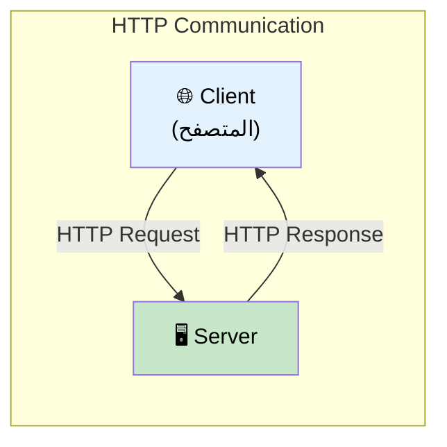
```mermaid
graph LR
    subgraph "HTTP Communication"
        CLIENT["🌐 Client<br/>(المتصفح)"] -->|"HTTP Request"| SERVER["🖥️ Server"]
        SERVER -->|"HTTP Response"| CLIENT
    end

    style CLIENT fill:#e3f2fd,color:#000
    style SERVER fill:#c8e6c9,color:#000
```

### مكونات رسالة HTTP

في HTTP/1.1، الرسائل بتكون **نص عادي** وبتتكون من 3 أجزاء رئيسية:

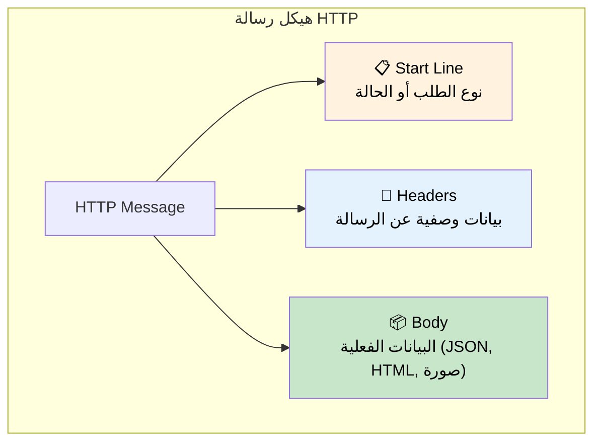
```mermaid
graph TB
    subgraph "هيكل رسالة HTTP"
        MSG["HTTP Message"]
        MSG --> SL["📋 Start Line<br/>نوع الطلب أو الحالة"]
        MSG --> HD["📝 Headers<br/>بيانات وصفية عن الرسالة"]
        MSG --> BD["📦 Body<br/>البيانات الفعلية (JSON, HTML, صورة)"]
    end

    style SL fill:#fff3e0,color:#000
    style HD fill:#e3f2fd,color:#000
    style BD fill:#c8e6c9,color:#000
```

| المكون | الوصف | مثال |
|--------|-------|------|
| **Start Line** | نوع الطلب أو حالة الرد | `GET /products HTTP/1.1` |
| **Headers** | بيانات وصفية (key-value) | `Content-Type: application/json` |
| **Body** | المحتوى الفعلي | `{"name": "iPhone"}` |

---

## الجزء الثاني: خصائص HTTP وإصداراته

### الخصائص الأساسية

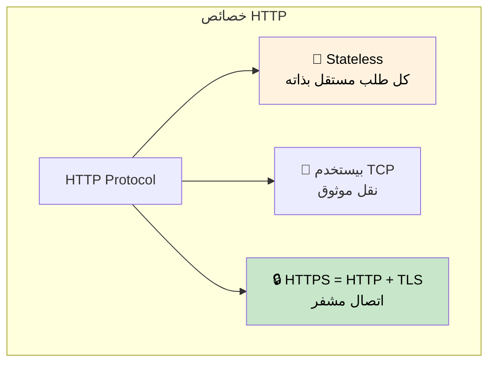
```mermaid
graph TB
    subgraph "خصائص HTTP"
        HTTP["HTTP Protocol"]
        HTTP --> STATELESS["🔄 Stateless<br/>كل طلب مستقل بذاته"]
        HTTP --> TCP["📡 بيستخدم TCP<br/>نقل موثوق"]
        HTTP --> TLS["🔒 HTTPS = HTTP + TLS<br/>اتصال مشفر"]
    end

    style STATELESS fill:#fff3e0,color:#000
    style TLS fill:#c8e6c9,color:#000
```

| الخاصية | المعنى |
|---------|--------|
| **Stateless** | السيرفر مش بيفتكر الطلبات السابقة |
| **TCP-based** | توصيل موثوق ومرتب |
| **HTTPS** | HTTP فوق TLS (مشفر) |

### HTTP/1.1 - مشكلة Head of Line Blocking

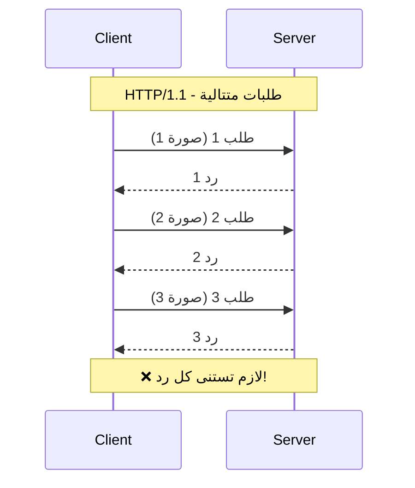
```mermaid
sequenceDiagram
    participant C as Client
    participant S as Server

    Note over C,S: HTTP/1.1 - طلبات متتالية
    C->>S: طلب 1 (صورة 1)
    S-->>C: رد 1
    C->>S: طلب 2 (صورة 2)
    S-->>C: رد 2
    C->>S: طلب 3 (صورة 3)
    S-->>C: رد 3

    Note over C,S: ❌ لازم تستنى كل رد!
```

**المشكلة:** الـ Client مش بيقدر يبعت طلب جديد غير لما يستقبل الرد على اللي قبله. لو بتحمل 10 صور، هتحمل واحدة ورا واحدة - بطيء جداً!

### HTTP/2 - الـ Multiplexing

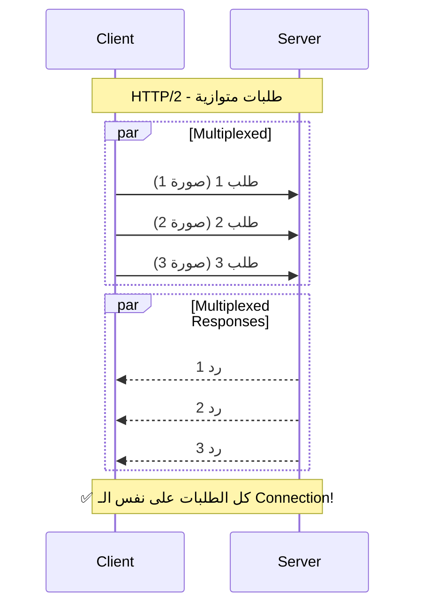
```mermaid
sequenceDiagram
    participant C as Client
    participant S as Server

    Note over C,S: HTTP/2 - طلبات متوازية
    par Multiplexed
        C->>S: طلب 1 (صورة 1)
        C->>S: طلب 2 (صورة 2)
        C->>S: طلب 3 (صورة 3)
    end
    par Multiplexed Responses
        S-->>C: رد 1
        S-->>C: رد 2
        S-->>C: رد 3
    end

    Note over C,S: ✅ كل الطلبات على نفس الـ Connection!
```

**الحل:** HTTP/2 بيدعم **Multiplexing** - طلبات وردود كتير في نفس الوقت على نفس الـ Connection.

### HTTP/3 - بروتوكول QUIC

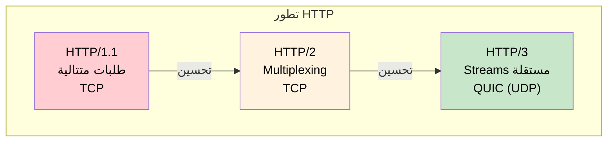
```mermaid
graph TB
    subgraph "تطور HTTP"
        H1["HTTP/1.1<br/>طلبات متتالية<br/>TCP"]
        H2["HTTP/2<br/>Multiplexing<br/>TCP"]
        H3["HTTP/3<br/>Streams مستقلة<br/>QUIC (UDP)"]

        H1 -->|"تحسين"| H2
        H2 -->|"تحسين"| H3
    end

    style H1 fill:#ffcdd2,color:#000
    style H2 fill:#fff3e0,color:#000
    style H3 fill:#c8e6c9,color:#000
```

| الإصدار | الـ Transport | الميزة الرئيسية | المشكلة المحلولة |
|---------|---------------|-----------------|------------------|
| **HTTP/1.1** | TCP | أساسي | - |
| **HTTP/2** | TCP | Multiplexing | Head-of-line blocking |
| **HTTP/3** | QUIC (UDP) | Streams مستقلة | لو packet ضاعت، بس الـ Stream بتاعها تتأثر |

---

## الجزء الثالث: الـ Resources والـ URLs

### يعني إيه Resource؟

الـ HTTP Server بيوفر **Resources** - حاجات ممكن الوصول ليها أو التعامل معاها:

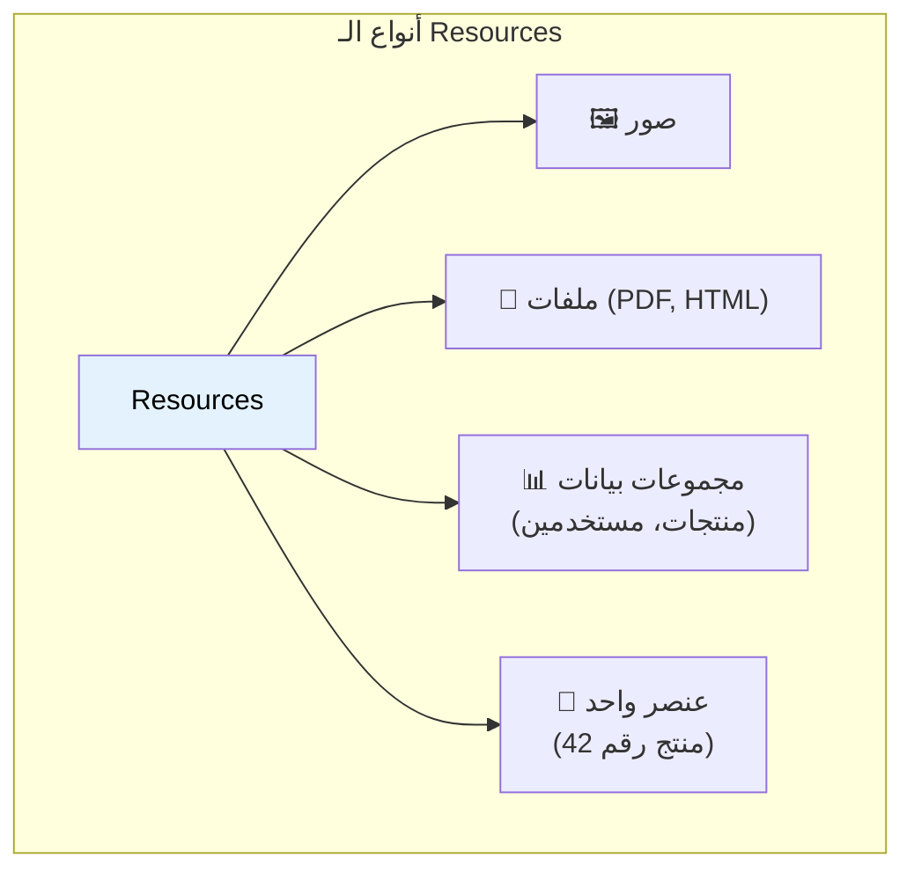
```mermaid
graph TB
    subgraph "أنواع الـ Resources"
        RES["Resources"]
        RES --> IMG["🖼️ صور"]
        RES --> FILE["📄 ملفات (PDF, HTML)"]
        RES --> DATA["📊 مجموعات بيانات<br/>(منتجات، مستخدمين)"]
        RES --> SINGLE["📝 عنصر واحد<br/>(منتج رقم 42)"]
    end

    style RES fill:#e3f2fd,color:#000
```

### هيكل الـ URL

كل Resource بيتم تحديده عن طريق **URL (Uniform Resource Locator)**:

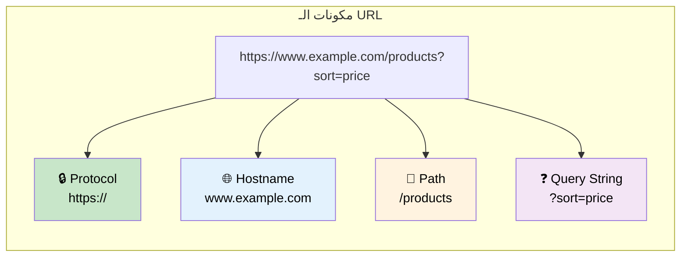
```mermaid
graph LR
    subgraph "مكونات الـ URL"
        URL["https://www.example.com/products?sort=price"]
        URL --> PROTO["🔒 Protocol<br/>https://"]
        URL --> HOST["🌐 Hostname<br/>www.example.com"]
        URL --> PATH["📁 Path<br/>/products"]
        URL --> QUERY["❓ Query String<br/>?sort=price"]
    end

    style PROTO fill:#c8e6c9,color:#000
    style HOST fill:#e3f2fd,color:#000
    style PATH fill:#fff3e0,color:#000
    style QUERY fill:#f3e5f5,color:#000
```

| المكون | الغرض | مثال |
|--------|-------|------|
| **Protocol** | طريقة الاتصال | `https://` |
| **Hostname** | عنوان السيرفر | `www.example.com` |
| **Path** | مكان الـ Resource (Endpoint) | `/products` |
| **Query String** | معاملات إضافية | `?sort=price&category=electronics` |

### أمثلة على الـ Endpoints

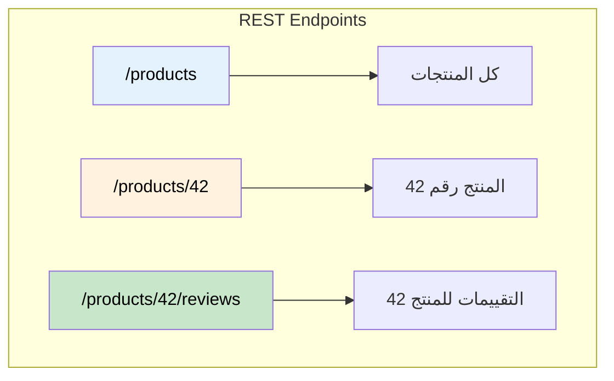
```mermaid
graph TB
    subgraph "REST Endpoints"
        E1["/products"] --> M1["كل المنتجات"]
        E2["/products/42"] --> M2["المنتج رقم 42"]
        E3["/products/42/reviews"] --> M3["التقييمات للمنتج 42"]
    end

    style E1 fill:#e3f2fd,color:#000
    style E2 fill:#fff3e0,color:#000
    style E3 fill:#c8e6c9,color:#000
```

> **ملحوظة:** خلي الـ URLs بسيطة! الـ Nesting العميق زي `/products/42/reviews/5/comments/3` بيبقى صعب في الإدارة.

---

## الجزء الرابع: الـ HTTP Methods (عمليات CRUD)

### نمط CRUD

الـ HTTP Methods بتتوافق مع عمليات **CRUD**:

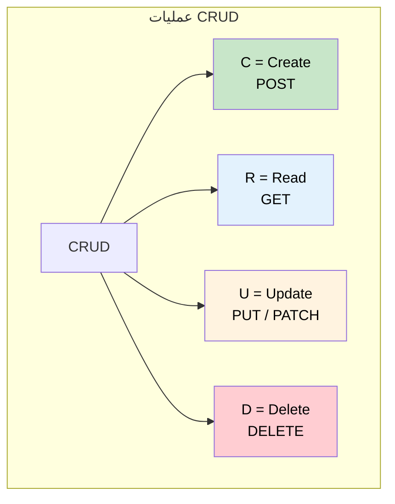
```mermaid
graph TB
    subgraph "عمليات CRUD"
        CRUD["CRUD"]
        CRUD --> C["C = Create<br/>POST"]
        CRUD --> R["R = Read<br/>GET"]
        CRUD --> U["U = Update<br/>PUT / PATCH"]
        CRUD --> D["D = Delete<br/>DELETE"]
    end

    style C fill:#c8e6c9,color:#000
    style R fill:#e3f2fd,color:#000
    style U fill:#fff3e0,color:#000
    style D fill:#ffcdd2,color:#000
```

### الـ HTTP Methods بالتفصيل

| Method | CRUD | الغرض | مثال |
|--------|------|-------|------|
| **GET** | Read | جلب بيانات | `GET /products` |
| **POST** | Create | إنشاء Resource جديد | `POST /products` |
| **PUT** | Update | استبدال Resource بالكامل | `PUT /products/42` |
| **PATCH** | Update | تحديث جزئي | `PATCH /products/42` |
| **DELETE** | Delete | حذف Resource | `DELETE /products/42` |

### أمثلة عملية

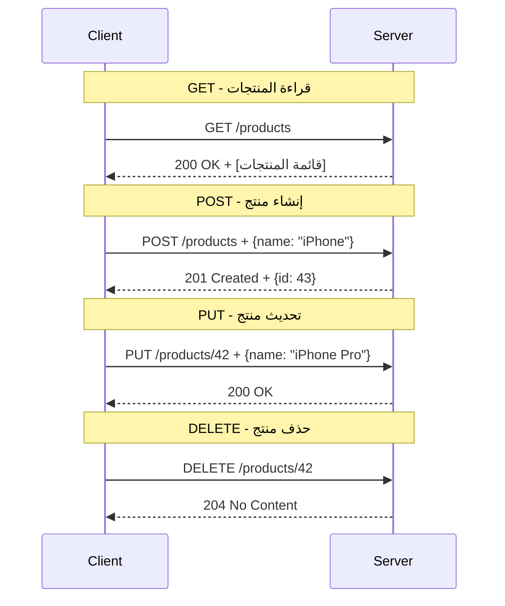
```mermaid
sequenceDiagram
    participant C as Client
    participant S as Server

    Note over C,S: GET - قراءة المنتجات
    C->>S: GET /products
    S-->>C: 200 OK + [قائمة المنتجات]

    Note over C,S: POST - إنشاء منتج
    C->>S: POST /products + {name: "iPhone"}
    S-->>C: 201 Created + {id: 43}

    Note over C,S: PUT - تحديث منتج
    C->>S: PUT /products/42 + {name: "iPhone Pro"}
    S-->>C: 200 OK

    Note over C,S: DELETE - حذف منتج
    C->>S: DELETE /products/42
    S-->>C: 204 No Content
```

### الـ Safety والـ Idempotency

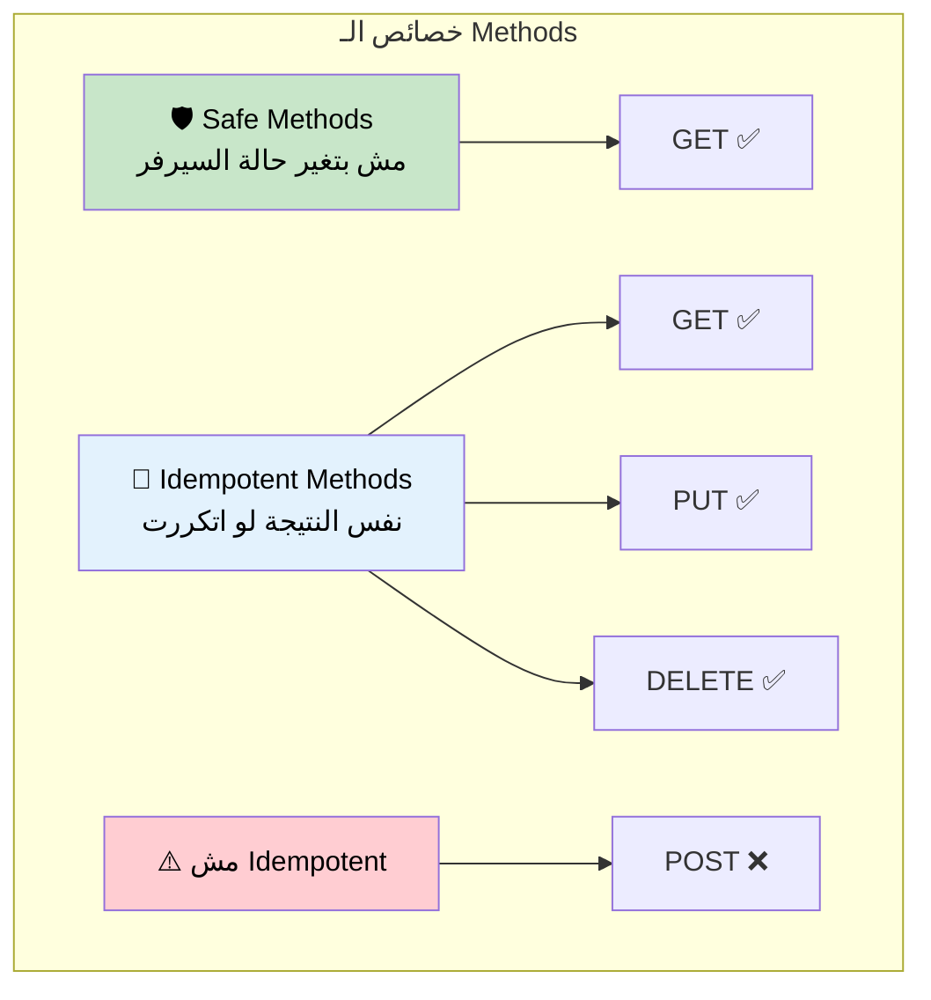
```mermaid
graph TB
    subgraph "خصائص الـ Methods"
        SAFE["🛡️ Safe Methods<br/>مش بتغير حالة السيرفر"]
        SAFE --> GET["GET ✅"]

        IDEM["🔄 Idempotent Methods<br/>نفس النتيجة لو اتكررت"]
        IDEM --> GET2["GET ✅"]
        IDEM --> PUT2["PUT ✅"]
        IDEM --> DELETE2["DELETE ✅"]

        NOTIDEM["⚠️ مش Idempotent"]
        NOTIDEM --> POST2["POST ❌"]
    end

    style SAFE fill:#c8e6c9,color:#000
    style IDEM fill:#e3f2fd,color:#000
    style NOTIDEM fill:#ffcdd2,color:#000
```

| الخاصية | المعنى | الـ Methods |
|---------|--------|-------------|
| **Safe** | مفيش Side Effects (قراءة فقط) | GET |
| **Idempotent** | التكرار ليه نفس التأثير | GET, PUT, DELETE |
| **Not Idempotent** | التكرار ممكن يعمل Duplicates | POST |

> **مثال:** لو استدعيت `PUT /products/42` بـ `{name: "iPhone 12 Pro"}` عشر مرات، النتيجة هتفضل واحدة - اسم المنتج "iPhone 12 Pro".

---

## الجزء الخامس: الـ HTTP Status Codes

### تصنيفات الـ Status Codes

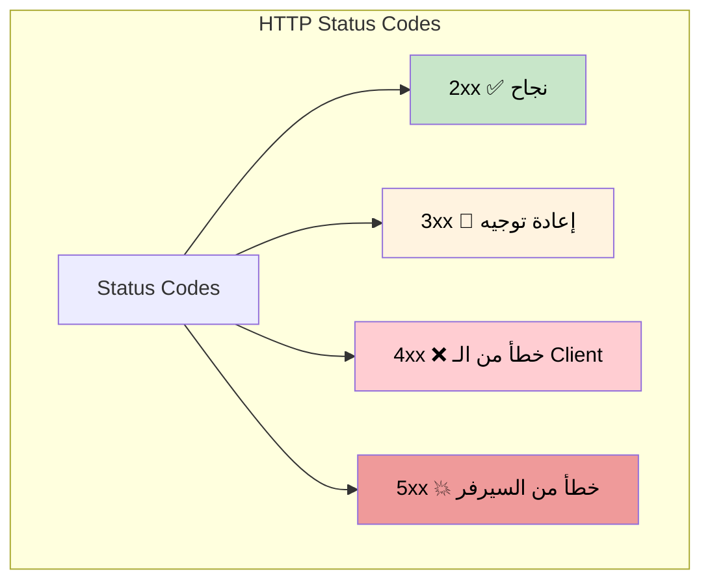
```mermaid
graph TB
    subgraph "HTTP Status Codes"
        SC["Status Codes"]
        SC --> S2["2xx ✅ نجاح"]
        SC --> S3["3xx 🔄 إعادة توجيه"]
        SC --> S4["4xx ❌ خطأ من الـ Client"]
        SC --> S5["5xx 💥 خطأ من السيرفر"]
    end

    style S2 fill:#c8e6c9,color:#000
    style S3 fill:#fff3e0,color:#000
    style S4 fill:#ffcdd2,color:#000
    style S5 fill:#ef9a9a,color:#000
```

### أشهر الـ Status Codes

| الكود | الاسم | المعنى |
|-------|-------|--------|
| **200** | OK | الطلب نجح |
| **201** | Created | تم إنشاء Resource |
| **204** | No Content | نجح، مفيش Body |
| **301** | Moved Permanently | الـ Resource اتنقل لـ URL جديد |
| **400** | Bad Request | بيانات الطلب غلط |
| **401** | Unauthorized | محتاج Authentication |
| **403** | Forbidden | مفيش صلاحية |
| **404** | Not Found | الـ Resource مش موجود |
| **500** | Internal Server Error | السيرفر فشل |
| **503** | Service Unavailable | السيرفر Overloaded أو في Maintenance |

### سلوك إعادة المحاولة

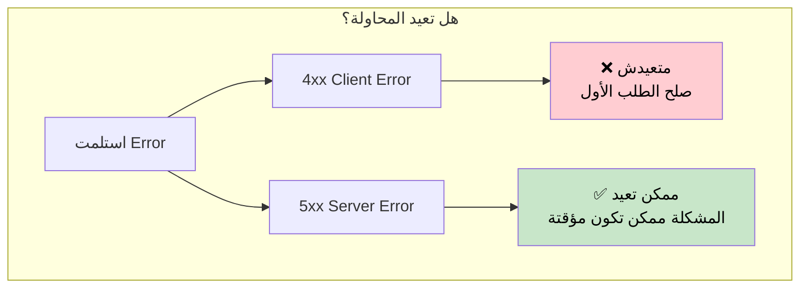
```mermaid
graph TB
    subgraph "هل تعيد المحاولة؟"
        ERR["استلمت Error"]
        ERR --> C4["4xx Client Error"]
        ERR --> C5["5xx Server Error"]

        C4 --> NO["❌ متعيدش<br/>صلح الطلب الأول"]
        C5 --> YES["✅ ممكن تعيد<br/>المشكلة ممكن تكون مؤقتة"]
    end

    style NO fill:#ffcdd2,color:#000
    style YES fill:#c8e6c9,color:#000
```

| نوع الخطأ | إعادة المحاولة؟ | السبب |
|-----------|-----------------|-------|
| **4xx** | لا | غلطة الـ Client - نفس الطلب هيفشل تاني |
| **5xx** | أيوه | غلطة السيرفر - ممكن يتعافى |

---

## الجزء السادس: الـ API Versioning

### المشكلة: التغييرات الكاسرة (Breaking Changes)

مع تطور الـ APIs، بعض التغييرات ممكن تكسر الـ Clients الموجودين:

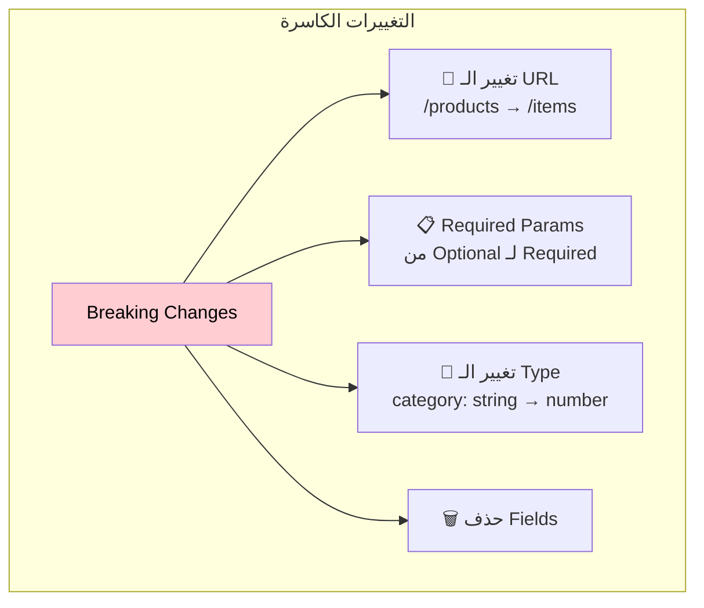
```mermaid
graph TB
    subgraph "التغييرات الكاسرة"
        BC["Breaking Changes"]
        BC --> URL["🔗 تغيير الـ URL<br/>/products → /items"]
        BC --> PARAM["📋 Required Params<br/>من Optional لـ Required"]
        BC --> TYPE["🔄 تغيير الـ Type<br/>category: string → number"]
        BC --> REMOVE["🗑️ حذف Fields"]
    end

    style BC fill:#ffcdd2,color:#000
```

### أمثلة على التغييرات الكاسرة

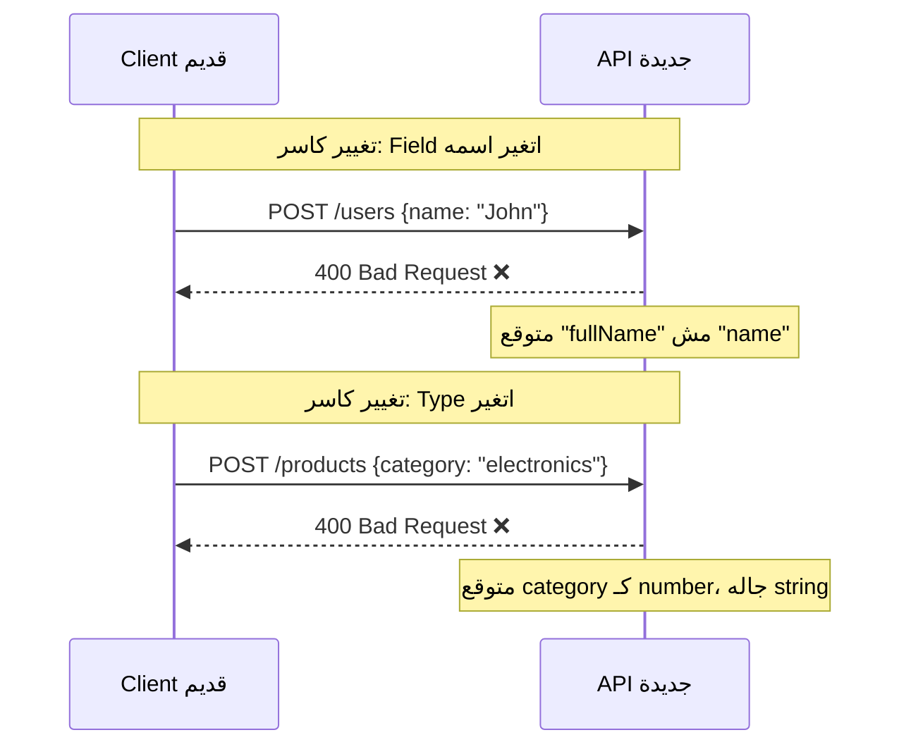
```mermaid
sequenceDiagram
    participant OLD as Client قديم
    participant NEW as API جديدة

    Note over OLD,NEW: تغيير كاسر: Field اتغير اسمه
    OLD->>NEW: POST /users {name: "John"}
    NEW-->>OLD: 400 Bad Request ❌
    Note over NEW: متوقع "fullName" مش "name"

    Note over OLD,NEW: تغيير كاسر: Type اتغير
    OLD->>NEW: POST /products {category: "electronics"}
    NEW-->>OLD: 400 Bad Request ❌
    Note over NEW: متوقع category كـ number، جاله string
```

### الحل: URL Versioning

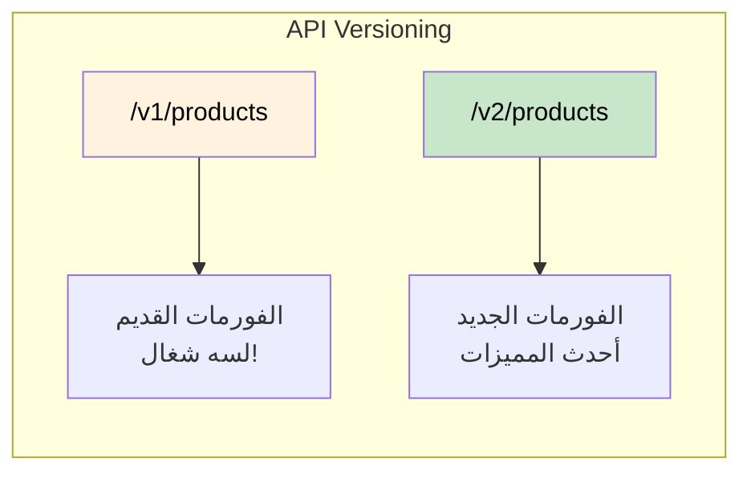
```mermaid
graph LR
    subgraph "API Versioning"
        V1["/v1/products"] --> OLD["الفورمات القديم<br/>لسه شغال!"]
        V2["/v2/products"] --> NEW["الفورمات الجديد<br/>أحدث المميزات"]
    end

    style V1 fill:#fff3e0,color:#000
    style V2 fill:#c8e6c9,color:#000
```

| الطريقة | مثال | الفايدة |
|---------|------|---------|
| **URL Versioning** | `/v1/products`, `/v2/products` | واضح وصريح |
| **Header Versioning** | `Accept-Version: v2` | URLs أنظف |

> **أفضل ممارسة:** خلي الإصدارات القديمة شغالة لحد ما كل الـ Clients ينتقلوا. بعدين Deprecate بشكل تدريجي.

---

## الجزء السابع: الـ Idempotency وإعادة المحاولات الآمنة

### مشكلة الـ Timeout

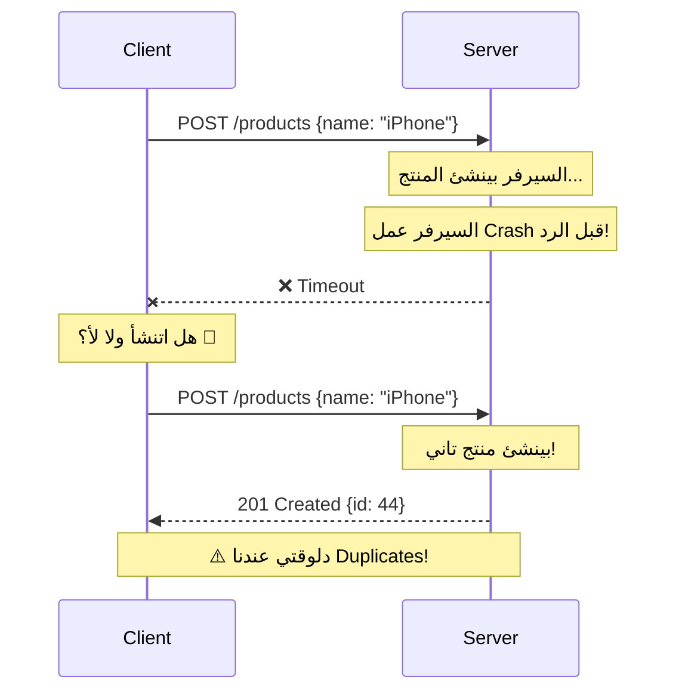
```mermaid
sequenceDiagram
    participant C as Client
    participant S as Server

    C->>S: POST /products {name: "iPhone"}
    Note over S: السيرفر بينشئ المنتج...
    Note over S: السيرفر عمل Crash قبل الرد!
    S--xC: ❌ Timeout

    Note over C: هل اتنشأ ولا لأ؟ 🤔

    C->>S: POST /products {name: "iPhone"}
    Note over S: بينشئ منتج تاني!
    S-->>C: 201 Created {id: 44}

    Note over C,S: ⚠️ دلوقتي عندنا Duplicates!
```

### الحل: Idempotency Keys

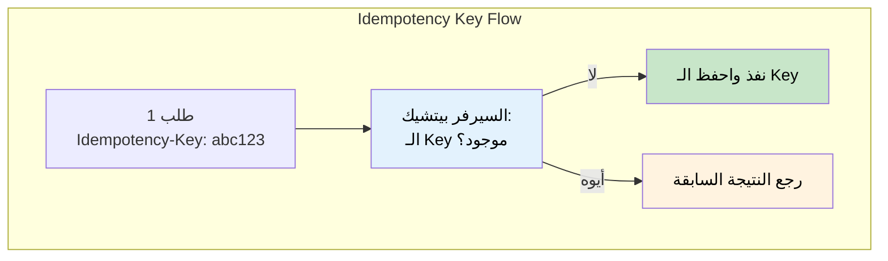
```mermaid
graph TB
    subgraph "Idempotency Key Flow"
        REQ1["طلب 1<br/>Idempotency-Key: abc123"] --> CHECK["السيرفر بيتشيك:<br/>الـ Key موجود؟"]
        CHECK -->|"لا"| EXEC["نفذ واحفظ الـ Key"]
        CHECK -->|"أيوه"| SKIP["رجع النتيجة السابقة"]
    end

    style CHECK fill:#e3f2fd,color:#000
    style EXEC fill:#c8e6c9,color:#000
    style SKIP fill:#fff3e0,color:#000
```

### إزاي بيشتغل

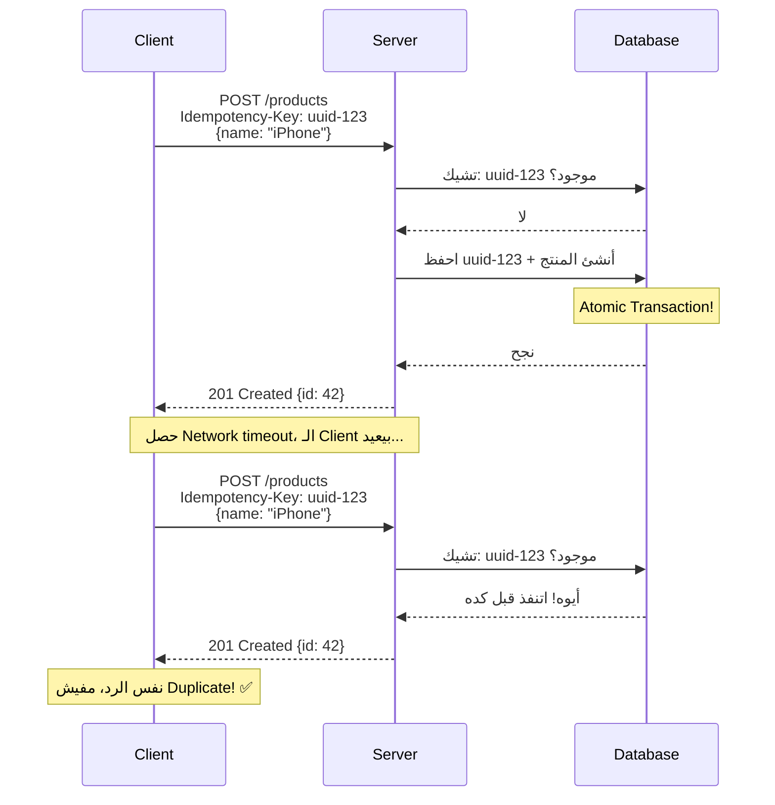
```mermaid
sequenceDiagram
    participant C as Client
    participant S as Server
    participant DB as Database

    C->>S: POST /products<br/>Idempotency-Key: uuid-123<br/>{name: "iPhone"}

    S->>DB: تشيك: uuid-123 موجود؟
    DB-->>S: لا

    S->>DB: احفظ uuid-123 + أنشئ المنتج
    Note over DB: Atomic Transaction!
    DB-->>S: نجح
    S-->>C: 201 Created {id: 42}

    Note over C,S: حصل Network timeout، الـ Client بيعيد...

    C->>S: POST /products<br/>Idempotency-Key: uuid-123<br/>{name: "iPhone"}

    S->>DB: تشيك: uuid-123 موجود؟
    DB-->>S: أيوه! اتنفذ قبل كده

    S-->>C: 201 Created {id: 42}
    Note over C: نفس الرد، مفيش Duplicate! ✅
```

### نصائح التنفيذ

| النصيحة | الوصف |
|---------|-------|
| **استخدم UUID** | اعمل Key فريد لكل عملية |
| **احفظ مع البيانات** | احفظ الـ Key في نفس الـ Transaction |
| **امسح الـ Keys القديمة** | نظف بعد فترة معقولة (24 ساعة) |
| **رجع نفس الرد** | الـ Duplicates لازم تاخد نفس الـ Response |

> **مهم جداً:** حفظ الـ Idempotency Key والعملية الفعلية لازم يكونوا في نفس الـ **Atomic Transaction**. غير كده، ممكن تحفظ الـ Key بس العملية تفشل!

---

## الملخص

```mermaid
graph TB
    subgraph "ملخص RESTful API"
        REST["REST API"]

        REST --> HTTP["📡 بروتوكول HTTP"]
        HTTP --> H1["Stateless"]
        HTTP --> H2["Request-Response"]

        REST --> RES["📦 Resources"]
        RES --> R1["بتتحدد بـ URLs"]
        RES --> R2["Endpoints"]

        REST --> METH["🔧 Methods"]
        METH --> M1["عمليات CRUD"]
        METH --> M2["Safe & Idempotent"]

        REST --> STAT["📊 Status Codes"]
        STAT --> S1["2xx نجاح"]
        STAT --> S2["4xx/5xx أخطاء"]

        REST --> VER["🔢 Versioning"]
        VER --> V1["تجنب Breaking Changes"]

        REST --> IDEM["🔄 Idempotency"]
        IDEM --> I1["Keys لإعادة المحاولة الآمنة"]
    end

    style REST fill:#e3f2fd,color:#000
```

## جدول مرجعي سريع

| الموضوع | النقاط الرئيسية |
|---------|-----------------|
| **HTTP** | بروتوكول Stateless، نموذج Request-Response |
| **إصدارات HTTP** | 1.1 (متتالي)، 2 (Multiplexing)، 3 (QUIC) |
| **Resources** | أي حاجة ممكن الوصول ليها عبر URL |
| **Endpoints** | مسارات URL زي `/products`، `/users/42` |
| **GET** | قراءة بيانات (Safe، Idempotent) |
| **POST** | إنشاء بيانات (مش Idempotent) |
| **PUT** | استبدال بيانات (Idempotent) |
| **PATCH** | تحديث جزئي (Idempotent) |
| **DELETE** | حذف بيانات (Idempotent) |
| **2xx** | نجاح |
| **3xx** | إعادة توجيه |
| **4xx** | خطأ من الـ Client (متعيدش) |
| **5xx** | خطأ من السيرفر (ممكن تعيد) |
| **Versioning** | `/v1/`، `/v2/` لتجنب Breaking Changes |
| **Idempotency Key** | UUID في الـ Header لإعادة POST الآمنة |

## مخطط تصميم REST

```mermaid
flowchart TB
    START["تصميم REST API"] --> RES["حدد الـ Resources"]
    RES --> URL["أنشئ URL Endpoints"]
    URL --> METH["عين HTTP Methods"]

    METH --> GET["GET للقراءة"]
    METH --> POST["POST للإنشاء"]
    METH --> PUT["PUT/PATCH للتحديث"]
    METH --> DEL["DELETE للحذف"]

    POST --> IDEM["أضف Idempotency Keys"]

    GET --> STATUS["حدد Status Codes"]
    POST --> STATUS
    PUT --> STATUS
    DEL --> STATUS
    IDEM --> STATUS

    STATUS --> VER["خطط لاستراتيجية Versioning"]
    VER --> DONE["✅ REST API جاهز"]

    style DONE fill:#c8e6c9,color:#000
    style IDEM fill:#fff3e0,color:#000
```
