# RESTful APIs - A Detailed Guide to HTTP and REST

## Introduction

In this section, we'll cover:
- HTTP Protocol overview and its components
- HTTP versions (HTTP/1.1, HTTP/2, HTTP/3)
- Resources, URLs, and Endpoints
- HTTP Methods (CRUD Operations)
- HTTP Status Codes
- API Versioning and Breaking Changes
- Idempotency and Safe Retries

---

## Part 1: What is HTTP?

### Overview

**HTTP (HyperText Transfer Protocol)** is a **stateless** protocol used to transfer data between clients (like browsers) and servers.

```mermaid
graph LR
    subgraph "HTTP Communication"
        CLIENT["🌐 Client<br/>(Browser)"] -->|"HTTP Request"| SERVER["🖥️ Server"]
        SERVER -->|"HTTP Response"| CLIENT
    end

    style CLIENT fill:#e3f2fd,color:#000
    style SERVER fill:#c8e6c9,color:#000
```

### HTTP Message Components

In HTTP/1.1, messages are **plain text** and consist of three main parts:

```mermaid
graph TB
    subgraph "HTTP Message Structure"
        MSG["HTTP Message"]
        MSG --> SL["📋 Start Line<br/>Method, URL, Status"]
        MSG --> HD["📝 Headers<br/>Metadata about the message"]
        MSG --> BD["📦 Body<br/>Actual data (JSON, HTML, Image)"]
    end

    style SL fill:#fff3e0,color:#000
    style HD fill:#e3f2fd,color:#000
    style BD fill:#c8e6c9,color:#000
```

| Component | Description | Example |
|-----------|-------------|---------|
| **Start Line** | Request type or response status | `GET /products HTTP/1.1` |
| **Headers** | Metadata (key-value pairs) | `Content-Type: application/json` |
| **Body** | Actual payload | `{"name": "iPhone"}` |

---

## Part 2: HTTP Properties and Versions

### Key Properties


| Property | Meaning |
|----------|---------|
| **Stateless** | Server doesn't remember previous requests |
| **TCP-based** | Reliable, ordered delivery |
| **HTTPS** | HTTP over TLS (encrypted) |

### HTTP/1.1 - Head of Line Blocking

```mermaid
sequenceDiagram
    participant C as Client
    participant S as Server

    Note over C,S: HTTP/1.1 - Sequential Requests
    C->>S: Request 1 (Image 1)
    S-->>C: Response 1
    C->>S: Request 2 (Image 2)
    S-->>C: Response 2
    C->>S: Request 3 (Image 3)
    S-->>C: Response 3

    Note over C,S: ❌ Must wait for each response!
```

**Problem:** Client can't send a new request until it receives the response for the previous one. Loading 10 images happens **sequentially** - very slow!

### HTTP/2 - Multiplexing

```mermaid
sequenceDiagram
    participant C as Client
    participant S as Server

    Note over C,S: HTTP/2 - Parallel Requests
    par Multiplexed
        C->>S: Request 1 (Image 1)
        C->>S: Request 2 (Image 2)
        C->>S: Request 3 (Image 3)
    end
    par Multiplexed Responses
        S-->>C: Response 1
        S-->>C: Response 2
        S-->>C: Response 3
    end

    Note over C,S: ✅ All requests on same connection!
```

**Solution:** HTTP/2 supports **multiplexing** - multiple requests/responses on the same connection simultaneously.

### HTTP/3 - QUIC Protocol


| Version | Transport | Key Feature | Problem Solved |
|---------|-----------|-------------|----------------|
| **HTTP/1.1** | TCP | Basic | - |
| **HTTP/2** | TCP | Multiplexing | Head-of-line blocking |
| **HTTP/3** | QUIC (UDP) | Independent streams | Packet loss affects only one stream |

---

## Part 3: Resources and URLs

### What is a Resource?

An HTTP server exposes **resources** - things that can be accessed or manipulated:

```mermaid
graph TB
    subgraph "Types of Resources"
        RES["Resources"]
        RES --> IMG["🖼️ Images"]
        RES --> FILE["📄 Files (PDF, HTML)"]
        RES --> DATA["📊 Data Collections<br/>(Products, Users)"]
        RES --> SINGLE["📝 Single Items<br/>(Product #42)"]
    end

    style RES fill:#e3f2fd,color:#000
```

### URL Structure

Every resource is identified by a **URL (Uniform Resource Locator)**:

```mermaid
graph LR
    subgraph "URL Components"
        URL["https://www.example.com/products?sort=price"]
        URL --> PROTO["🔒 Protocol<br/>https://"]
        URL --> HOST["🌐 Hostname<br/>www.example.com"]
        URL --> PATH["📁 Path<br/>/products"]
        URL --> QUERY["❓ Query String<br/>?sort=price"]
    end

    style PROTO fill:#c8e6c9,color:#000
    style HOST fill:#e3f2fd,color:#000
    style PATH fill:#fff3e0,color:#000
    style QUERY fill:#f3e5f5,color:#000
```

| Component | Purpose | Example |
|-----------|---------|---------|
| **Protocol** | Communication method | `https://` |
| **Hostname** | Server address | `www.example.com` |
| **Path** | Resource location (Endpoint) | `/products` |
| **Query String** | Optional parameters | `?sort=price&category=electronics` |

### Endpoint Examples


> **Note:** Keep URLs simple! Deep nesting like `/products/42/reviews/5/comments/3` becomes hard to manage.

---

## Part 4: HTTP Methods (CRUD Operations)

### The CRUD Pattern

HTTP methods map to **CRUD** operations:


### HTTP Methods in Detail

| Method | CRUD | Purpose | Example |
|--------|------|---------|---------|
| **GET** | Read | Retrieve data | `GET /products` |
| **POST** | Create | Create new resource | `POST /products` |
| **PUT** | Update | Replace entire resource | `PUT /products/42` |
| **PATCH** | Update | Partial update | `PATCH /products/42` |
| **DELETE** | Delete | Remove resource | `DELETE /products/42` |

### Method Examples


### Safety and Idempotency

```mermaid
graph TB
    subgraph "Method Properties"
        SAFE["🛡️ Safe Methods<br/>Don't change server state"]
        SAFE --> GET["GET ✅"]

        IDEM["🔄 Idempotent Methods<br/>Same result if repeated"]
        IDEM --> GET2["GET ✅"]
        IDEM --> PUT2["PUT ✅"]
        IDEM --> DELETE2["DELETE ✅"]

        NOTIDEM["⚠️ Not Idempotent"]
        NOTIDEM --> POST2["POST ❌"]
    end

    style SAFE fill:#c8e6c9,color:#000
    style IDEM fill:#e3f2fd,color:#000
    style NOTIDEM fill:#ffcdd2,color:#000
```

| Property | Meaning | Methods |
|----------|---------|---------|
| **Safe** | No side effects (read-only) | GET |
| **Idempotent** | Repeating has same effect | GET, PUT, DELETE |
| **Not Idempotent** | Repeating may create duplicates | POST |

> **Example:** Calling `PUT /products/42` with `{name: "iPhone 12 Pro"}` ten times will always result in the same state - the product name is "iPhone 12 Pro".

---

## Part 5: HTTP Status Codes

### Status Code Categories

```mermaid
graph TB
    subgraph "HTTP Status Codes"
        SC["Status Codes"]
        SC --> S2["2xx ✅ Success"]
        SC --> S3["3xx 🔄 Redirection"]
        SC --> S4["4xx ❌ Client Error"]
        SC --> S5["5xx 💥 Server Error"]
    end

    style S2 fill:#c8e6c9,color:#000
    style S3 fill:#fff3e0,color:#000
    style S4 fill:#ffcdd2,color:#000
    style S5 fill:#ef9a9a,color:#000
```

### Common Status Codes

| Code | Name | Meaning |
|------|------|---------|
| **200** | OK | Request successful |
| **201** | Created | Resource created |
| **204** | No Content | Success, no body |
| **301** | Moved Permanently | Resource moved to new URL |
| **400** | Bad Request | Invalid request data |
| **401** | Unauthorized | Authentication required |
| **403** | Forbidden | No permission |
| **404** | Not Found | Resource doesn't exist |
| **500** | Internal Server Error | Server failed |
| **503** | Service Unavailable | Server overloaded/maintenance |

### Retry Behavior


| Error Type | Retry? | Reason |
|------------|--------|--------|
| **4xx** | No | Client's fault - same request will fail again |
| **5xx** | Yes | Server's fault - might recover |

---

## Part 6: API Versioning

### The Problem: Breaking Changes

As APIs evolve, changes might break existing clients:

```mermaid
graph TB
    subgraph "Breaking Changes"
        BC["Breaking Changes"]
        BC --> URL["🔗 URL Changes<br/>/products → /items"]
        BC --> PARAM["📋 Required Params<br/>Optional → Required"]
        BC --> TYPE["🔄 Type Changes<br/>category: string → number"]
        BC --> REMOVE["🗑️ Removed Fields"]
    end

    style BC fill:#ffcdd2,color:#000
```

### Examples of Breaking Changes


### Solution: URL Versioning


| Approach | Example | Benefit |
|----------|---------|---------|
| **URL Versioning** | `/v1/products`, `/v2/products` | Clear, explicit |
| **Header Versioning** | `Accept-Version: v2` | Cleaner URLs |

> **Best Practice:** Keep old versions running until all clients migrate. Then deprecate gracefully.

---

## Part 7: Idempotency and Safe Retries

### The Timeout Problem

```mermaid
sequenceDiagram
    participant C as Client
    participant S as Server

    C->>S: POST /products {name: "iPhone"}
    Note over S: Server creates product...
    Note over S: Server crashes before response!
    S--xC: ❌ Timeout

    Note over C: Did it create or not? 🤔

    C->>S: POST /products {name: "iPhone"}
    Note over S: Creates ANOTHER product!
    S-->>C: 201 Created {id: 44}

    Note over C,S: ⚠️ Now we have duplicates!
```

### Solution: Idempotency Keys


### How It Works

```mermaid
sequenceDiagram
    participant C as Client
    participant S as Server
    participant DB as Database

    C->>S: POST /products<br/>Idempotency-Key: uuid-123<br/>{name: "iPhone"}

    S->>DB: Check: uuid-123 exists?
    DB-->>S: No

    S->>DB: Store uuid-123 + Create Product
    Note over DB: Atomic Transaction!
    DB-->>S: Success
    S-->>C: 201 Created {id: 42}

    Note over C,S: Network timeout, client retries...

    C->>S: POST /products<br/>Idempotency-Key: uuid-123<br/>{name: "iPhone"}

    S->>DB: Check: uuid-123 exists?
    DB-->>S: Yes! Already processed

    S-->>C: 201 Created {id: 42}
    Note over C: Same response, no duplicate! ✅
```

### Implementation Tips

| Tip | Description |
|-----|-------------|
| **Use UUID** | Generate unique key per operation |
| **Store with data** | Save key in same transaction as data |
| **Expire old keys** | Clean up after reasonable time (24h) |
| **Return same response** | Duplicates should get identical response |

> **Critical:** The idempotency key storage and the actual operation MUST be in the same **atomic transaction**. Otherwise, you might store the key but fail the operation!

---

## Summary

```mermaid
graph TB
    subgraph "RESTful API Summary"
        REST["REST API"]

        REST --> HTTP["📡 HTTP Protocol"]
        HTTP --> H1["Stateless"]
        HTTP --> H2["Request-Response"]

        REST --> RES["📦 Resources"]
        RES --> R1["Identified by URLs"]
        RES --> R2["Endpoints"]

        REST --> METH["🔧 Methods"]
        METH --> M1["CRUD Operations"]
        METH --> M2["Safe & Idempotent"]

        REST --> STAT["📊 Status Codes"]
        STAT --> S1["2xx Success"]
        STAT --> S2["4xx/5xx Errors"]

        REST --> VER["🔢 Versioning"]
        VER --> V1["Avoid breaking changes"]

        REST --> IDEM["🔄 Idempotency"]
        IDEM --> I1["Keys for safe retries"]
    end

    style REST fill:#e3f2fd,color:#000
```

## Quick Reference Table

| Topic | Key Points |
|-------|------------|
| **HTTP** | Stateless protocol, request-response model |
| **HTTP Versions** | 1.1 (sequential), 2 (multiplexing), 3 (QUIC) |
| **Resources** | Anything accessible via URL |
| **Endpoints** | URL paths like `/products`, `/users/42` |
| **GET** | Read data (safe, idempotent) |
| **POST** | Create data (not idempotent) |
| **PUT** | Replace data (idempotent) |
| **PATCH** | Partial update (idempotent) |
| **DELETE** | Remove data (idempotent) |
| **2xx** | Success |
| **3xx** | Redirection |
| **4xx** | Client error (don't retry) |
| **5xx** | Server error (can retry) |
| **Versioning** | `/v1/`, `/v2/` to avoid breaking changes |
| **Idempotency Key** | UUID header for safe POST retries |

## REST Design Flowchart

```mermaid
flowchart TB
    START["Design REST API"] --> RES["Define Resources"]
    RES --> URL["Create URL Endpoints"]
    URL --> METH["Assign HTTP Methods"]

    METH --> GET["GET for reading"]
    METH --> POST["POST for creating"]
    METH --> PUT["PUT/PATCH for updating"]
    METH --> DEL["DELETE for removing"]

    POST --> IDEM["Add Idempotency Keys"]

    GET --> STATUS["Define Status Codes"]
    POST --> STATUS
    PUT --> STATUS
    DEL --> STATUS
    IDEM --> STATUS

    STATUS --> VER["Plan Versioning Strategy"]
    VER --> DONE["✅ REST API Ready"]

    style DONE fill:#c8e6c9,color:#000
    style IDEM fill:#fff3e0,color:#000
```
