# Failure Detection - شرح تفصيلي لاكتشاف الأعطال في الأنظمة الموزعة

## المقدمة

في الجزء ده هنتكلم عن:
- أنواع الأعطال (Failures) اللي ممكن تحصل في الأنظمة الموزعة
- آلية الـ Timeout وإزاي بنستخدمها
- تقنيات الـ Ping و Heartbeat لاكتشاف الأعطال بشكل استباقي
- بروتوكول الـ Gossip وإزاي بيشتغل
- أمثلة تطبيقية زي Database Replication و Kubernetes

---

## الجزء الأول: المشاكل في الأنظمة الموزعة

### إيه اللي ممكن يحصل غلط؟

لما الكلاينت يبعت Request للسيرفر، أو في العموم لما أي Process بتحاول تتواصل مع Process تانية من خلال الـ Network، فيه مشاكل كتير ممكن تحصل.

سواء كنا بنشوف مسلسل على منصة Streaming، أو بنشتري حاجة Online، أو حتى بنشوف حسابنا في البنك - في الآخر احنا بنعتمد على شبكة معقدة من الـ Systems المرتبطة ببعض.

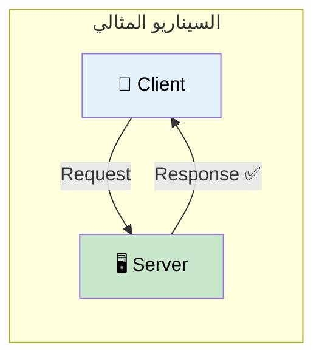
```mermaid
graph LR
    subgraph "السيناريو المثالي"
        C1["👤 Client"] -->|"Request"| S1["🖥️ Server"]
        S1 -->|"Response ✅"| C1
    end

    style C1 fill:#e3f2fd,color:#000
    style S1 fill:#c8e6c9,color:#000
```

### لما الـ Response مش بييجي...

في الحالة المثالية، الكلاينت بيبعت Request والسيرفر بيرد عليه. لكن إيه اللي هيحصل لو الكلاينت ما استقبلش أي Response؟

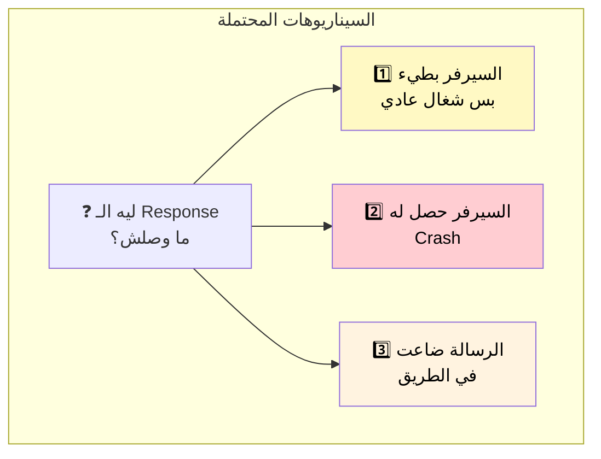
```mermaid
graph TB
    subgraph "السيناريوهات المحتملة"
        Q["❓ ليه الـ Response<br/>ما وصلش؟"]

        Q --> A["1️⃣ السيرفر بطيء<br/>بس شغال عادي"]
        Q --> B["2️⃣ السيرفر حصل له<br/>Crash"]
        Q --> C["3️⃣ الرسالة ضاعت<br/>في الطريق"]
    end

    style A fill:#fff9c4,color:#000
    style B fill:#ffcdd2,color:#000
    style C fill:#fff3e0,color:#000
```

| السيناريو | الوصف |
|-----------|-------|
| 🐢 السيرفر بطيء | السيرفر شغال بشكل طبيعي، بس الـ Response بياخد وقت أطول |
| 💥 السيرفر Crashed | السيرفر فيه مشكلة فعلية وما يقدرش يرد |
| 📨 الرسالة ضاعت | الـ Response راح من السيرفر بس ضاع في الـ Network |

### المشكلة الحقيقية

في أسوأ الحالات، الكلاينت ممكن يفضل مستني رد مش هييجي خالص! وطبعاً مينفعش يفضل كده للأبد.

---

## الجزء التاني: آلية الـ Timeout

### الحل: نحدد مدة انتظار

الـ Timeout معناه إن الكلاينت بيحدد مدة انتظار معينة. لو المدة دي عدت من غير ما يوصل له أي Response، بيفترض إن السيرفر مش متاح.

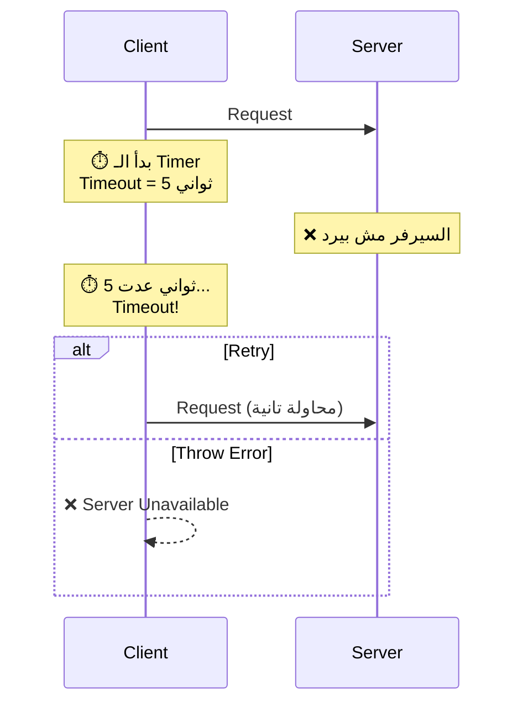
```mermaid
sequenceDiagram
    participant C as Client
    participant S as Server

    C->>S: Request

    Note over C: ⏱️ بدأ الـ Timer<br/>Timeout = 5 ثواني

    Note over S: ❌ السيرفر مش بيرد

    Note over C: ⏱️ 5 ثواني عدت...<br/>Timeout!

    alt Retry
        C->>S: Request (محاولة تانية)
    else Throw Error
        C-->>C: ❌ Server Unavailable
    end
```

### بعد الـ Timeout، إيه الخيارات؟

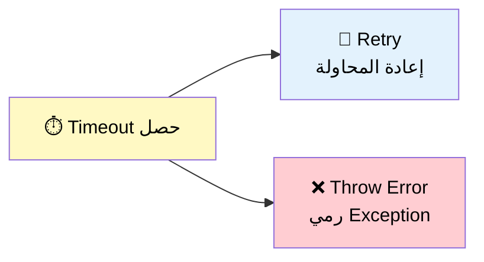
```mermaid
graph LR
    TO["⏱️ Timeout حصل"] --> A["🔄 Retry<br/>إعادة المحاولة"]
    TO --> B["❌ Throw Error<br/>رمي Exception"]

    style TO fill:#fff9c4,color:#000
    style A fill:#e3f2fd,color:#000
    style B fill:#ffcdd2,color:#000
```

### التحدي: اختيار المدة المناسبة

| المدة | المشكلة |
|-------|---------|
| ⚡ قصيرة جداً | الكلاينت ممكن يفتكر السيرفر واقع وهو بس بطيء |
| 🐌 طويلة جداً | الكلاينت هيفضل مستني على الفاضي لو السيرفر فعلاً واقع |

> 💡 مفيش مدة مثالية! الاختيار بيعتمد على عوامل كتير زي الـ User Experience وطبيعة الـ Business.

---

## الجزء التالت: اكتشاف الأعطال بشكل استباقي

### الفكرة

بدل ما نستنى الكلاينت يبعت Request ويكتشف إن السيرفر مش متاح، ممكن نخلي عملية الـ Failure Detection تكون **استباقية** وتتابع بنفسها مين شغال ومين لأ.

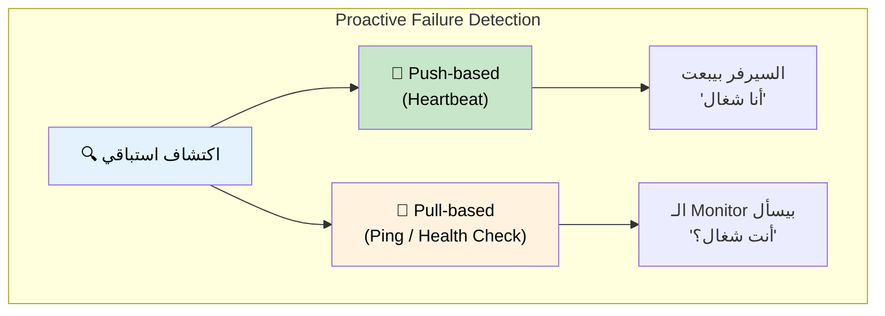
```mermaid
graph TB
    subgraph "Proactive Failure Detection"
        PFD["🔍 اكتشاف استباقي"]

        PFD --> PUSH["💓 Push-based<br/>(Heartbeat)"]
        PFD --> PULL["🏓 Pull-based<br/>(Ping / Health Check)"]

        PUSH --> PUSH_DESC["السيرفر بيبعت<br/>'أنا شغال'"]
        PULL --> PULL_DESC["الـ Monitor بيسأل<br/>'أنت شغال؟'"]
    end

    style PFD fill:#e3f2fd,color:#000
    style PUSH fill:#c8e6c9,color:#000
    style PULL fill:#fff3e0,color:#000
```

### 1. Push-based (Heartbeat)

السيرفر **بيبعت من نفسه** إشارات دورية للـ Monitor من غير ما حد يسأله. زي نبض القلب - لو وقف، يبقى فيه مشكلة!

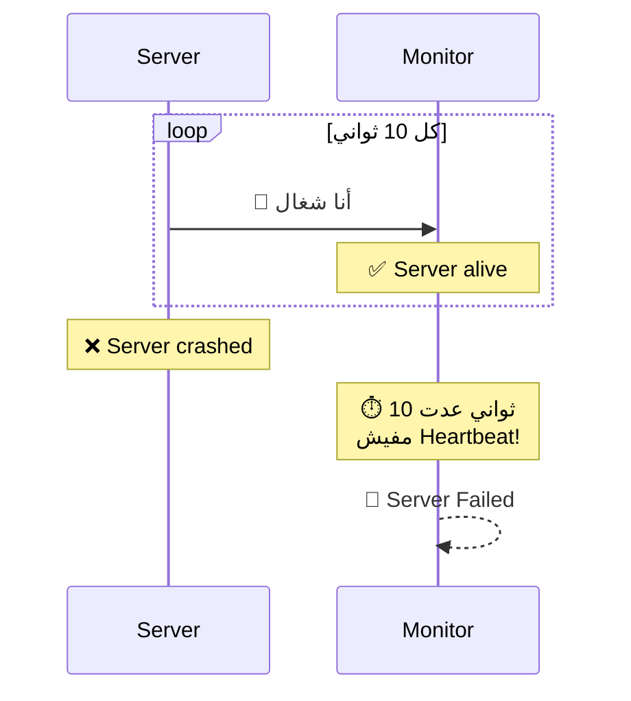
```mermaid
sequenceDiagram
    participant S as Server
    participant M as Monitor

    loop كل 10 ثواني
        S->>M: 💓 أنا شغال
        Note over M: ✅ Server alive
    end

    Note over S: ❌ Server crashed

    Note over M: ⏱️ 10 ثواني عدت<br/>مفيش Heartbeat!

    M-->>M: 🚨 Server Failed
```

**إزاي بيشتغل:**
1. السيرفر بيبعت Heartbeat كل فترة معينة (مثلاً كل 10 ثواني)
2. الـ Monitor بيتابع آخر إشارة وصلت
3. لو ما وصلتش إشارة في الوقت المتوقع → السيرفر Failed ❌

### 2. Pull-based (Ping / Health Check)

الـ Monitor **بيسأل بنفسه** السيرفر لو شغال وبيستنى الرد.

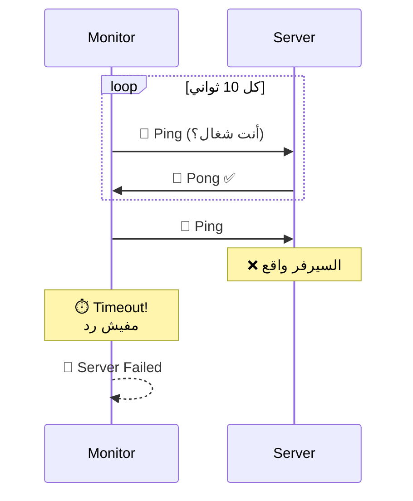
```mermaid
sequenceDiagram
    participant M as Monitor
    participant S as Server

    loop كل 10 ثواني
        M->>S: 🏓 Ping (أنت شغال؟)
        S->>M: 🏓 Pong ✅
    end

    M->>S: 🏓 Ping
    Note over S: ❌ السيرفر واقع

    Note over M: ⏱️ Timeout!<br/>مفيش رد

    M-->>M: 🚨 Server Failed
```

**إزاي بيشتغل:**
1. الـ Monitor بيبعت Ping كل فترة معينة (مثلاً كل 5 أو 30 ثانية)
2. لو جاء Pong خلال مدة معينة (مثلاً 200ms) → السيرفر شغال ✅
3. لو ما جاش رد (Timeout) → السيرفر Failed ❌

### مقارنة: Push vs Pull

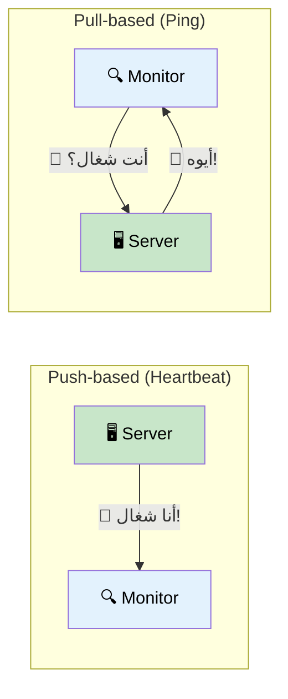
```mermaid
graph LR
    subgraph "Push-based (Heartbeat)"
        S1["🖥️ Server"] -->|"💓 أنا شغال!"| M1["🔍 Monitor"]
    end

    subgraph "Pull-based (Ping)"
        M2["🔍 Monitor"] -->|"🏓 أنت شغال؟"| S2["🖥️ Server"]
        S2 -->|"🏓 أيوه!"| M2
    end

    style S1 fill:#c8e6c9,color:#000
    style M1 fill:#e3f2fd,color:#000
    style S2 fill:#c8e6c9,color:#000
    style M2 fill:#e3f2fd,color:#000
```

| الجانب | Push-based (Heartbeat) | Pull-based (Ping) |
|--------|------------------------|-------------------|
| **مين بيبدأ؟** | السيرفر | الـ Monitor |
| **الاتجاه** | Server → Monitor | Monitor → Server → Monitor |
| **الترافيك** | إشارات في اتجاه واحد | Request + Response |
| **الحمل على السيرفر** | أقل (بس بيبعت) | أعلى (لازم يرد) |
| **تعقيد الـ Monitor** | بيسمع بس | لازم يسأل بنفسه |

---

## الجزء الرابع: فوايد الـ Failure Detection

### 1. Health Monitoring (مراقبة الصحة)

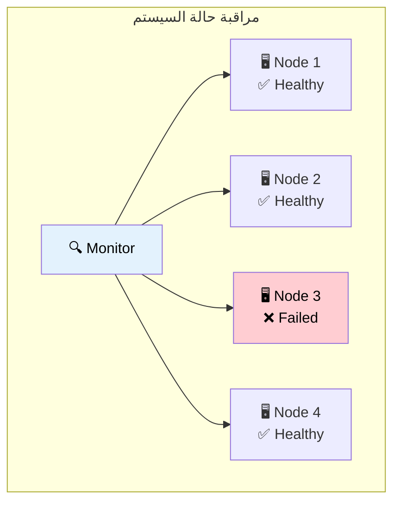
```mermaid
graph TB
    subgraph "مراقبة حالة السيستم"
        M["🔍 Monitor"] --> N1["🖥️ Node 1<br/>✅ Healthy"]
        M --> N2["🖥️ Node 2<br/>✅ Healthy"]
        M --> N3["🖥️ Node 3<br/>❌ Failed"]
        M --> N4["🖥️ Node 4<br/>✅ Healthy"]
    end

    style N3 fill:#ffcdd2,color:#000
    style M fill:#e3f2fd,color:#000
```

بتساعدنا نعرف بالظبط أنهي جزء في السيستم فيه مشاكل أو مش قادر يستجيب.

### 2. Recovery (التعافي)

بناءً على اللي حصل، نقدر ناخد Action مناسب:

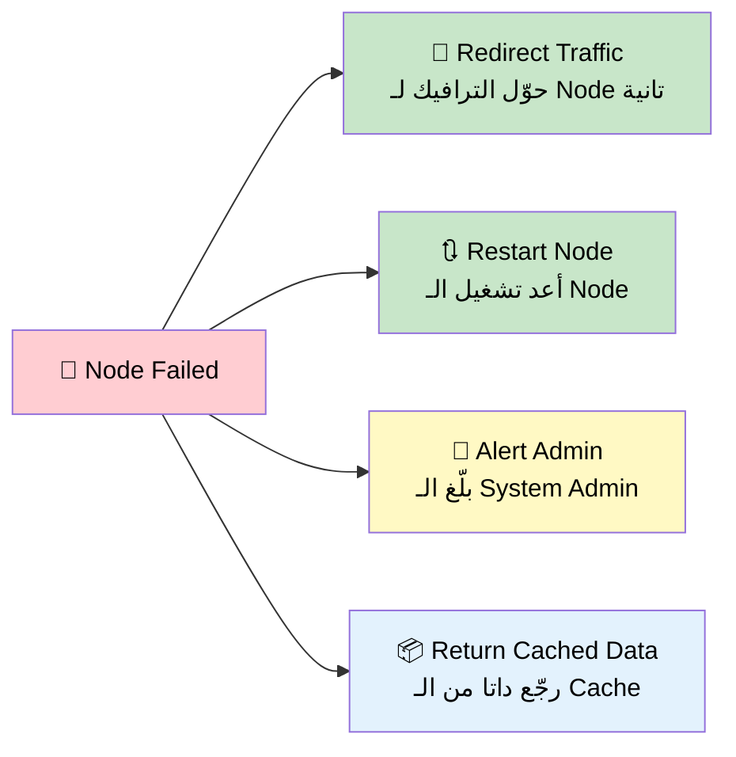
```mermaid
graph LR
    F["🚨 Node Failed"] --> A1["🔄 Redirect Traffic<br/>حوّل الترافيك لـ Node تانية"]
    F --> A2["🔃 Restart Node<br/>أعد تشغيل الـ Node"]
    F --> A3["📧 Alert Admin<br/>بلّغ الـ System Admin"]
    F --> A4["📦 Return Cached Data<br/>رجّع داتا من الـ Cache"]

    style F fill:#ffcdd2,color:#000
    style A1 fill:#c8e6c9,color:#000
    style A2 fill:#c8e6c9,color:#000
    style A3 fill:#fff9c4,color:#000
    style A4 fill:#e3f2fd,color:#000
```

### 3. Load Balancing (توزيع الحمل)

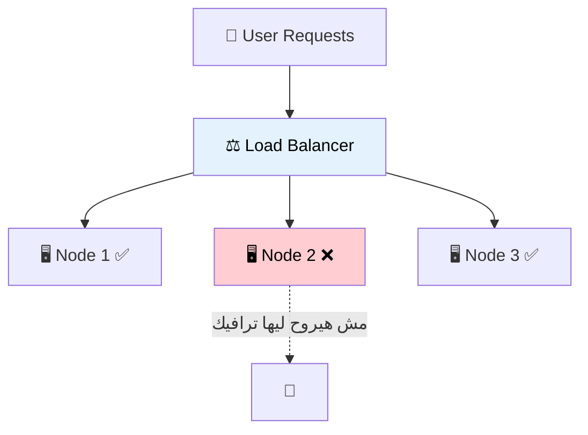
```mermaid
graph TB
    LB["⚖️ Load Balancer"] --> N1["🖥️ Node 1 ✅"]
    LB --> N2["🖥️ Node 2 ❌"]
    LB --> N3["🖥️ Node 3 ✅"]

    U["👥 User Requests"] --> LB

    N2 -.->|"مش هيروح ليها ترافيك"| X["🚫"]

    style N2 fill:#ffcdd2,color:#000
    style LB fill:#e3f2fd,color:#000
```

من خلال معرفتنا بالـ Nodes اللي مش شغالة، نقدر نوجه الترافيك للـ Nodes السليمة بس.

---

## الجزء الخامس: أمثلة تطبيقية

### 1. Database Replication & Failover

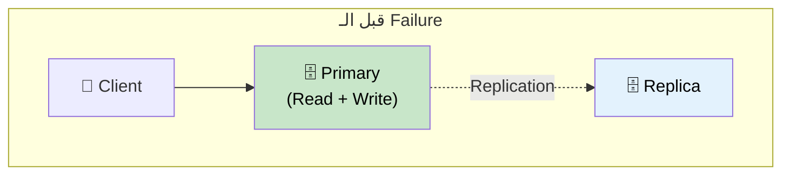
```mermaid
graph TB
    subgraph "قبل الـ Failure"
        C1["👤 Client"] --> P1["🗄️ Primary<br/>(Read + Write)"]
        P1 -.->|"Replication"| R1["🗄️ Replica"]
    end

    style P1 fill:#c8e6c9,color:#000
    style R1 fill:#e3f2fd,color:#000
```

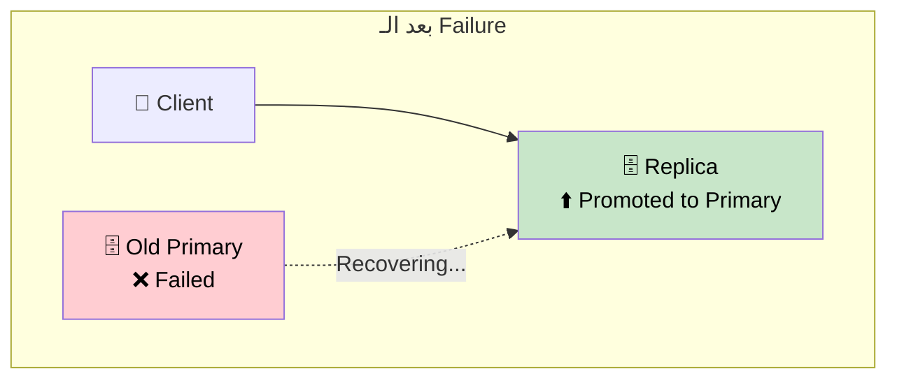
```mermaid
graph TB
    subgraph "بعد الـ Failure"
        C2["👤 Client"] --> R2["🗄️ Replica<br/>⬆️ Promoted to Primary"]
        P2["🗄️ Old Primary<br/>❌ Failed"] -.->|"Recovering..."| R2
    end

    style P2 fill:#ffcdd2,color:#000
    style R2 fill:#c8e6c9,color:#000
```

**السيناريو:**
1. عندنا Primary Database بتستقبل الـ Read و Write
2. عندنا Replica بتاخد نسخة من الداتا
3. لو الـ Primary وقعت، من خلال الـ Heartbeat نقدر نكتشف ده
4. نعمل **Failover**: الـ Replica تبقى هي الـ Primary الجديدة
5. الـ System يكمل شغل من غير Downtime

### 2. Kubernetes

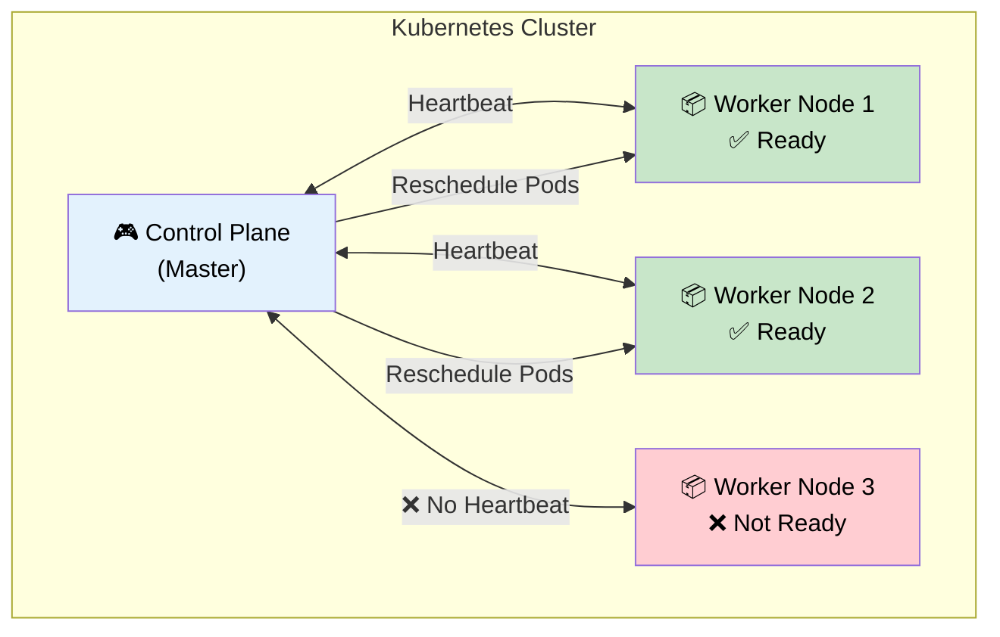
```mermaid
graph TB
    subgraph "Kubernetes Cluster"
        CP["🎮 Control Plane<br/>(Master)"]

        CP <-->|"Heartbeat"| W1["📦 Worker Node 1<br/>✅ Ready"]
        CP <-->|"Heartbeat"| W2["📦 Worker Node 2<br/>✅ Ready"]
        CP <-->|"❌ No Heartbeat"| W3["📦 Worker Node 3<br/>❌ Not Ready"]
    end

    CP -->|"Reschedule Pods"| W1
    CP -->|"Reschedule Pods"| W2

    style CP fill:#e3f2fd,color:#000
    style W1 fill:#c8e6c9,color:#000
    style W2 fill:#c8e6c9,color:#000
    style W3 fill:#ffcdd2,color:#000
```

**إزاي Kubernetes بيستخدم Heartbeat:**
1. كل Worker Node بتبعت Heartbeat للـ Control Plane بشكل دوري
2. الـ Control Plane بيتابع حالة كل Node
3. لو Node بطلت تبعت Heartbeat، بتتعلم كـ **Not Ready**
4. الـ Pods اللي كانت عليها بيتم إعادة جدولتها على Nodes تانية

---

## الجزء السادس: تحديات الـ Heartbeat

### المشاكل

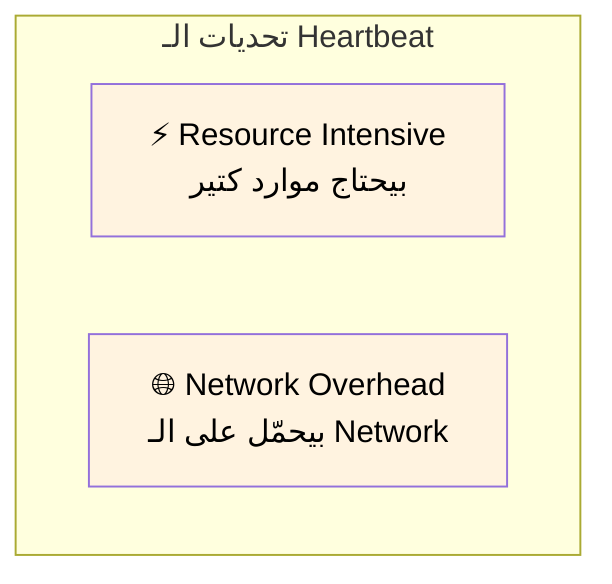
```mermaid
graph TB
    subgraph "تحديات الـ Heartbeat"
        P1["⚡ Resource Intensive<br/>بيحتاج موارد كتير"]
        P2["🌐 Network Overhead<br/>بيحمّل على الـ Network"]
    end

    style P1 fill:#fff3e0,color:#000
    style P2 fill:#fff3e0,color:#000
```

| التحدي | الوصف |
|--------|-------|
| **Resource Intensive** | الإرسال الدوري بيحتاج CPU و Memory |
| **Network Overhead** | كمية الـ Signals الكبيرة بتحمّل على الـ Network |

تخيل عندك آلاف الـ Nodes بتكلم بعض - كمية الـ Heartbeat Signals ممكن تكون ضخمة جداً!

---

## الجزء السابع: بروتوكول الـ Gossip

### الفكرة

بدل ما يكون فيه Monitor مركزي مسؤول يعرف حالة كل الـ Nodes، كل Node بتشارك المعلومات مع عدد عشوائي من الـ Nodes التانية - زي الإشاعة أو النميمة! 🗣️

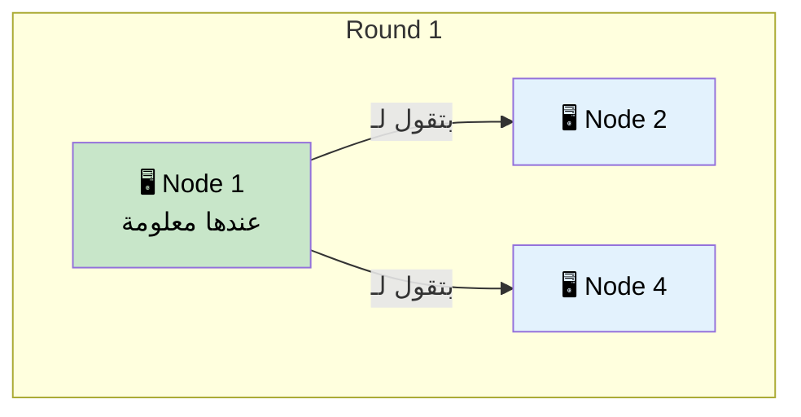
```mermaid
graph TB
    subgraph "Round 1"
        N1["🖥️ Node 1<br/>عندها معلومة"] -->|"بتقول لـ"| N2["🖥️ Node 2"]
        N1 -->|"بتقول لـ"| N4["🖥️ Node 4"]
    end

    style N1 fill:#c8e6c9,color:#000
    style N2 fill:#e3f2fd,color:#000
    style N4 fill:#e3f2fd,color:#000
```

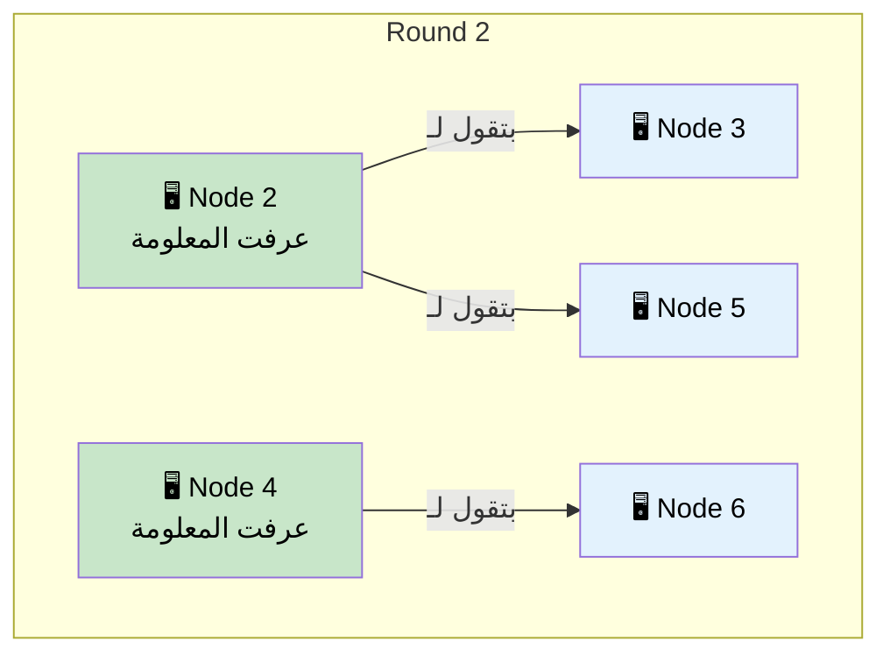
```mermaid
graph TB
    subgraph "Round 2"
        N2_2["🖥️ Node 2<br/>عرفت المعلومة"] -->|"بتقول لـ"| N3["🖥️ Node 3"]
        N2_2 -->|"بتقول لـ"| N5["🖥️ Node 5"]
        N4_2["🖥️ Node 4<br/>عرفت المعلومة"] -->|"بتقول لـ"| N6["🖥️ Node 6"]
    end

    style N2_2 fill:#c8e6c9,color:#000
    style N4_2 fill:#c8e6c9,color:#000
    style N3 fill:#e3f2fd,color:#000
    style N5 fill:#e3f2fd,color:#000
    style N6 fill:#e3f2fd,color:#000
```

### إزاي بيشتغل؟

تخيل عندنا 100 Server:

1. **بدل** ما كل Server يبعت لكل الـ 99 التانيين (مكلف جداً!)
2. كل Server بيختار **عدد عشوائي** من الـ Servers (مثلاً 3)
3. بيبعت لهم آخر معلومات عنده
4. الـ Servers اللي استلمت بتعمل نفس الحاجة في الجولة اللي بعدها
5. في النهاية، المعلومة بتوصل لكل الـ Servers

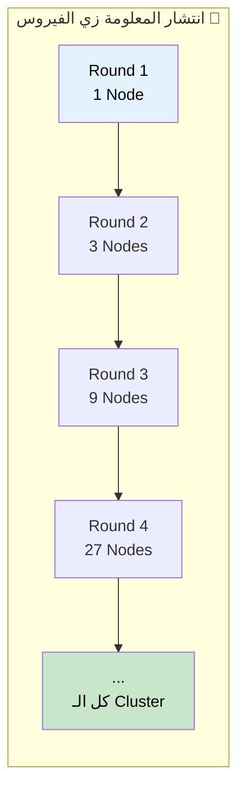
```mermaid
graph LR
    subgraph "انتشار المعلومة زي الفيروس 🦠"
        R1["Round 1<br/>1 Node"] --> R2["Round 2<br/>3 Nodes"]
        R2 --> R3["Round 3<br/>9 Nodes"]
        R3 --> R4["Round 4<br/>27 Nodes"]
        R4 --> R5["...<br/>كل الـ Cluster"]
    end

    style R1 fill:#e3f2fd,color:#000
    style R5 fill:#c8e6c9,color:#000
```

### لو Server وقع؟

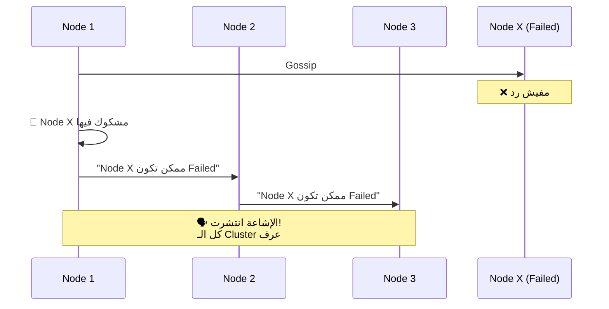
```mermaid
sequenceDiagram
    participant N1 as Node 1
    participant N2 as Node 2
    participant N3 as Node 3
    participant NF as Node X (Failed)

    N1->>NF: Gossip
    Note over NF: ❌ مفيش رد

    N1->>N1: 🤔 Node X مشكوك فيها

    N1->>N2: "Node X ممكن تكون Failed"
    N2->>N3: "Node X ممكن تكون Failed"

    Note over N1,N3: 🗣️ الإشاعة انتشرت!<br/>كل الـ Cluster عرف
```

### مميزات الـ Gossip Protocol

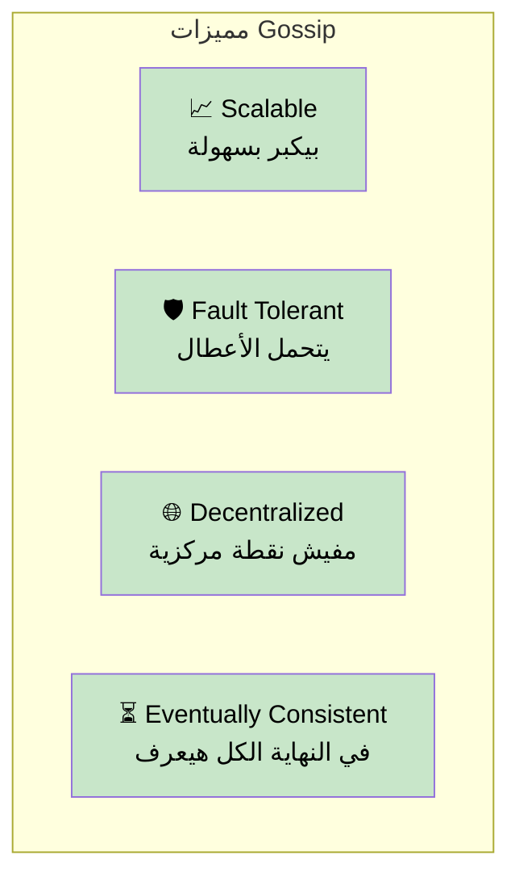
```mermaid
graph TB
    subgraph "مميزات Gossip"
        A["📈 Scalable<br/>بيكبر بسهولة"]
        B["🛡️ Fault Tolerant<br/>يتحمل الأعطال"]
        C["🌐 Decentralized<br/>مفيش نقطة مركزية"]
        D["⏳ Eventually Consistent<br/>في النهاية الكل هيعرف"]
    end

    style A fill:#c8e6c9,color:#000
    style B fill:#c8e6c9,color:#000
    style C fill:#c8e6c9,color:#000
    style D fill:#c8e6c9,color:#000
```

| الميزة | الشرح |
|--------|-------|
| **Scalable** | بيكبر بسهولة مع عدد الـ Servers |
| **Fault Tolerant** | لو بعض الرسايل ضاعت، المعلومة هتوصل في الآخر |
| **Decentralized** | مفيش Single Point of Failure |
| **Eventually Consistent** | كل الـ Servers هيكون عندها نفس الرؤية في النهاية |

### مثال تطبيقي: Apache Cassandra

```mermaid
graph TB
    subgraph "Cassandra Cluster"
        C1["🗄️ Node 1"] <-->|"Gossip"| C2["🗄️ Node 2"]
        C2 <-->|"Gossip"| C3["🗄️ Node 3"]
        C3 <-->|"Gossip"| C4["🗄️ Node 4"]
        C4 <-->|"Gossip"| C1
        C1 <-->|"Gossip"| C3
        C2 <-->|"Gossip"| C4
    end

    style C1 fill:#e3f2fd,color:#000
    style C2 fill:#e3f2fd,color:#000
    style C3 fill:#e3f2fd,color:#000
    style C4 fill:#e3f2fd,color:#000
```

Cassandra بتستخدم الـ Gossip Protocol عشان:
- كل Node تعرف حالة الـ Nodes التانية
- مفيش Leader أو Master Node
- الـ Cluster يفضل شغال حتى لو بعض الـ Nodes وقعت

---

## الجزء الثامن: امتى نستخدم إيه؟

### Heartbeat vs Timeout-based Detection

```mermaid
graph TB
    subgraph "اختار الطريقة المناسبة"
        Q{"طبيعة السيستم؟"}

        Q -->|"تواصل مستمر<br/>بين الـ Services"| HB["💓 Heartbeat<br/>اكتشاف استباقي"]
        Q -->|"تواصل متقطع<br/>Request-based"| TO["⏱️ Timeout<br/>اكتشاف وقت الـ Request"]
    end

    style HB fill:#c8e6c9,color:#000
    style TO fill:#e3f2fd,color:#000
```

| الطريقة | متى نستخدمها | المثال |
|---------|--------------|--------|
| **Heartbeat** | لما الـ Services بتتعامل مع بعض بشكل مستمر وعايزين نعرف فوراً لو حاجة وقعت | Database Clusters, Kubernetes |
| **Timeout** | لما التواصل مش مستمر وبيكون Request-based | API Calls, HTTP Requests |
| **Gossip** | لما عندنا Cluster كبير ومحتاجين Scalability | Cassandra, DynamoDB |

---

## الخلاصة

```mermaid
graph TB
    subgraph "ملخص Failure Detection"
        FD["🔍 Failure Detection"]

        FD --> TO["⏱️ Timeout<br/>الكلاينت بيستنى مدة محددة"]
        FD --> HB["💓 Heartbeat<br/>إشارات دورية"]
        FD --> GP["🗣️ Gossip<br/>انتشار المعلومات"]

        HB --> PUSH["Push-based<br/>Server بيبعت"]
        HB --> PULL["Pull-based<br/>Monitor بيسأل"]
    end

    style FD fill:#e3f2fd,color:#000
    style TO fill:#fff9c4,color:#000
    style HB fill:#c8e6c9,color:#000
    style GP fill:#fff3e0,color:#000
```

| الموضوع | النقاط الأساسية |
|---------|-----------------|
| **Failures** | ممكن السيرفر يكون بطيء، يقع، أو الرسالة تضيع |
| **Timeout** | الكلاينت بيحدد مدة انتظار ويتصرف بعدها |
| **Ping** | Monitor بيسأل الـ Server بشكل دوري |
| **Heartbeat** | Server بيبعت إشارة إنه شغال |
| **Push vs Pull** | الـ Server بيبعت vs الـ Monitor بيسحب |
| **Gossip Protocol** | انتشار المعلومات بشكل لامركزي |
| **Use Cases** | Database Failover, Kubernetes, Cassandra |

> 💡 **مفيش نظام مثالي!** احنا بنحاول نوصل لتوازن بين سرعة اكتشاف الأعطال واستهلاك الموارد.
