# Failure Detection - A Detailed Guide to Detecting Failures in Distributed Systems

## Introduction

In this section, we'll cover:
- Types of failures that can occur in distributed systems
- The Timeout mechanism and how to use it
- Ping and Heartbeat techniques for proactive failure detection
- The Gossip Protocol and how it works
- Practical examples like Database Replication and Kubernetes

---

## Part 1: Problems in Distributed Systems

### What Can Go Wrong?

When a client sends a request to a server, or in general when any process tries to communicate with another process over the network, many things can go wrong.

Whether we're streaming a show, shopping online, or checking our bank account - we ultimately depend on a complex network of interconnected systems.

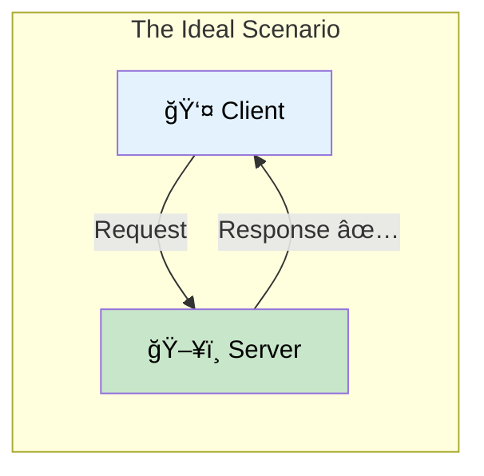
```mermaid
graph LR
    subgraph "The Ideal Scenario"
        C1["👤 Client"] -->|"Request"| S1["ğŸ–¥ï¸ Server"]
        S1 -->|"Response ✅"| C1
    end

    style C1 fill:#e3f2fd,color:#000
    style S1 fill:#c8e6c9,color:#000
```

### When the Response Doesn't Arrive...

In the ideal case, the client sends a request and the server responds. But what happens if the client doesn't receive any response?

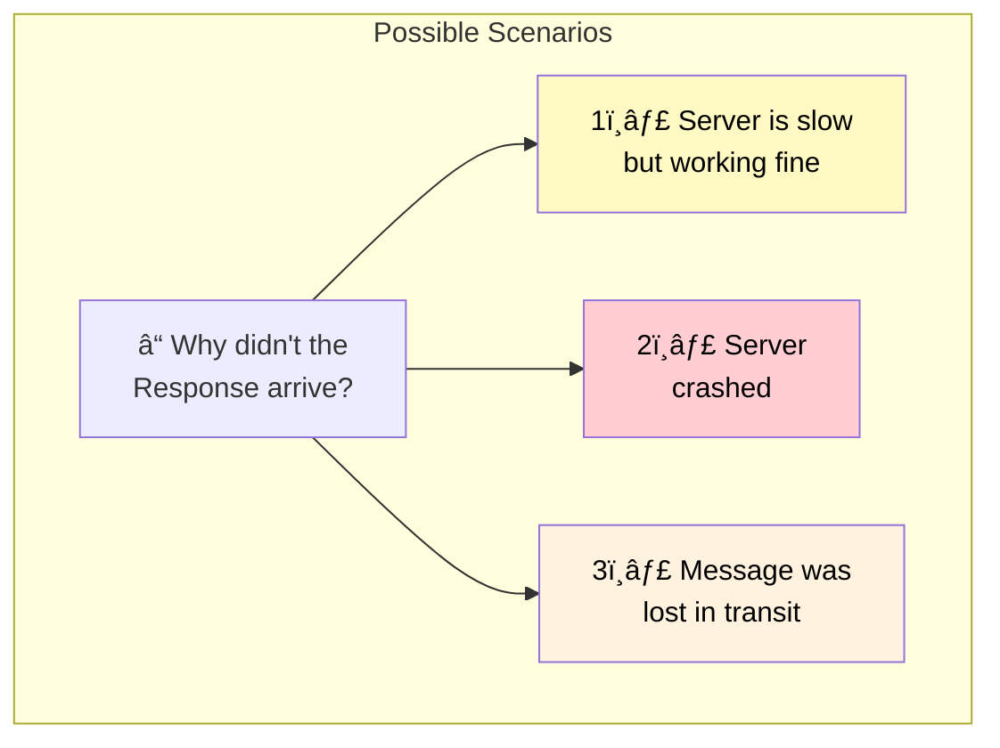
```mermaid
graph TB
    subgraph "Possible Scenarios"
        Q["â“ Why didn't the<br/>Response arrive?"]

        Q --> A["1ï¸âƒ£ Server is slow<br/>but working fine"]
        Q --> B["2ï¸âƒ£ Server<br/>crashed"]
        Q --> C["3ï¸âƒ£ Message was<br/>lost in transit"]
    end

    style A fill:#fff9c4,color:#000
    style B fill:#ffcdd2,color:#000
    style C fill:#fff3e0,color:#000
```

| Scenario | Description |
|----------|-------------|
| 🢠Server is slow | Server is working normally, but the response takes longer |
| 💥 Server crashed | Server has an actual problem and can't respond |
| 📨 Message lost | Response left the server but got lost in the network |

### The Real Problem

In the worst case, the client might wait forever for a response that will never come! Obviously, it can't wait indefinitely.

---

## Part 2: The Timeout Mechanism

### The Solution: Set a Wait Duration

A Timeout means the client sets a specific wait duration. If this duration passes without receiving any response, it assumes the server is unavailable.

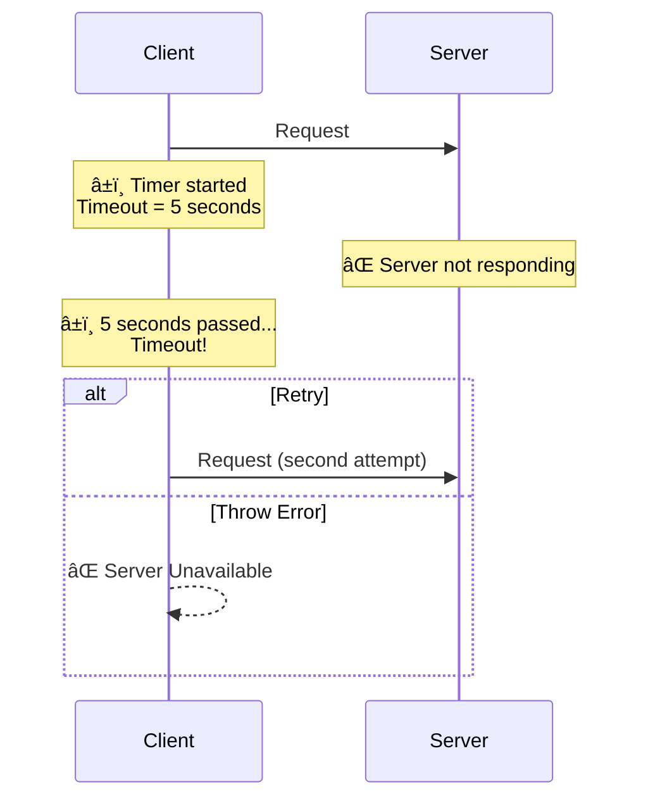
```mermaid
sequenceDiagram
    participant C as Client
    participant S as Server

    C->>S: Request

    Note over C: â±ï¸ Timer started<br/>Timeout = 5 seconds

    Note over S: ⌠Server not responding

    Note over C: â±ï¸ 5 seconds passed...<br/>Timeout!

    alt Retry
        C->>S: Request (second attempt)
    else Throw Error
        C-->>C: ⌠Server Unavailable
    end
```

### After Timeout, What Are the Options?

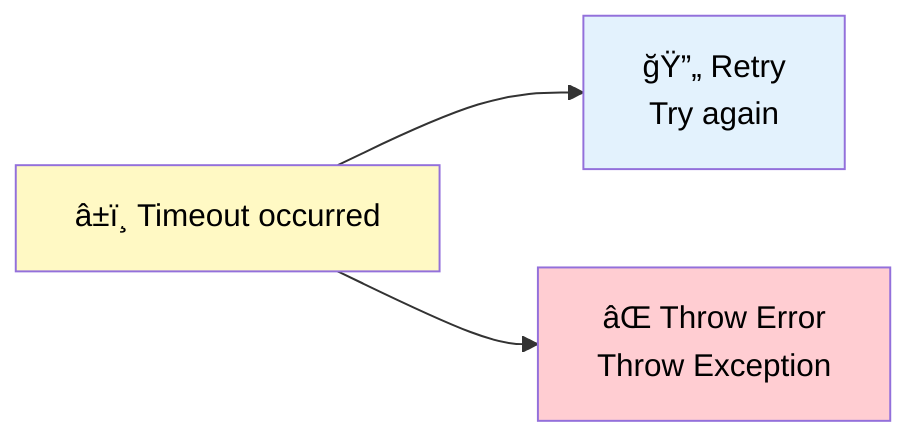
```mermaid
graph LR
    TO["â±ï¸ Timeout occurred"] --> A["🔄 Retry<br/>Try again"]
    TO --> B["⌠Throw Error<br/>Throw Exception"]

    style TO fill:#fff9c4,color:#000
    style A fill:#e3f2fd,color:#000
    style B fill:#ffcdd2,color:#000
```

### The Challenge: Choosing the Right Duration

| Duration | Problem |
|----------|---------|
| âš¡ Too short | Client might think the server is down when it's just slow |
| 🌠Too long | Client will wait unnecessarily if the server is actually down |

> 💡 There's no perfect duration! The choice depends on many factors like User Experience and business requirements.

---

## Part 3: Proactive Failure Detection

### The Idea

Instead of waiting for the client to send a request and discover the server is unavailable, we can make the failure detection process **proactive** - actively monitoring who's working and who's not.

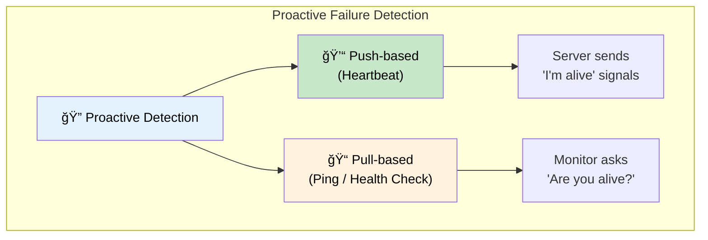
```mermaid
graph TB
    subgraph "Proactive Failure Detection"
        PFD["🔠Proactive Detection"]

        PFD --> PUSH["💓 Push-based<br/>(Heartbeat)"]
        PFD --> PULL["📠Pull-based<br/>(Ping / Health Check)"]

        PUSH --> PUSH_DESC["Server sends<br/>'I'm alive' signals"]
        PULL --> PULL_DESC["Monitor asks<br/>'Are you alive?'"]
    end

    style PFD fill:#e3f2fd,color:#000
    style PUSH fill:#c8e6c9,color:#000
    style PULL fill:#fff3e0,color:#000
```

### 1. Push-based (Heartbeat)

The Server **proactively sends** periodic signals to the Monitor without being asked. Like a real heartbeat - if it stops, something is wrong!

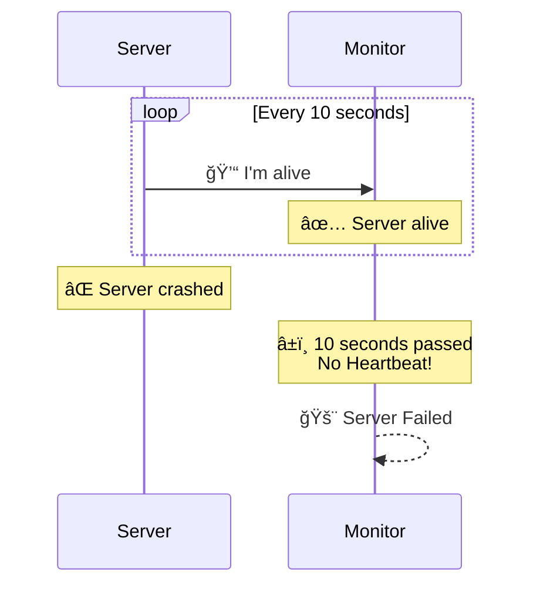
```mermaid
sequenceDiagram
    participant S as Server
    participant M as Monitor

    loop Every 10 seconds
        S->>M: 💓 I'm alive
        Note over M: ✅ Server alive
    end

    Note over S: ⌠Server crashed

    Note over M: â±ï¸ 10 seconds passed<br/>No Heartbeat!

    M-->>M: 🚨 Server Failed
```

**How it works:**
1. Server sends a Heartbeat signal at regular intervals (e.g., every 10 seconds)
2. Monitor tracks the last received signal
3. If no signal arrives within the expected time → Server is considered Failed âŒ

### 2. Pull-based (Ping / Health Check)

The Monitor **actively asks** the Server if it's alive and waits for a response.

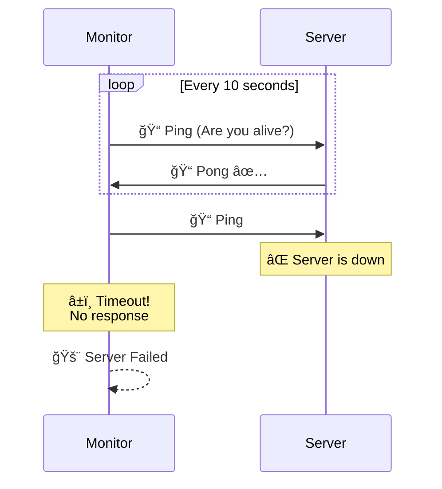
```mermaid
sequenceDiagram
    participant M as Monitor
    participant S as Server

    loop Every 10 seconds
        M->>S: 📠Ping (Are you alive?)
        S->>M: 📠Pong ✅
    end

    M->>S: 📠Ping
    Note over S: ⌠Server is down

    Note over M: â±ï¸ Timeout!<br/>No response

    M-->>M: 🚨 Server Failed
```

**How it works:**
1. Monitor sends a Ping at regular intervals (e.g., every 5 or 30 seconds)
2. If Pong arrives within a certain time (e.g., 200ms) → Server is alive ✅
3. If no response (Timeout) → Server Failed âŒ

### Comparison: Push vs Pull

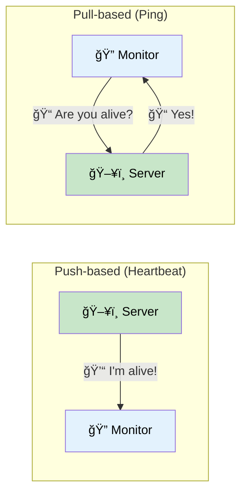
```mermaid
graph LR
    subgraph "Push-based (Heartbeat)"
        S1["ğŸ–¥ï¸ Server"] -->|"💓 I'm alive!"| M1["🔠Monitor"]
    end

    subgraph "Pull-based (Ping)"
        M2["🔠Monitor"] -->|"📠Are you alive?"| S2["ğŸ–¥ï¸ Server"]
        S2 -->|"📠Yes!"| M2
    end

    style S1 fill:#c8e6c9,color:#000
    style M1 fill:#e3f2fd,color:#000
    style S2 fill:#c8e6c9,color:#000
    style M2 fill:#e3f2fd,color:#000
```

| Aspect | Push-based (Heartbeat) | Pull-based (Ping) |
|--------|------------------------|-------------------|
| **Who initiates?** | Server | Monitor |
| **Direction** | Server → Monitor | Monitor → Server → Monitor |
| **Network traffic** | One-way signals | Request + Response |
| **Server load** | Lower (just sends) | Higher (must respond) |
| **Monitor complexity** | Just listens | Must actively poll |

---

## Part 4: Benefits of Failure Detection

### 1. Health Monitoring

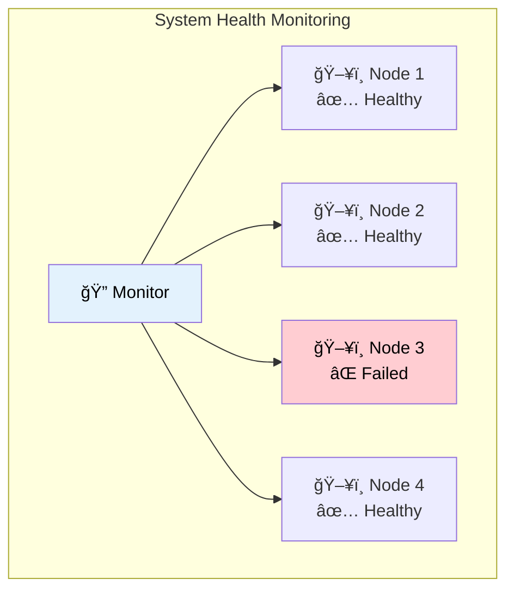
```mermaid
graph TB
    subgraph "System Health Monitoring"
        M["🔠Monitor"] --> N1["ğŸ–¥ï¸ Node 1<br/>✅ Healthy"]
        M --> N2["ğŸ–¥ï¸ Node 2<br/>✅ Healthy"]
        M --> N3["ğŸ–¥ï¸ Node 3<br/>⌠Failed"]
        M --> N4["ğŸ–¥ï¸ Node 4<br/>✅ Healthy"]
    end

    style N3 fill:#ffcdd2,color:#000
    style M fill:#e3f2fd,color:#000
```

Helps us identify exactly which part of the system has problems or can't respond.

### 2. Recovery

Based on what happened, we can take appropriate action:

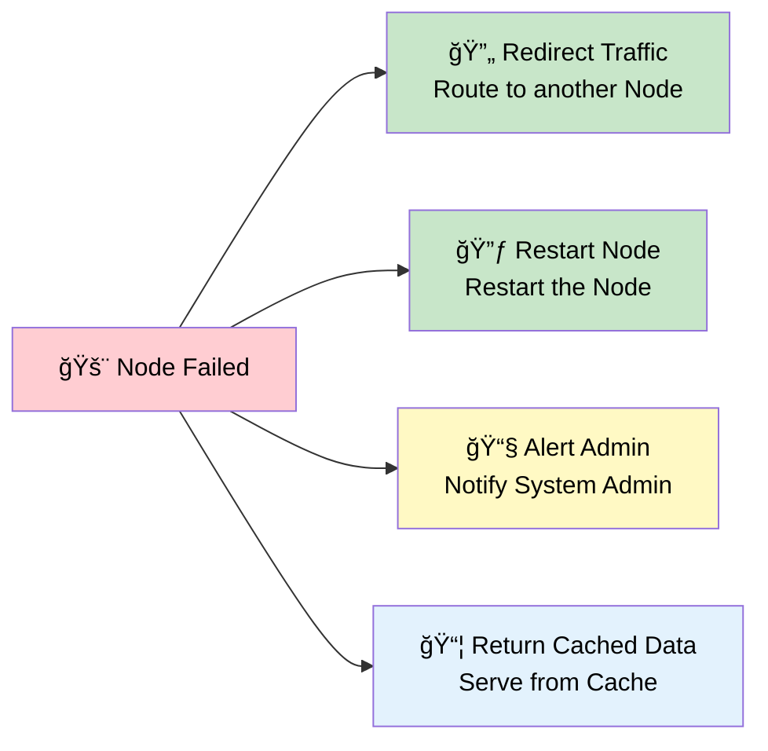
```mermaid
graph LR
    F["🚨 Node Failed"] --> A1["🔄 Redirect Traffic<br/>Route to another Node"]
    F --> A2["🔃 Restart Node<br/>Restart the Node"]
    F --> A3["📧 Alert Admin<br/>Notify System Admin"]
    F --> A4["📦 Return Cached Data<br/>Serve from Cache"]

    style F fill:#ffcdd2,color:#000
    style A1 fill:#c8e6c9,color:#000
    style A2 fill:#c8e6c9,color:#000
    style A3 fill:#fff9c4,color:#000
    style A4 fill:#e3f2fd,color:#000
```

### 3. Load Balancing

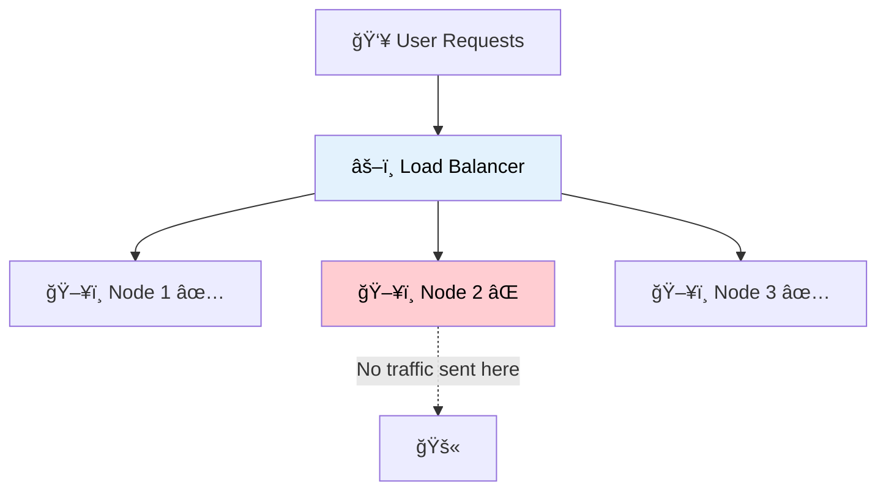
```mermaid
graph TB
    LB["âš–ï¸ Load Balancer"] --> N1["ğŸ–¥ï¸ Node 1 ✅"]
    LB --> N2["ğŸ–¥ï¸ Node 2 âŒ"]
    LB --> N3["ğŸ–¥ï¸ Node 3 ✅"]

    U["👥 User Requests"] --> LB

    N2 -.->|"No traffic sent here"| X["🚫"]

    style N2 fill:#ffcdd2,color:#000
    style LB fill:#e3f2fd,color:#000
```

By knowing which Nodes are down, we can direct traffic only to healthy Nodes.

---

## Part 5: Practical Examples

### 1. Database Replication & Failover

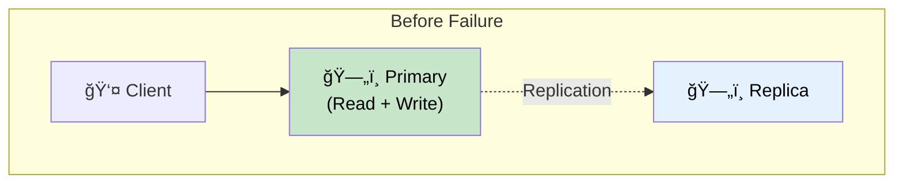
```mermaid
graph TB
    subgraph "Before Failure"
        C1["👤 Client"] --> P1["ğŸ—„ï¸ Primary<br/>(Read + Write)"]
        P1 -.->|"Replication"| R1["ğŸ—„ï¸ Replica"]
    end

    style P1 fill:#c8e6c9,color:#000
    style R1 fill:#e3f2fd,color:#000
```

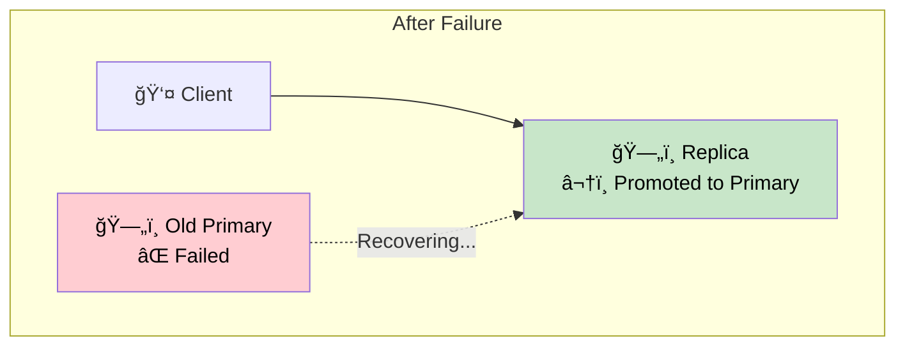
```mermaid
graph TB
    subgraph "After Failure"
        C2["👤 Client"] --> R2["ğŸ—„ï¸ Replica<br/>â¬†ï¸ Promoted to Primary"]
        P2["ğŸ—„ï¸ Old Primary<br/>⌠Failed"] -.->|"Recovering..."| R2
    end

    style P2 fill:#ffcdd2,color:#000
    style R2 fill:#c8e6c9,color:#000
```

**The Scenario:**
1. We have a Primary Database receiving Read and Write operations
2. We have a Replica maintaining a copy of the data
3. If the Primary fails, Heartbeat helps us detect it
4. We perform **Failover**: Replica becomes the new Primary
5. System continues working without Downtime

### 2. Kubernetes

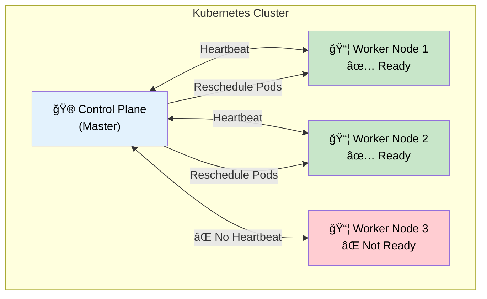
```mermaid
graph TB
    subgraph "Kubernetes Cluster"
        CP["🮠Control Plane<br/>(Master)"]

        CP <-->|"Heartbeat"| W1["📦 Worker Node 1<br/>✅ Ready"]
        CP <-->|"Heartbeat"| W2["📦 Worker Node 2<br/>✅ Ready"]
        CP <-->|"⌠No Heartbeat"| W3["📦 Worker Node 3<br/>⌠Not Ready"]
    end

    CP -->|"Reschedule Pods"| W1
    CP -->|"Reschedule Pods"| W2

    style CP fill:#e3f2fd,color:#000
    style W1 fill:#c8e6c9,color:#000
    style W2 fill:#c8e6c9,color:#000
    style W3 fill:#ffcdd2,color:#000
```

**How Kubernetes uses Heartbeat:**
1. Each Worker Node sends Heartbeat to the Control Plane periodically
2. Control Plane monitors each Node's status
3. If a Node stops sending Heartbeat, it's marked as **Not Ready**
4. Pods that were on it get rescheduled to other Nodes

---

## Part 6: Challenges with Heartbeat

### The Problems

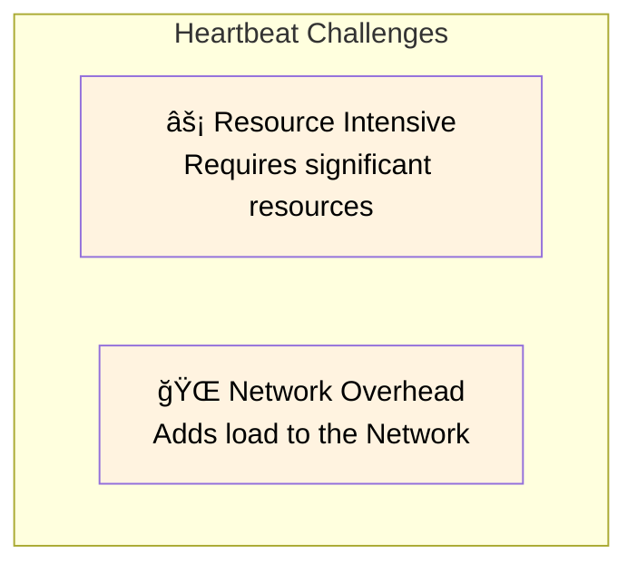
```mermaid
graph TB
    subgraph "Heartbeat Challenges"
        P1["âš¡ Resource Intensive<br/>Requires significant resources"]
        P2["🌠Network Overhead<br/>Adds load to the Network"]
    end

    style P1 fill:#fff3e0,color:#000
    style P2 fill:#fff3e0,color:#000
```

| Challenge | Description |
|-----------|-------------|
| **Resource Intensive** | Periodic sending requires CPU and Memory |
| **Network Overhead** | Large volume of signals adds load to the Network |

Imagine having thousands of Nodes communicating with each other - the amount of Heartbeat Signals can be massive!

---

## Part 7: The Gossip Protocol

### The Idea

Instead of having a centralized Monitor responsible for knowing the state of all Nodes, each Node shares information with a random subset of other Nodes - like rumors or gossip! 🗣ï¸

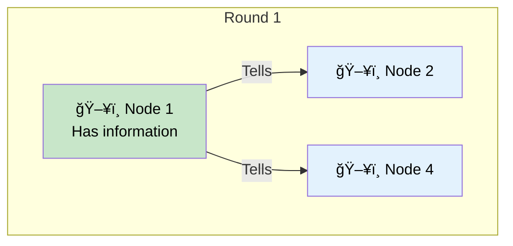
```mermaid
graph TB
    subgraph "Round 1"
        N1["ğŸ–¥ï¸ Node 1<br/>Has information"] -->|"Tells"| N2["ğŸ–¥ï¸ Node 2"]
        N1 -->|"Tells"| N4["ğŸ–¥ï¸ Node 4"]
    end

    style N1 fill:#c8e6c9,color:#000
    style N2 fill:#e3f2fd,color:#000
    style N4 fill:#e3f2fd,color:#000
```

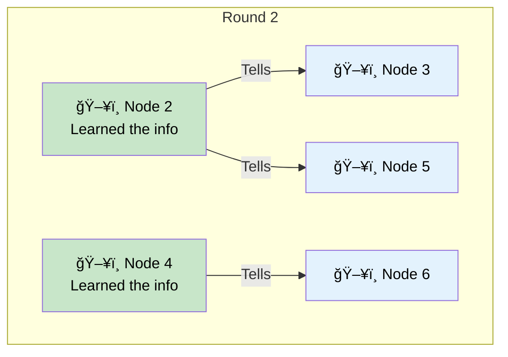
```mermaid
graph TB
    subgraph "Round 2"
        N2_2["ğŸ–¥ï¸ Node 2<br/>Learned the info"] -->|"Tells"| N3["ğŸ–¥ï¸ Node 3"]
        N2_2 -->|"Tells"| N5["ğŸ–¥ï¸ Node 5"]
        N4_2["ğŸ–¥ï¸ Node 4<br/>Learned the info"] -->|"Tells"| N6["ğŸ–¥ï¸ Node 6"]
    end

    style N2_2 fill:#c8e6c9,color:#000
    style N4_2 fill:#c8e6c9,color:#000
    style N3 fill:#e3f2fd,color:#000
    style N5 fill:#e3f2fd,color:#000
    style N6 fill:#e3f2fd,color:#000
```

### How Does It Work?

Imagine we have 100 Servers:

1. **Instead of** each Server sending to all 99 others (very expensive!)
2. Each Server picks a **random number** of Servers (e.g., 3)
3. Sends them the latest information it has
4. Servers that received do the same in the next round
5. Eventually, information reaches all Servers

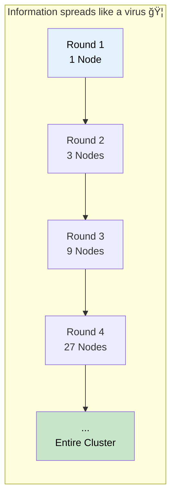
```mermaid
graph LR
    subgraph "Information spreads like a virus 🦠"
        R1["Round 1<br/>1 Node"] --> R2["Round 2<br/>3 Nodes"]
        R2 --> R3["Round 3<br/>9 Nodes"]
        R3 --> R4["Round 4<br/>27 Nodes"]
        R4 --> R5["...<br/>Entire Cluster"]
    end

    style R1 fill:#e3f2fd,color:#000
    style R5 fill:#c8e6c9,color:#000
```

### What If a Server Goes Down?

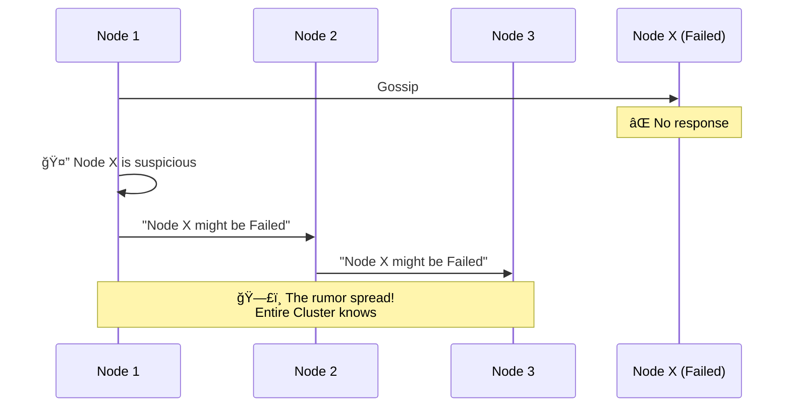
```mermaid
sequenceDiagram
    participant N1 as Node 1
    participant N2 as Node 2
    participant N3 as Node 3
    participant NF as Node X (Failed)

    N1->>NF: Gossip
    Note over NF: ⌠No response

    N1->>N1: 🤔 Node X is suspicious

    N1->>N2: "Node X might be Failed"
    N2->>N3: "Node X might be Failed"

    Note over N1,N3: ğŸ—£ï¸ The rumor spread!<br/>Entire Cluster knows
```

### Advantages of the Gossip Protocol

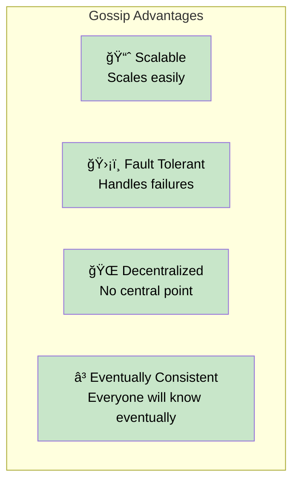
```mermaid
graph TB
    subgraph "Gossip Advantages"
        A["📈 Scalable<br/>Scales easily"]
        B["ğŸ›¡ï¸ Fault Tolerant<br/>Handles failures"]
        C["🌠Decentralized<br/>No central point"]
        D["â³ Eventually Consistent<br/>Everyone will know eventually"]
    end

    style A fill:#c8e6c9,color:#000
    style B fill:#c8e6c9,color:#000
    style C fill:#c8e6c9,color:#000
    style D fill:#c8e6c9,color:#000
```

| Advantage | Explanation |
|-----------|-------------|
| **Scalable** | Scales easily with the number of Servers |
| **Fault Tolerant** | If some messages are lost, information will arrive eventually |
| **Decentralized** | No Single Point of Failure |
| **Eventually Consistent** | All Servers will have the same view eventually |

### Practical Example: Apache Cassandra

```mermaid
graph TB
    subgraph "Cassandra Cluster"
        C1["ğŸ—„ï¸ Node 1"] <-->|"Gossip"| C2["ğŸ—„ï¸ Node 2"]
        C2 <-->|"Gossip"| C3["ğŸ—„ï¸ Node 3"]
        C3 <-->|"Gossip"| C4["ğŸ—„ï¸ Node 4"]
        C4 <-->|"Gossip"| C1
        C1 <-->|"Gossip"| C3
        C2 <-->|"Gossip"| C4
    end

    style C1 fill:#e3f2fd,color:#000
    style C2 fill:#e3f2fd,color:#000
    style C3 fill:#e3f2fd,color:#000
    style C4 fill:#e3f2fd,color:#000
```

Cassandra uses the Gossip Protocol so that:
- Each Node knows the state of other Nodes
- There's no Leader or Master Node
- The Cluster keeps working even if some Nodes fail

---

## Part 8: When to Use What?

### Heartbeat vs Timeout-based Detection

```mermaid
graph TB
    subgraph "Choose the Right Approach"
        Q{"System Nature?"}

        Q -->|"Continuous communication<br/>between Services"| HB["💓 Heartbeat<br/>Proactive detection"]
        Q -->|"Intermittent communication<br/>Request-based"| TO["â±ï¸ Timeout<br/>Detection at Request time"]
    end

    style HB fill:#c8e6c9,color:#000
    style TO fill:#e3f2fd,color:#000
```

| Method | When to Use | Example |
|--------|-------------|---------|
| **Heartbeat** | When Services communicate continuously and need to know immediately if something fails | Database Clusters, Kubernetes |
| **Timeout** | When communication isn't continuous and is Request-based | API Calls, HTTP Requests |
| **Gossip** | When you have a large Cluster and need Scalability | Cassandra, DynamoDB |

---

## Conclusion

```mermaid
graph TB
    subgraph "Failure Detection Summary"
        FD["🔠Failure Detection"]

        FD --> TO["â±ï¸ Timeout<br/>Client waits for a set duration"]
        FD --> HB["💓 Heartbeat<br/>Periodic signals"]
        FD --> GP["ğŸ—£ï¸ Gossip<br/>Information spreading"]

        HB --> PUSH["Push-based<br/>Server sends"]
        HB --> PULL["Pull-based<br/>Monitor asks"]
    end

    style FD fill:#e3f2fd,color:#000
    style TO fill:#fff9c4,color:#000
    style HB fill:#c8e6c9,color:#000
    style GP fill:#fff3e0,color:#000
```

| Topic | Key Points |
|-------|------------|
| **Failures** | Server might be slow, crash, or message might get lost |
| **Timeout** | Client sets a wait duration and acts accordingly |
| **Ping** | Monitor asks the Server periodically |
| **Heartbeat** | Server sends a signal that it's alive |
| **Push vs Pull** | Server sends vs Monitor pulls |
| **Gossip Protocol** | Decentralized information spreading |
| **Use Cases** | Database Failover, Kubernetes, Cassandra |

> 💡 **There's no perfect system!** We try to balance between speed of failure detection and resource consumption.
