# TCP و UDP - شرح تفصيلي لبروتوكولات النقل

## المقدمة

في الجزء ده هنتكلم عن:
- إزاي الأجهزة بتتواصل مع بعض في الشبكات
- بروتوكول TCP (Transmission Control Protocol) وإزاي بيحقق الموثوقية
- الـ Connection Lifecycle
- Flow Control
- الفرق بين TCP و UDP

---

## الجزء الأول: أساسيات التواصل في الشبكات

### إزاي جهازين بيتواصلوا؟

تخيل إنك عايز تبعت رسالة لصاحبك اللي ساكن في مدينة تانية. الرسالة مش هتروح مباشرة - هتعدي على مكاتب بريد كتير في الطريق لحد ما توصل.

**نفس الفكرة في الشبكات:** لما جهازك عايز يبعت بيانات لسيرفر، البيانات بتعدي على راوترات كتير، كل راوتر بيوصلها للراوتر اللي بعده لحد ما توصل للوجهة النهائية.

### عشان العملية دي تنجح، محتاجين حاجتين أساسيتين:

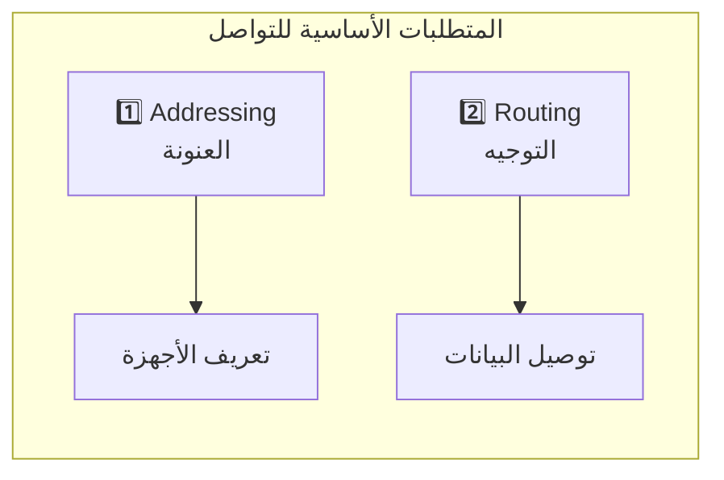

#### 1. العنونة (Addressing)
زي ما كل بيت ليه عنوان بريدي، كل جهاز على الإنترنت ليه عنوان اسمه **IP Address**.

| النوع | عدد العناوين | ملاحظات |
|-------|-------------|---------|
| IPv4 | 2³² ≈ 4.3 مليار | بدأ يخلص! |
| IPv6 | 2¹²⁸ | عدد أكبر من ذرات الرمل على الأرض |

#### 2. التوجيه (Routing)
الراوتر لازم يعرف يبعت الـ Packet على فين. عنده حاجة اسمها **Routing Table** - دي زي خريطة محلية بتقوله: "لو عايز توصل للعنوان ده، ابعت للراوتر اللي بعدك في الاتجاه ده".

**مين اللي بيبني الخرايط دي؟**
بروتوكول اسمه **BGP (Border Gateway Protocol)** - ده اللي بيخلي الإنترنت كله مترابط.

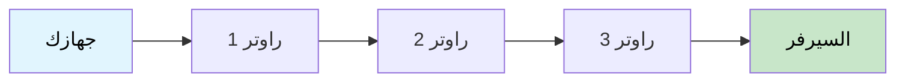

---

## الجزء التاني: المشكلة مع الـ IP

### الـ IP لوحده مش بيضمن حاجة!

الـ IP شغلته بس إنه يوصل الـ Packet من نقطة A لنقطة B. لكن:

- ❌ مش بيضمن إن الـ Packet هتوصل أصلاً
- ❌ مش بيضمن إن الـ Packets هتوصل بالترتيب الصح
- ❌ مش بيضمن إن البيانات ماتغيرتش في الطريق

### ليه؟ مشكلة الـ Packet Drop

تخيل راوتر في نص الطريق عليه ضغط رهيب - بيستقبل Packets أكتر من طاقته.

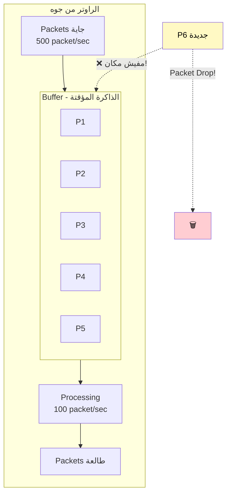

**الوضع الطبيعي:**
- جاي: 100 packet/sec
- بيعالج: 100 packet/sec
- Buffer: فاضي ✅

**الوضع المشكلة:**
- جاي: 500 packet/sec
- بيعالج: 100 packet/sec
- Buffer: بيمتلي... 🔴 → **Packet Drop!**

---

## الجزء التالت: TCP بييجي ينقذ الموقف

### يعني إيه TCP؟

**TCP = Transmission Control Protocol**

ده بروتوكول بيشتغل **فوق** الـ IP وبيوفر حاجة اسمها **Reliability** (الموثوقية).

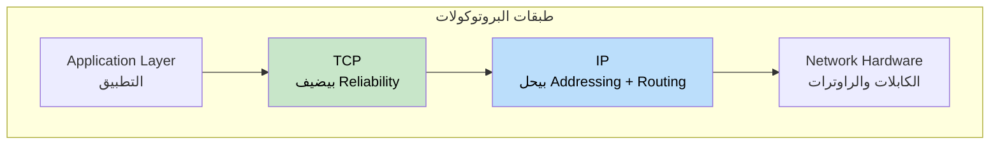

### TCP بيضمن إيه بالظبط؟

| الضمان | الشرح |
|--------|-------|
| ✅ البيانات هتوصل | لو ضاعت، هيعيد يبعتها |
| ✅ هتوصل بالترتيب الصح | حتى لو وصلت مخربطة، هيرتبها |
| ✅ مفيش تكرار | لو نفس الـ Packet وصلت مرتين، هيشيل الزيادة |
| ✅ البيانات سليمة | هيتأكد إن محصلش أي corruption في الطريق |

---

## الجزء الرابع: آليات TCP للموثوقية

### الآلية الأولى: Segmentation + Sequence Numbers

TCP بياخد البيانات الكبيرة وبيقسمها لقطع صغيرة اسمها **Segments**، وكل Segment بياخد رقم تسلسلي.

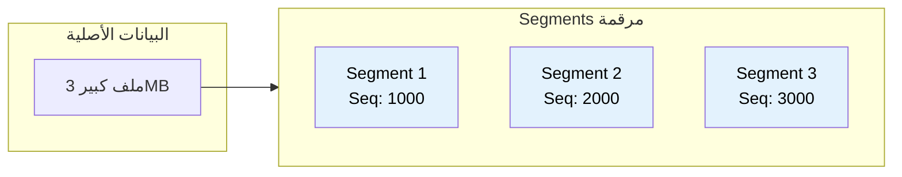

**الفايدة؟**
- لو جاله Seq 1000 وبعده 3000 → يعرف إن Segment 2000 ضايع!
- لو جاله 3000 قبل 2000 → يقدر يرتبهم صح
- لو جاله 2000 مرتين → يشيل النسخة الزيادة

### الآلية التانية: Acknowledgment + Retransmission

كل Segment بيتبعت، الريسيفر لازم يرد بتأكيد (ACK) إنه استلمه.

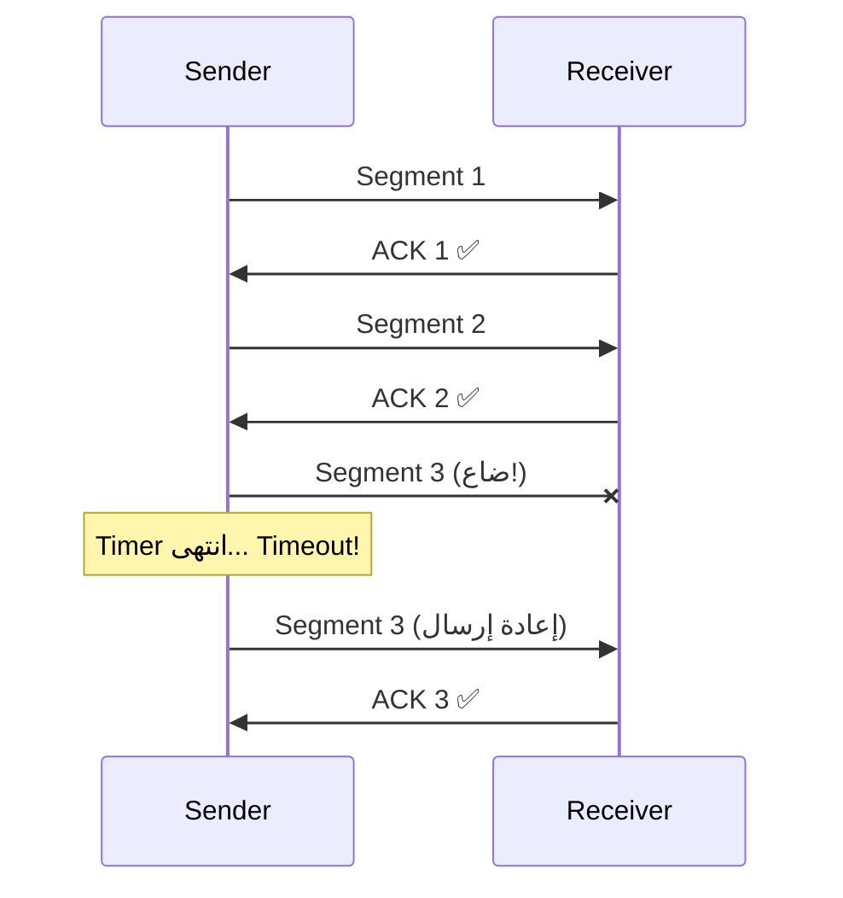

### الآلية التالتة: Checksum

إزاي نتأكد إن البيانات ماتغيرتش في الطريق؟

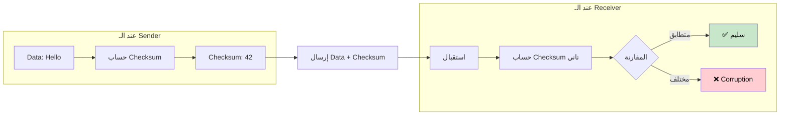

---

## الجزء الخامس: Connection Lifecycle

### حالات الـ Connection

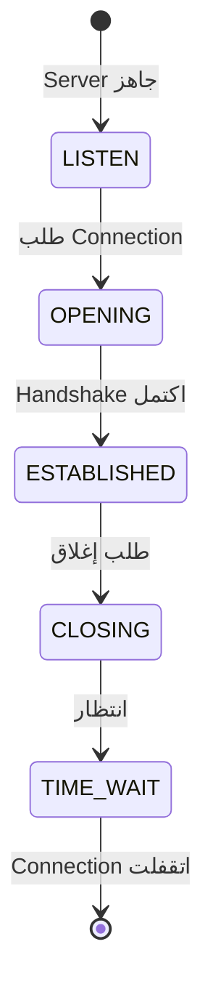

| الحالة | المعنى |
|--------|--------|
| LISTEN | السيرفر مستني Connections |
| OPENING | الـ Connection لسه بيتفتح |
| ESTABLISHED | الـ Connection مفتوح والبيانات بتتنقل |
| CLOSING | الـ Connection بيتقفل |
| TIME_WAIT | بيستنى شوية قبل ما يشيل الـ Socket |

### الـ Three-Way Handshake

عشان يتفتح Connection جديد، TCP بيستخدم تقنية اسمها **Three-Way Handshake**.

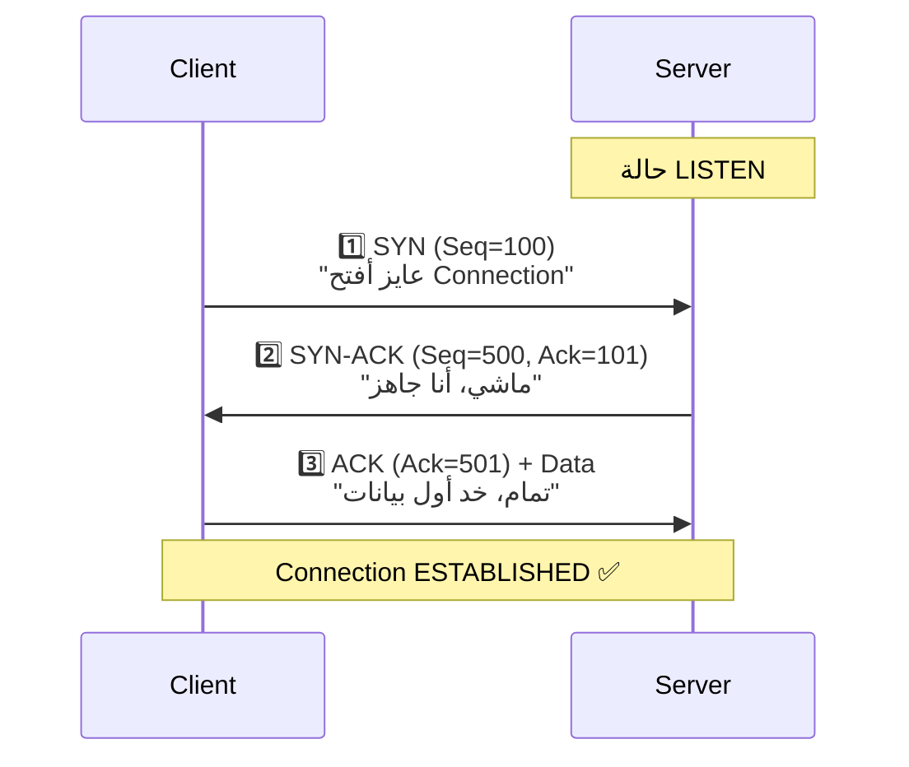

**شرح الأرقام:**

| الرمز | المعنى |
|-------|--------|
| Seq=100 | "أنا ببعتلك الـ Packet رقم 100" |
| Ack=101 | "استلمت 100، مستني 101" |

**ليه بنزوّد 1؟**
الـ Ack=101 معناها: "أنا استلمت لحد 100، مستني منك 101"

### مشكلة الـ Cold Start

```mermaid
gantt
    title Cold Start - ضريبة فتح الـ Connection
    dateFormat X
    axisFormat %L ms

    section Handshake
    SYN رايح           :0, 50
    SYN-ACK راجع       :50, 100

    section Data
    أول Data فعلية     :100, 150
```

**المشكلة:** الـ Handshake بياخد Round Trip كاملة من غير ما أي بيانات تتنقل!

| السيناريو | RTT | وقت Cold Start |
|-----------|-----|----------------|
| سيرفر في أمريكا | 200ms | 200ms ضايعة! |
| سيرفر في مصر (CDN) | 20ms | 20ms بس |

**الحل:** الشركات بتحط سيرفرات قريبة من المستخدمين (**CDN**).

---

## الجزء السادس: قفل الـ Connection

### ليه لازم نقفل الـ Connection؟

طول ما الـ Connection مفتوحة:
- فيه **Socket** شغالة
- فيه **Memory** محجوزة
- فيه **Resources** مستهلكة

من الناحيتين (Client و Server).

### حالة TIME_WAIT

لما الـ Socket بيتقفل، نظام التشغيل **مش بيشيله على طول!** بيحطه في حالة TIME_WAIT لمدة دقيقتين تقريباً.

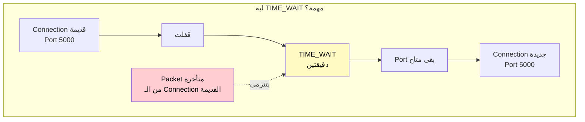

### المشكلة مع TIME_WAIT

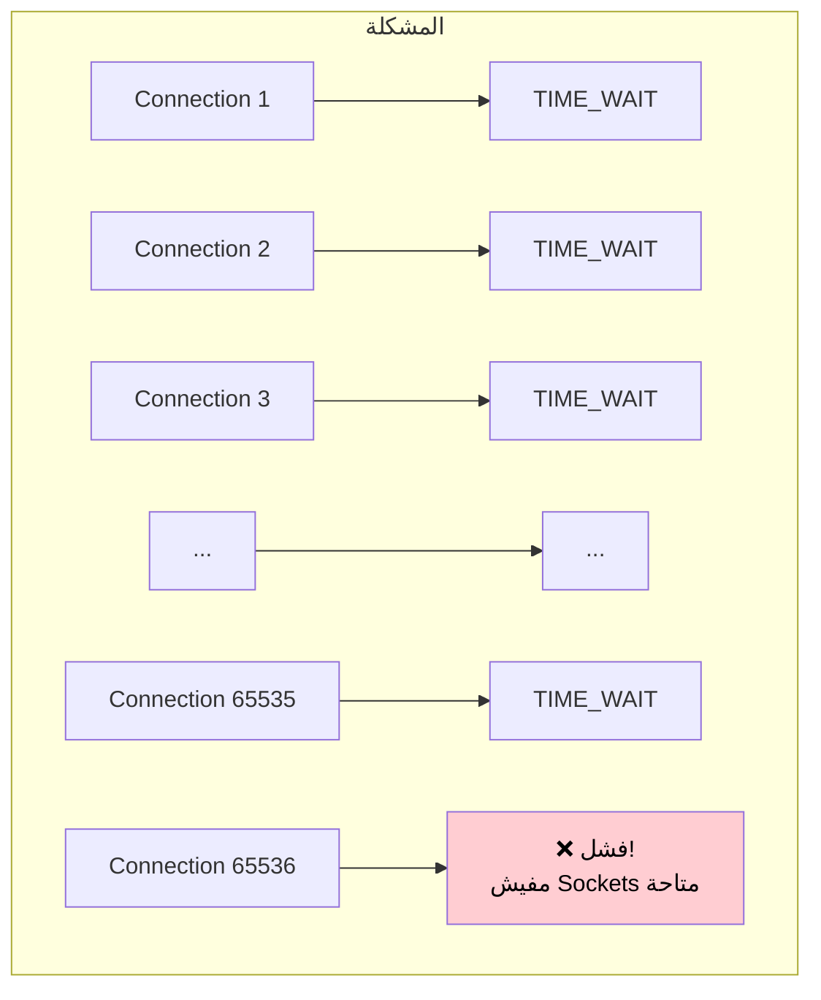

### الحل: Connection Pooling

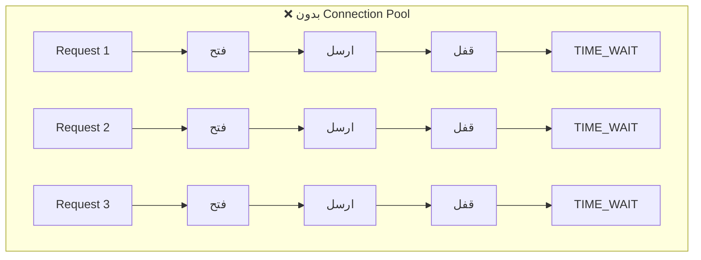

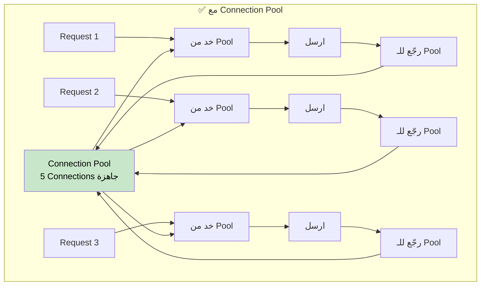

**الفرق:**

| | بدون Pool | مع Pool |
|--|-----------|---------|
| الوقت | 160ms | 20ms |
| Sockets في TIME_WAIT | كتير! | صفر |

---

## الجزء السابع: Flow Control

### المشكلة

إيه اللي هيحصل لو الـ Sender بيبعت بيانات أسرع من قدرة الـ Receiver على المعالجة؟

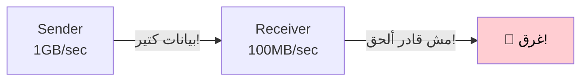

### الحل: Flow Control

الـ Receiver عنده **Buffer** وبيبلّغ الـ Sender بالمساحة المتاحة.

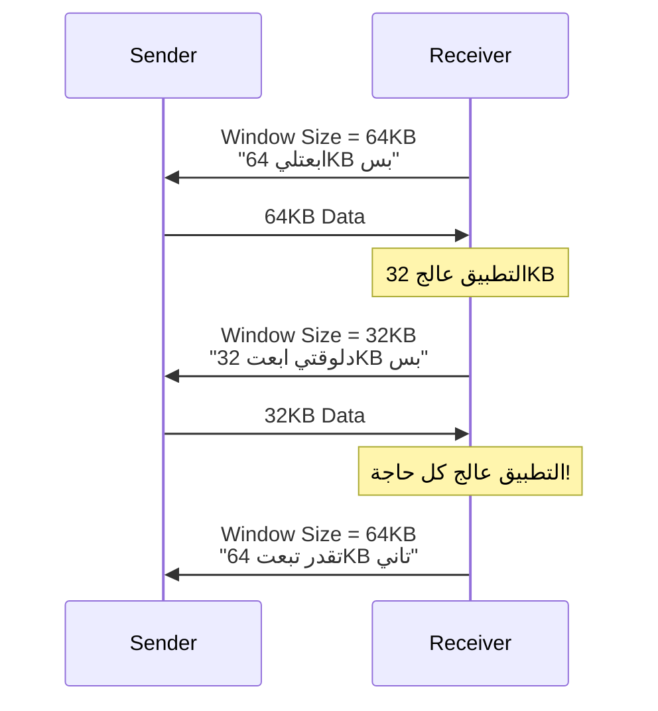

---

## الجزء الثامن: UDP - البديل الخفيف

### لو شلنا كل حاجة من TCP...

لو شلنا:
- ❌ الـ Connection
- ❌ الـ Sequence Numbers
- ❌ الـ Acknowledgments
- ❌ الـ Flow Control
- ❌ الـ Retransmission

هنلاقي نفسنا قدام بروتوكول بسيط جداً اسمه **UDP (User Datagram Protocol)**.

### مقارنة TCP vs UDP

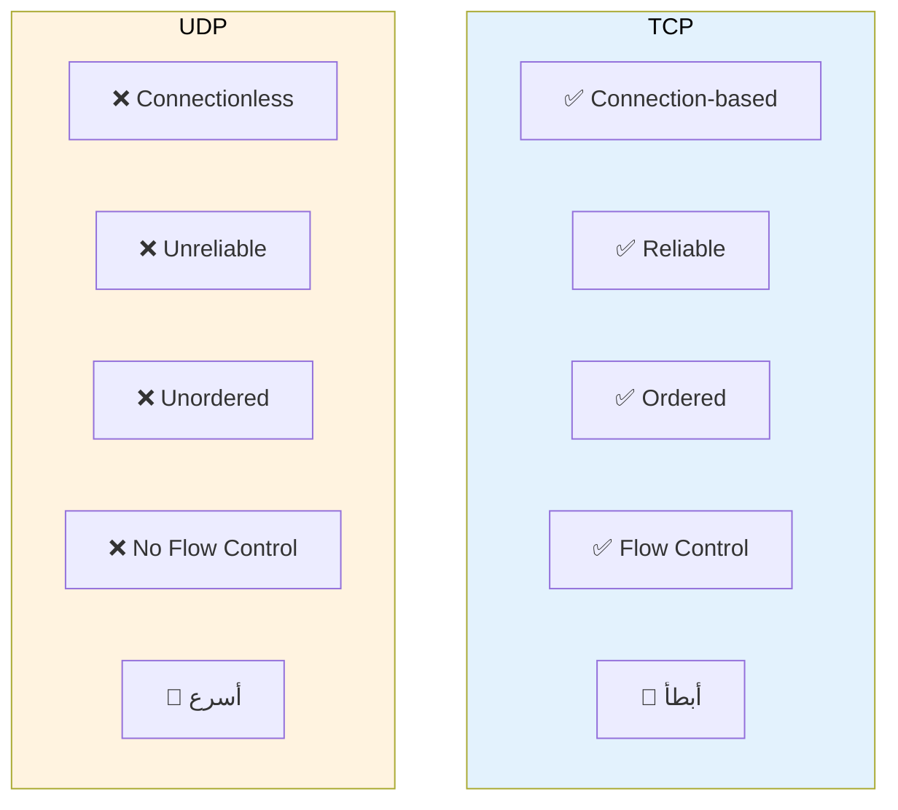

| الخاصية | TCP | UDP |
|---------|-----|-----|
| Connection | ✅ محتاج Handshake | ❌ Connectionless |
| Reliability | ✅ مضمون | ❌ مش مضمون |
| Ordering | ✅ بالترتيب | ❌ ممكن يوصل مخربط |
| Flow Control | ✅ موجود | ❌ مفيش |
| السرعة | 🐢 أبطأ | 🚀 أسرع |

### امتى نستخدم UDP؟

#### 1. الألعاب الـ Multiplayer

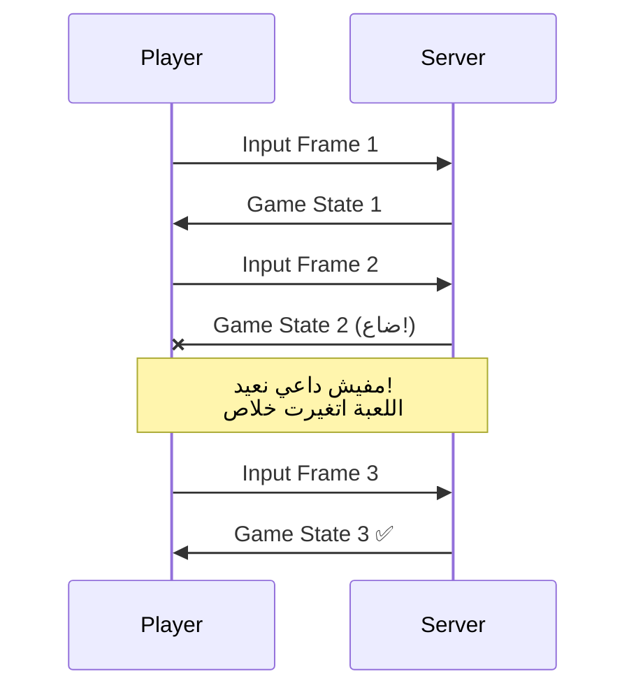

**ليه؟** لأن الـ game state بيتغير كل لحظة. Snapshot من 100ms قبل كده مالهاش أي قيمة!

#### 2. الـ Video Streaming

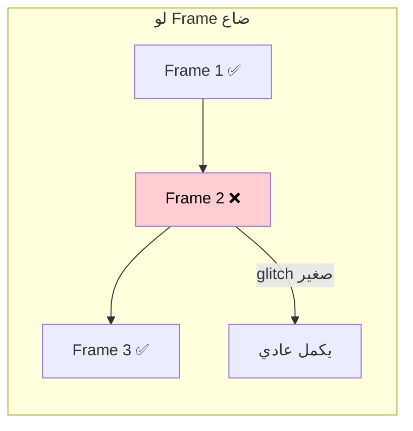

**ليه؟** لأن إعادة إرسال frame من 5 ثواني قبل كده مالهاش لازمة - خلاص الماتش اتغير، ممكن يكون دخل جون!

---

## الخلاصة

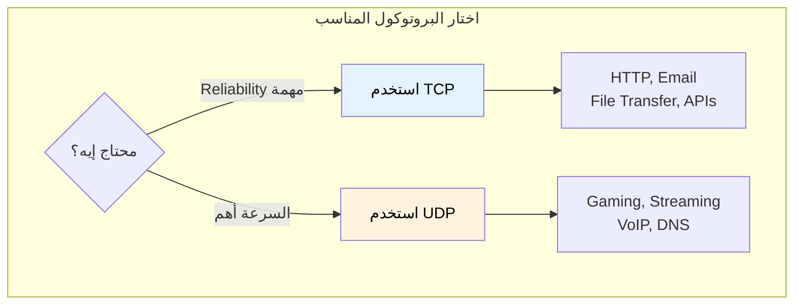

| البروتوكول | الاستخدام |
|------------|-----------|
| **TCP** | HTTP, Email, File Transfer, APIs |
| **UDP** | Gaming, Streaming, VoIP, DNS |

---

## CDN - Content Delivery Network

شبكة من السيرفرات المنتشرة حول العالم، بتخزن نسخة من المحتوى قريبة من المستخدمين.

```mermaid
graph TB
    subgraph "من غير CDN"
        USER1["مصر 🇪🇬"] -->|"200ms"| ORIGIN["سيرفر أمريكا 🇺🇸"]
    end

    subgraph "مع CDN"
        USER2["مصر 🇪🇬"] -->|"20ms"| CDN_EG["CDN مصر 🇪🇬"]
        CDN_EG -.->|"نسخة من المحتوى"| ORIGIN2["السيرفر الأصلي"]
    end

    style CDN_EG fill:#c8e6c9,color:#000
```

**أشهر شركات CDN:**
- Cloudflare
- AWS CloudFront
- Akamai
- Fastly

---

## ملخص سريع للمراجعة

| الموضوع | النقاط الأساسية |
|---------|-----------------|
| **IP** | Addressing + Routing، مش بيضمن التوصيل |
| **TCP** | Reliability فوق الـ IP |
| **Segmentation** | تقسيم البيانات + Sequence Numbers |
| **ACK/Retransmission** | تأكيد الاستلام + إعادة الإرسال |
| **Checksum** | التأكد من سلامة البيانات |
| **3-Way Handshake** | SYN → SYN-ACK → ACK |
| **Cold Start** | ضريبة فتح الـ Connection |
| **TIME_WAIT** | انتظار قبل إغلاق الـ Socket |
| **Connection Pool** | إعادة استخدام الـ Connections |
| **Flow Control** | التحكم في سرعة الإرسال |
| **UDP** | بروتوكول خفيف بدون ضمانات |
