# TCP & UDP - A Detailed Guide to Transport Protocols

## Introduction

In this section, we'll cover:
- How devices communicate over networks
- TCP (Transmission Control Protocol) and how it achieves reliability
- Connection Lifecycle
- Flow Control
- The difference between TCP and UDP

---

## Part 1: Networking Basics

### How Do Two Devices Communicate?

Imagine you want to send a letter to a friend living in another city. The letter won't go directly - it will pass through many post offices along the way until it arrives.

**The same concept applies to networks:** When your device wants to send data to a server, the data passes through many routers, each one forwarding it to the next until it reaches its final destination.

### For this process to work, we need two essential things:

```mermaid
graph LR
    subgraph "Essential Requirements for Communication"
        A["1️⃣ Addressing"] --> C["Identify devices"]
        B["2️⃣ Routing"] --> D["Deliver data"]
    end
```

#### 1. Addressing
Just like every house has a postal address, every device on the internet has an address called an **IP Address**.

| Type | Number of Addresses | Notes |
|------|---------------------|-------|
| IPv4 | 2³² ≈ 4.3 billion | Running out! |
| IPv6 | 2¹²⁸ | More than the number of sand grains on Earth |

#### 2. Routing
The router needs to know where to send the Packet. It has something called a **Routing Table** - like a local map that tells it: "If you want to reach this address, send it to the next router in this direction."

**Who builds these maps?**
A protocol called **BGP (Border Gateway Protocol)** - this is what keeps the entire internet connected.

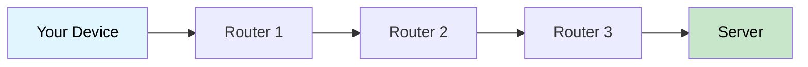

---

## Part 2: The Problem with IP

### IP Alone Doesn't Guarantee Anything!

IP's job is simply to deliver the Packet from point A to point B. However:

- ❌ It doesn't guarantee the Packet will arrive at all
- ❌ It doesn't guarantee Packets will arrive in the correct order
- ❌ It doesn't guarantee the data wasn't corrupted in transit

### Why? The Packet Drop Problem

Imagine a router in the middle of the path under heavy load - receiving more Packets than it can handle.

```mermaid
graph TB
    subgraph "Inside the Router"
        direction TB
        IN["Incoming Packets<br/>500 packet/sec"] --> BUFFER

        subgraph BUFFER["Buffer - Temporary Memory"]
            P1["P1"]
            P2["P2"]
            P3["P3"]
            P4["P4"]
            P5["P5"]
        end

        BUFFER --> PROC["Processing<br/>100 packet/sec"]
        PROC --> OUT["Outgoing Packets"]
    end

    NEW["New P6"] -.->|"❌ No space!"| BUFFER
    NEW -.->|"Packet Drop!"| DROP["🗑️"]

    style DROP fill:#ffcdd2,color:#000
    style NEW fill:#fff9c4,color:#000
```

**Normal situation:**
- Incoming: 100 packet/sec
- Processing: 100 packet/sec
- Buffer: Empty ✅

**Problem situation:**
- Incoming: 500 packet/sec
- Processing: 100 packet/sec
- Buffer: Filling up... 🔴 → **Packet Drop!**

---

## Part 3: TCP Comes to the Rescue

### What is TCP?

**TCP = Transmission Control Protocol**

This protocol operates **on top of** IP and provides something called **Reliability**.

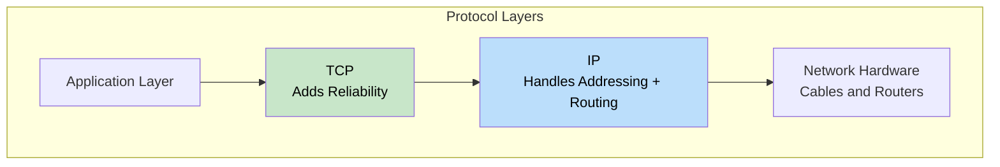

### What Exactly Does TCP Guarantee?

| Guarantee | Explanation |
|-----------|-------------|
| ✅ Data will arrive | If lost, it will resend |
| ✅ In correct order | Even if received out of order, it will reorder |
| ✅ No duplicates | If same Packet arrives twice, removes the duplicate |
| ✅ Data integrity | Ensures no corruption occurred in transit |

---

## Part 4: TCP Reliability Mechanisms

### Mechanism 1: Segmentation + Sequence Numbers

TCP takes large data and divides it into small pieces called **Segments**, each with a sequence number.

```mermaid
graph LR
    subgraph "Original Data"
        DATA["Large File 3MB"]
    end

    DATA --> SEG

    subgraph SEG["Numbered Segments"]
        S1["Segment 1<br/>Seq: 1000"]
        S2["Segment 2<br/>Seq: 2000"]
        S3["Segment 3<br/>Seq: 3000"]
    end

    style S1 fill:#e3f2fd,color:#000
    style S2 fill:#e3f2fd,color:#000
    style S3 fill:#e3f2fd,color:#000
```

**Benefits:**
- If it receives Seq 1000 then 3000 → knows Segment 2000 is missing!
- If it receives 3000 before 2000 → can reorder them correctly
- If it receives 2000 twice → removes the duplicate

### Mechanism 2: Acknowledgment + Retransmission

Every Segment sent requires the receiver to respond with an acknowledgment (ACK).

```mermaid
sequenceDiagram
    participant S as Sender
    participant R as Receiver

    S->>R: Segment 1
    R->>S: ACK 1 ✅

    S->>R: Segment 2
    R->>S: ACK 2 ✅

    S-xR: Segment 3 (Lost!)

    Note over S: Timer expired... Timeout!

    S->>R: Segment 3 (Retransmission)
    R->>S: ACK 3 ✅
```

### Mechanism 3: Checksum

How do we ensure data wasn't corrupted in transit?

```mermaid
graph LR
    subgraph "At Sender"
        DATA1["Data: Hello"] --> CALC1["Calculate Checksum"]
        CALC1 --> CS1["Checksum: 42"]
    end

    CS1 --> SEND["Send Data + Checksum"]

    SEND --> RECV

    subgraph "At Receiver"
        RECV["Receive"] --> CALC2["Recalculate Checksum"]
        CALC2 --> COMPARE{"Compare"}
        COMPARE -->|"Match"| OK["✅ Valid"]
        COMPARE -->|"Mismatch"| BAD["❌ Corruption"]
    end

    style OK fill:#c8e6c9,color:#000
    style BAD fill:#ffcdd2,color:#000
```

---

## Part 5: Connection Lifecycle

### Connection States

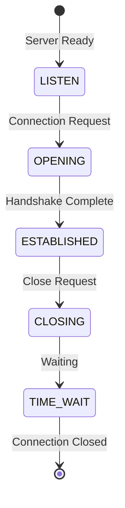

| State | Meaning |
|-------|---------|
| LISTEN | Server waiting for Connections |
| OPENING | Connection being established |
| ESTABLISHED | Connection open, data transferring |
| CLOSING | Connection being closed |
| TIME_WAIT | Waiting before removing Socket |

### The Three-Way Handshake

To open a new Connection, TCP uses a technique called **Three-Way Handshake**.

```mermaid
sequenceDiagram
    participant C as Client
    participant S as Server

    Note over S: LISTEN State

    C->>S: 1️⃣ SYN (Seq=100)<br/>"I want to open a Connection"

    S->>C: 2️⃣ SYN-ACK (Seq=500, Ack=101)<br/>"OK, I'm ready"

    C->>S: 3️⃣ ACK (Ack=501) + Data<br/>"Great, here's the first data"

    Note over C,S: Connection ESTABLISHED ✅
```

**Understanding the Numbers:**

| Symbol | Meaning |
|--------|---------|
| Seq=100 | "I'm sending you Packet number 100" |
| Ack=101 | "Received 100, expecting 101" |

**Why add 1?**
Ack=101 means: "I received up to 100, expecting 101 from you"

### The Cold Start Problem

```mermaid
gantt
    title Cold Start - Connection Opening Cost
    dateFormat X
    axisFormat %L ms

    section Handshake
    SYN outgoing        :0, 50
    SYN-ACK returning   :50, 100

    section Data
    First actual Data   :100, 150
```

**The Problem:** The Handshake takes a full Round Trip without any data being transferred!

| Scenario | RTT | Cold Start Time |
|----------|-----|-----------------|
| Server in USA | 200ms | 200ms wasted! |
| Server nearby (CDN) | 20ms | Only 20ms |

**The Solution:** Companies place servers close to users (**CDN**).

---

## Part 6: Closing the Connection

### Why Must We Close the Connection?

As long as the Connection is open:
- A **Socket** is active
- **Memory** is reserved
- **Resources** are consumed

On both sides (Client and Server).

### The TIME_WAIT State

When the Socket closes, the operating system **doesn't remove it immediately!** It puts it in TIME_WAIT state for about two minutes.

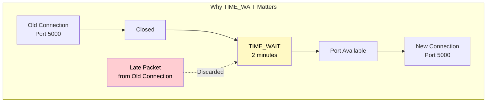

### The Problem with TIME_WAIT

```mermaid
graph TB
    subgraph "The Problem"
        C1["Connection 1"] --> TW1["TIME_WAIT"]
        C2["Connection 2"] --> TW2["TIME_WAIT"]
        C3["Connection 3"] --> TW3["TIME_WAIT"]
        C4["..."] --> TW4["..."]
        C5["Connection 65535"] --> TW5["TIME_WAIT"]
        C6["Connection 65536"] --> FAIL["❌ Failed!<br/>No Sockets Available"]
    end

    style FAIL fill:#ffcdd2,color:#000
```

### The Solution: Connection Pooling

```mermaid
graph TB
    subgraph "❌ Without Connection Pool"
        R1["Request 1"] --> O1["Open"] --> S1["Send"] --> C1["Close"] --> T1["TIME_WAIT"]
        R2["Request 2"] --> O2["Open"] --> S2["Send"] --> C2["Close"] --> T2["TIME_WAIT"]
        R3["Request 3"] --> O3["Open"] --> S3["Send"] --> C3["Close"] --> T3["TIME_WAIT"]
    end
```

```mermaid
graph TB
    subgraph "✅ With Connection Pool"
        POOL["Connection Pool<br/>5 Ready Connections"]

        R1["Request 1"] --> GET1["Get from Pool"] --> USE1["Send"] --> RET1["Return to Pool"]
        R2["Request 2"] --> GET2["Get from Pool"] --> USE2["Send"] --> RET2["Return to Pool"]
        R3["Request 3"] --> GET3["Get from Pool"] --> USE3["Send"] --> RET3["Return to Pool"]

        RET1 --> POOL
        RET2 --> POOL
        RET3 --> POOL
        POOL --> GET1
        POOL --> GET2
        POOL --> GET3
    end

    style POOL fill:#c8e6c9,color:#000
```

**The Difference:**

| | Without Pool | With Pool |
|--|--------------|-----------|
| Time | 160ms | 20ms |
| Sockets in TIME_WAIT | Many! | Zero |

---

## Part 7: Flow Control

### The Problem

What happens if the Sender sends data faster than the Receiver can process?

```mermaid
graph LR
    SENDER["Sender<br/>1GB/sec"] -->|"Too much data!"| RECEIVER["Receiver<br/>100MB/sec"]
    RECEIVER -->|"Can't keep up!"| FLOOD["🌊 Overwhelmed!"]

    style FLOOD fill:#ffcdd2,color:#000
```

### The Solution: Flow Control

The Receiver has a **Buffer** and informs the Sender of available space.

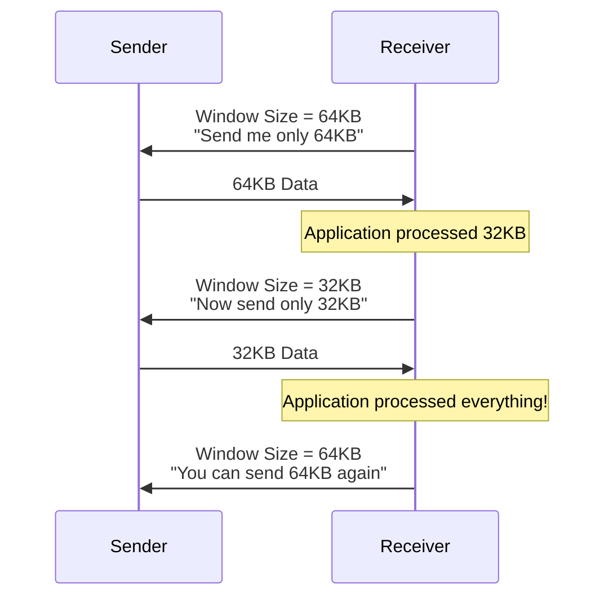

---

## Part 8: UDP - The Lightweight Alternative

### If We Remove Everything from TCP...

If we remove:
- ❌ Connection
- ❌ Sequence Numbers
- ❌ Acknowledgments
- ❌ Flow Control
- ❌ Retransmission

We end up with a very simple protocol called **UDP (User Datagram Protocol)**.

### TCP vs UDP Comparison

```mermaid
graph TB
    subgraph TCP["TCP"]
        T1["✅ Connection-based"]
        T2["✅ Reliable"]
        T3["✅ Ordered"]
        T4["✅ Flow Control"]
        T5["🐢 Slower"]
    end

    subgraph UDP["UDP"]
        U1["❌ Connectionless"]
        U2["❌ Unreliable"]
        U3["❌ Unordered"]
        U4["❌ No Flow Control"]
        U5["🚀 Faster"]
    end

    style TCP fill:#e3f2fd,color:#000
    style UDP fill:#fff3e0,color:#000
```

| Feature | TCP | UDP |
|---------|-----|-----|
| Connection | ✅ Requires Handshake | ❌ Connectionless |
| Reliability | ✅ Guaranteed | ❌ Not guaranteed |
| Ordering | ✅ In order | ❌ May arrive out of order |
| Flow Control | ✅ Present | ❌ None |
| Speed | 🐢 Slower | 🚀 Faster |

### When to Use UDP?

#### 1. Multiplayer Games

```mermaid
sequenceDiagram
    participant P as Player
    participant S as Server

    P->>S: Input Frame 1
    S->>P: Game State 1

    P->>S: Input Frame 2
    S-xP: Game State 2 (Lost!)

    Note over P,S: No need to resend!<br/>Game has already changed

    P->>S: Input Frame 3
    S->>P: Game State 3 ✅
```

**Why?** Because game state changes every moment. A snapshot from 100ms ago has no value!

#### 2. Video Streaming

```mermaid
graph LR
    subgraph "If a Frame is Lost"
        F1["Frame 1 ✅"] --> F2["Frame 2 ❌"] --> F3["Frame 3 ✅"]
        F2 -->|"Small glitch"| CONT["Continues normally"]
    end

    style F2 fill:#ffcdd2,color:#000
```

**Why?** Because resending a frame from 5 seconds ago is pointless - the match has changed, maybe a goal was scored!

---

## Summary

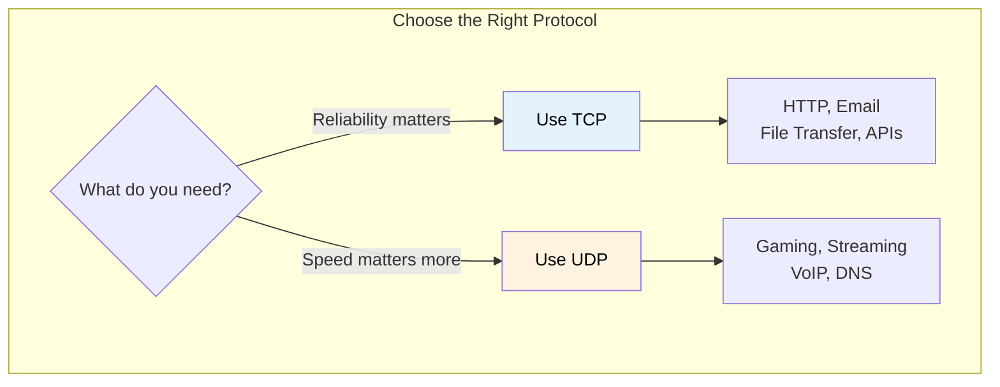

| Protocol | Use Cases |
|----------|-----------|
| **TCP** | HTTP, Email, File Transfer, APIs |
| **UDP** | Gaming, Streaming, VoIP, DNS |

---

## CDN - Content Delivery Network

A network of servers distributed around the world, storing copies of content close to users.

```mermaid
graph TB
    subgraph "Without CDN"
        USER1["Egypt 🇪🇬"] -->|"200ms"| ORIGIN["Server in USA 🇺🇸"]
    end

    subgraph "With CDN"
        USER2["Egypt 🇪🇬"] -->|"20ms"| CDN_EG["CDN in Egypt 🇪🇬"]
        CDN_EG -.->|"Copy of content"| ORIGIN2["Origin Server"]
    end

    style CDN_EG fill:#c8e6c9,color:#000
```

**Popular CDN Providers:**
- Cloudflare
- AWS CloudFront
- Akamai
- Fastly

---

## Quick Reference Summary

| Topic | Key Points |
|-------|------------|
| **IP** | Addressing + Routing, no delivery guarantee |
| **TCP** | Reliability on top of IP |
| **Segmentation** | Data division + Sequence Numbers |
| **ACK/Retransmission** | Delivery confirmation + Resending |
| **Checksum** | Data integrity verification |
| **3-Way Handshake** | SYN → SYN-ACK → ACK |
| **Cold Start** | Connection opening cost |
| **TIME_WAIT** | Wait before Socket removal |
| **Connection Pool** | Connection reuse |
| **Flow Control** | Sending rate control |
| **UDP** | Lightweight protocol without guarantees |
